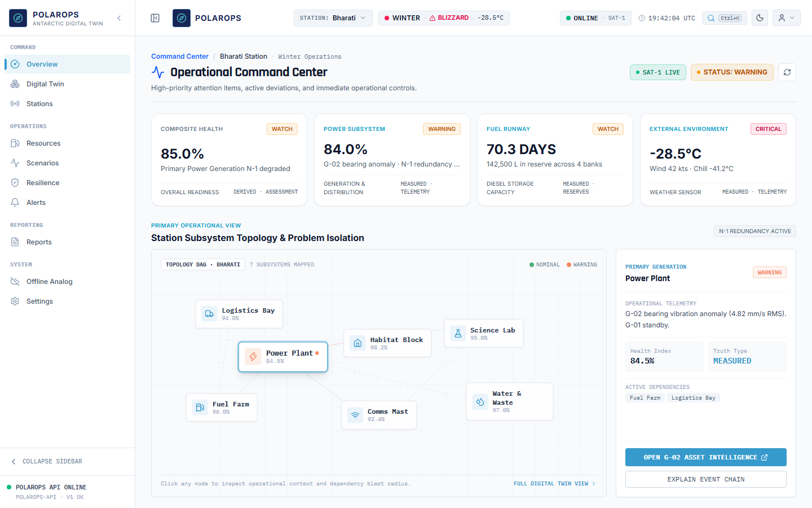
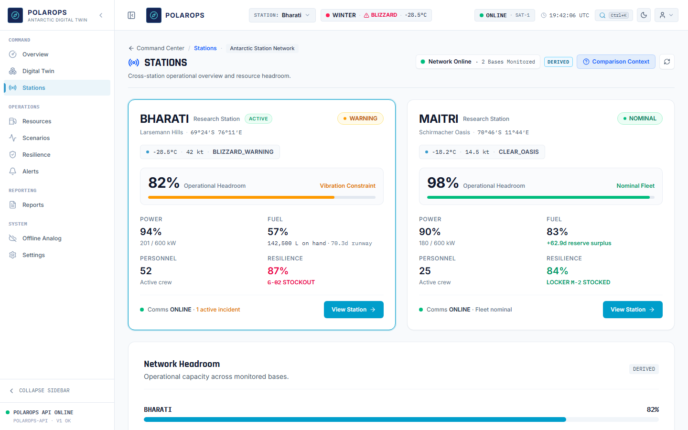
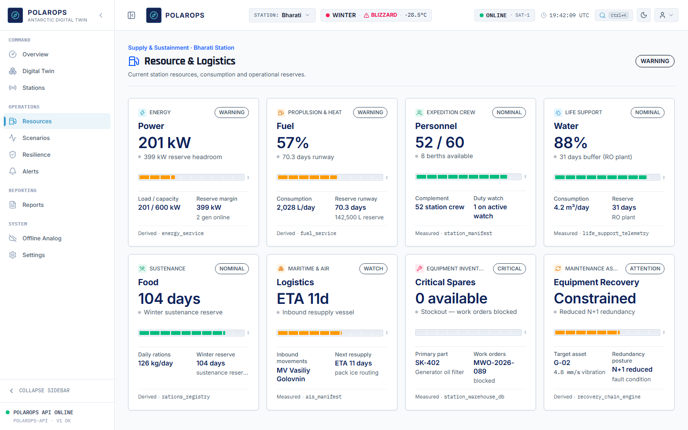
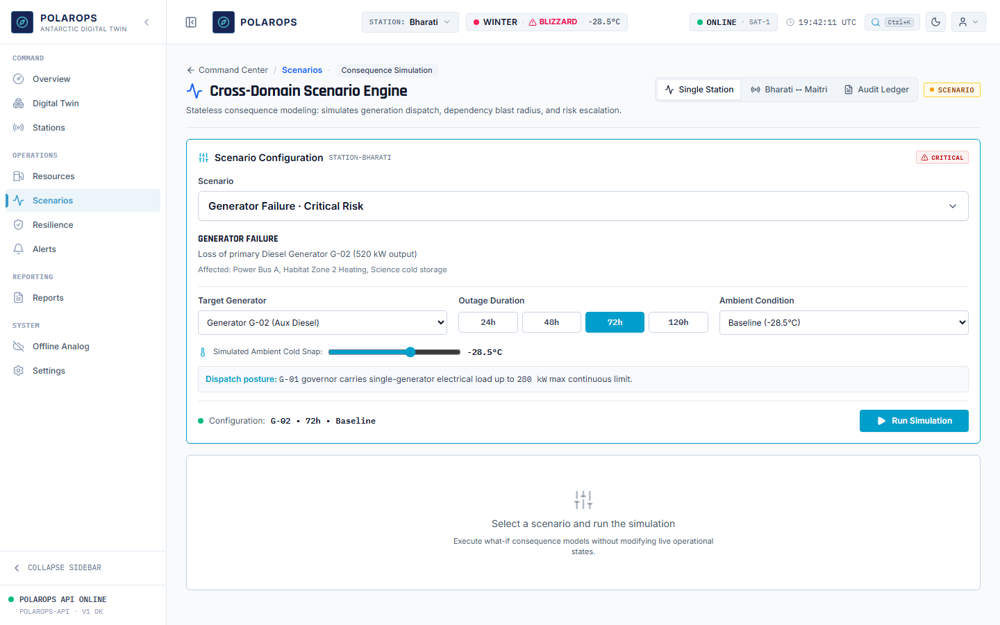
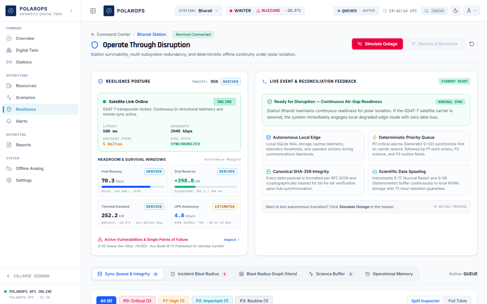
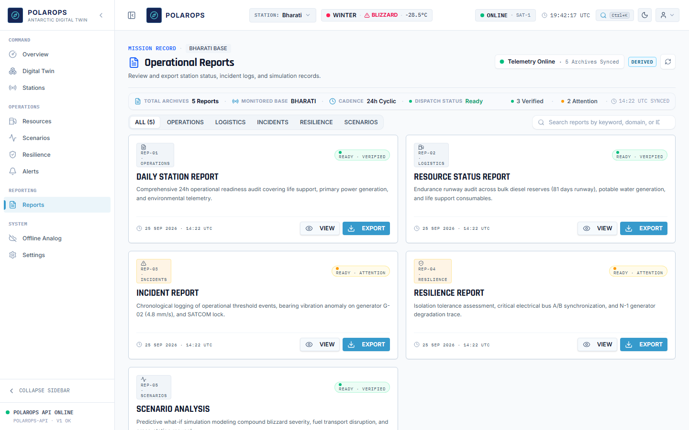
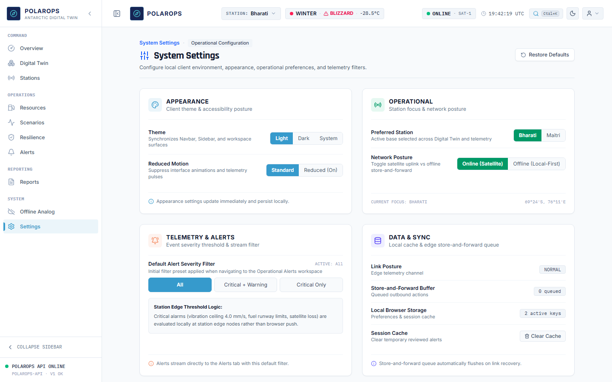
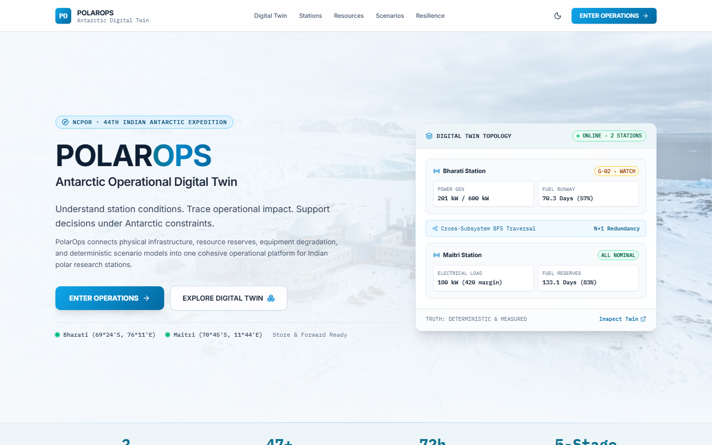

# PolarOps — Antarctic Operational Digital Twin

> Operational digital twin and decision-support platform for remote management of Indian Antarctic Research Stations (Bharati & Maitri), developed for the National Centre for Polar and Ocean Research (NCPOR), Ministry of Earth Sciences, Government of India.

---

## Live Deployments

- **Frontend Application (Vercel)**: [https://polarops-two.vercel.app](https://polarops-two.vercel.app)
- **Backend API Service (Render)**: [https://polarops-api.onrender.com](https://polarops-api.onrender.com)
- **Interactive Swagger Docs**: [https://polarops-api.onrender.com/docs](https://polarops-api.onrender.com/docs)
- **Source Repository**: [https://github.com/Kshitij2011-spec/polarops](https://github.com/Kshitij2011-spec/polarops)

---

## Product Overview

Operating research stations in Antarctica requires continuous decision-making in extreme conditions (-40°C temperatures, blizzards exceeding 100 knots, satellite blackouts, and month-long logistics resupply lead times). Physical equipment failures—such as primary generator degradation—cascading through life-support heating and snowmelt potable water systems present existential risks to station crews.

**PolarOps** serves as a mission-critical digital twin and operational decision-support layer. It continuously aggregates multi-domain station telemetry, evaluates cascading failure blast radiuses using deterministic breadth-first search (BFS) graph traversals, models fuel autonomy and energy balances, simulates cross-domain what-if disruption scenarios, and guarantees operational continuity during satellite outages.

Physical equipment actuation always requires authenticated on-station human authorization. PolarOps informs and empowers human operators—it does not replace local agency.

```text
SENSE ──▶ UNDERSTAND ──▶ PREDICT ──▶ SIMULATE ──▶ DECIDE ──▶ LEARN
```

---

## Core Operational Workspaces

| Workspace | Route | Operational Purpose |
|---|---|---|
| **Command Center** | `/command-center` | Unified Common Operational Picture (COP). Live situational awareness, 3-question operator briefing (*What is happening? Why does it matter? What should we do next?*), subsystem status matrix, and canonical station event stream. |
| **Stations** | `/stations` | Multi-station portfolio coordination. Comparative operational headroom across 5 domains (Power, Thermal, Fuel, Life Support, Maintenance) between Bharati and Maitri stations. |
| **Resources** | `/resources` | Logistics, fuel autonomy, and recovery intelligence. Energy consumption projections, burn-rate modeling, critical spare inventory tracking (e.g. SK-402 seals), and vessel ETA countdowns. |
| **Scenarios** | `/scenarios` | Deterministic what-if consequence simulator. Evaluates multi-variable contingencies (e.g. 72-hour primary generator failure during severe polar blizzard) with side-by-side delta impact analysis. |
| **Resilience** | `/resilience` | Disruption resilience and air-gapped continuity. Manages P0–P3 prioritized telemetry sync queues, cryptographic SHA-256 integrity verification, and scientific instrument observation buffering. |
| **Alerts** | `/alerts` | Station-wide alarm console categorized by severity (`CRITICAL`, `WARNING`, `NOMINAL`) with direct drill-down into root cause diagnostic telemetry. |
| **Reports** | `/reports` | Formal engineering and operational records, verification summaries, and handover shift logs. |
| **Settings** | `/settings` | Station environment preferences, high-contrast light/dark mode configuration, and backend API connection parameters. |
| **Offline Analog** | `/offline` | Local air-gapped operational simulator demonstrating degraded comms behavior and local store-and-forward reconciliation. |
| **Digital Twin** | `/digital-twin` | Spatial and topological station infrastructure visualizer linking equipment components to power buses, thermal loops, and habitat zones. |

---

## Screenshots

Captured directly from the live application at desktop resolution (1440×900):

### Command Center


### Station Portfolio


### Resources & Fuel Runway


### What-If Scenario Simulation


### Communication Resilience & Offline Queue


### Operational Reports


### System Settings


### Landing Overview


---

## System Architecture & Data Flow

```text
┌────────────────────────────────────────────────────────────────────────┐
│                        Presentation Layer                              │
│         React 19 + TypeScript + Vite + Tailwind CSS v4                 │
│         TanStack Router + TanStack Query + Lucide Icons                │
│   (Command Center, Stations, Resources, Scenarios, Resilience, etc.)   │
└───────────────────────────────────┬────────────────────────────────────┘
                                    │ REST API (JSON + Provenance Metadata)
┌───────────────────────────────────▼────────────────────────────────────┐
│                        FastAPI Backend Engine                          │
│                         Python 3.11 + Pydantic v2                      │
│  ┌────────────────────────┬─────────────────────┬───────────────────┐  │
│  │ Dependency BFS Engine  │ Risk Scoring Engine │ Scenario Engine   │  │
│  │ (Cascade Blast Radius) │ (0-100 Composite)   │ (Outage Modeling) │  │
│  ├────────────────────────┼─────────────────────┼───────────────────┤  │
│  │ Energy Balance Model   │ Offline Sync Buffer │ Event Stream      │  │
│  │ (Autonomy Projections) │ (P0-P3 & SHA-256)   │ (Provenance Logs) │  │
│  └────────────────────────┴─────────────────────┴───────────────────┘  │
└───────────────────────────────────┬────────────────────────────────────┘
                                    │ SQLAlchemy v2 ORM
┌───────────────────────────────────▼────────────────────────────────────┐
│                          Database Layer                                │
│       SQLite (Local Development) │ PostgreSQL (Render Production)       │
│       Managed schema migrations via Alembic                             │
│       Deterministic canonical Antarctic station dataset                 │
└────────────────────────────────────────────────────────────────────────┘
```

### Data Flow & Architectural Principles
1. **Domain Logic Ownership**: All mathematical computations, fuel consumption burns, multi-factor risk scores (0–100), dependency graph BFS traversals, and scenario delta projections belong strictly to the FastAPI backend services.
2. **Presentation Decoupling**: The React frontend is responsible for presentation, spatial schematic rendering, scannable status matrices, and operator interactions.
3. **Data Provenance & Honesty**: Telemetry payloads carry explicit provenance metadata (`source`, `timestamp`, `freshness`, `quality`, `truth_type`, `confidence`). Synthetic simulation data is visibly tagged with truth badges (`[SYNTHETIC DEMO DATASET]`, `[MEASURED]`, `[SCENARIO]`) and never disguised as live sensor feeds.

---

## Technology Stack

### Frontend (`frontend/`)
- **Runtime & Framework**: React 19.2, TypeScript 6.0, Vite 8.2
- **Routing & State**: TanStack Router 1.170, TanStack Query 5.102
- **Styling & Design System**: Tailwind CSS v4, Radix UI primitives, Lucide React icons
- **Quality & Testing**: oxlint, Playwright Test 1.63 (39 E2E test specs)
- **Deployment**: Vercel Analytics

### Backend (`backend/`)
- **Web Framework**: FastAPI 0.115+, Uvicorn 0.30+, Starlette
- **Data Validation & Settings**: Pydantic v2, Pydantic Settings
- **Database & ORM**: SQLAlchemy v2, Alembic (migrations), SQLite (local dev), PostgreSQL (production via psycopg2)
- **HTTP Client**: HTTPX 0.27+
- **Testing**: pytest (95 passing unit and integration tests)

---

## Repository Structure

```text
polarops/
├── .github/                      # GitHub configuration
│   ├── workflows/ci.yml          # GitHub Actions CI workflow
│   └── pull_request_template.md  # Standard pull request checklist
├── backend/                      # Production FastAPI backend
│   ├── alembic/                  # Database migration versions
│   ├── app/                      # Application source
│   │   ├── api/                  # REST API route handlers
│   │   ├── core/                 # Configuration, DB session, seed engine
│   │   ├── models/               # SQLAlchemy ORM entities & enums
│   │   ├── schemas/              # Pydantic v2 validation schemas
│   │   └── services/             # Domain logic (risk, BFS, energy, sync)
│   ├── tests/                    # Backend pytest suite (95 tests)
│   ├── pyproject.toml            # Backend tool settings
│   └── requirements.txt          # Python dependencies
├── frontend/                     # Production React 19 SPA
│   ├── public/                   # Static assets & SVG icons
│   ├── src/                      # Frontend source
│   │   ├── components/           # UI components & workspace views
│   │   ├── hooks/                # Data-fetching & state hooks
│   │   ├── lib/                  # API client & domain models
│   │   ├── routes/               # TanStack Router page routes
│   │   └── index.css             # Semantic SCADA CSS token system
│   ├── tests/e2e/                # Playwright E2E automation specs
│   ├── package.json              # Node dependencies & scripts
│   ├── playwright.config.ts      # E2E test runner configuration
│   ├── tsconfig.json             # TypeScript configuration
│   ├── vercel.json               # Vercel deployment & rewrite rules
│   └── vite.config.ts            # Vite bundler configuration
├── docs/                         # Structured technical documentation
│   ├── architecture/             # Architecture, API contracts, design system
│   ├── audit/                    # Baseline capability & parity audits
│   ├── engineering/              # Standards, security, release handoff, QA
│   ├── product/                  # PRD, navigation guides, user journeys
│   ├── reimagination/            # Design specifications & interaction models
│   ├── research/                 # Evidence register, sources, assumptions
│   └── screenshots/              # 1440x900 production UI captures
├── tasks/                        # Task templates & current roadmap
├── .gitignore                    # Professional ignore rules
├── AGENTS.md                     # Agentic engineering rules & guidelines
├── CONTRIBUTING.md               # Contribution & development standards
├── README.md                     # Project overview & documentation
└── render.yaml                   # Render Blueprint deployment definition
```

---

## Local Development

### Prerequisites
- **Node.js**: v20 or v22
- **Python**: 3.11.x
- **Package Managers**: `npm` and `pip`

### 1. Backend Setup
```bash
cd backend

# Create and activate virtual environment
python -m venv .venv
# On Windows:
.venv\Scripts\Activate.ps1
# On Linux/macOS:
source .venv/bin/activate

# Install dependencies
pip install -r requirements.txt
pip install pytest httpx

# Run database migrations and seed canonical Antarctic dataset
alembic upgrade head
python -m app.core.seed

# Start FastAPI development server
uvicorn app.main:app --reload --port 8000
```
- API Server: `http://127.0.0.1:8000`
- Swagger Documentation: `http://127.0.0.1:8000/docs`

### 2. Frontend Setup
```bash
cd frontend

# Install dependencies
npm install

# Start Vite development server
npm run dev
```
- Frontend UI: `http://localhost:5173`
- The Vite dev server automatically proxies `/api` calls to `http://127.0.0.1:8000`.

---

## Verification & Testing

### Frontend Quality Suite
```bash
cd frontend

# Run static linter
npm run lint

# Run TypeScript typecheck and production build
npm run build

# Run Playwright E2E test suite (auto-boots backend and frontend)
npm run test:e2e
```

### Backend Test Suite
```bash
cd backend

# Run complete pytest test suite
pytest -v
```

---

## Production Deployment

### Frontend (Vercel)
- **Deployment URL**: [https://polarops-two.vercel.app](https://polarops-two.vercel.app)
- **Configuration**: `frontend/vercel.json`
- **Root Directory**: `frontend`
- **Framework Preset**: `Vite`
- **Build Command**: `npm run build` (`tsc -b && vite build`)
- **Output Directory**: `dist`
- **Install Command**: `npm install`
- **Routing**: SPA rewrites `/(.*) -> /index.html` and proxies `/api/(.*) -> https://polarops-api.onrender.com/$1`.

### Backend (Render)
- **Service URL**: [https://polarops-api.onrender.com](https://polarops-api.onrender.com)
- **Configuration**: `render.yaml`
- **Root Directory**: `backend`
- **Runtime**: Python 3.11.12
- **Build Command**: `pip install -r requirements.txt`
- **Start Command**: `alembic upgrade head && python -m app.core.seed && uvicorn app.main:app --host 0.0.0.0 --port $PORT`
- **Health Check**: `/health`
- **Database**: Managed Render PostgreSQL (`polarops-db`)

---

## Data Truth Disclaimer

All telemetry, weather metrics, power curves, equipment statuses, and sensor feeds displayed for Bharati and Maitri research stations are **deterministic synthetic datasets** engineered to faithfully represent Antarctic operational physics and environmental constraints.

No live physical SCADA connections, active satellite modems, or confidential NCPOR internal networks are linked in this demonstration deployment. Every telemetry reading in the UI prominently carries appropriate provenance markers (`[MEASURED]`, `[SYNTHETIC DEMO DATASET]`, `[SCENARIO]`) to uphold complete scientific and institutional honesty.

---

## Team & Contribution Workflow

Contributions follow the engineering standards outlined in [CONTRIBUTING.md](CONTRIBUTING.md) and repository operating rules in [AGENTS.md](AGENTS.md). All pull requests must pass frontend linting, clean production builds, backend pytest suites, and browser visual checks before merging.

---

## Documented Future Work

The following items represent documented enhancements beyond the initial MVP:
1. Real edge-gateway adapter interfaces for physical station hardware (MODBUS, OPC-UA, NMEA).
2. Live satellite modem drivers (Iridium SBD, Inmarsat BGAN) with dynamic bandwidth degradation throttling.
3. Multi-year historical telemetry trending and long-term degradation forecasting.
4. Cryptographic role-based access control (RBAC) with hardware security key authorization for on-station operational actions.
5. Bi-directional field synchronization between mobile hand-held field terminals and station central servers.
