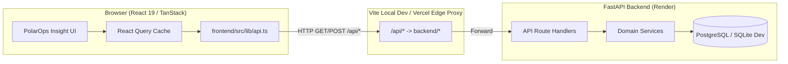

# PolarOps Integration Architecture

## 1. Executive Summary
This document establishes the architecture for integrating the new PolarOps Insight user experience into the proven PolarOps backend system.

The core principle governing this integration is:
> **Frontend adapts to backend, and backend may be extended additively to support genuinely new frontend operational capabilities.**

The backend (FastAPI / PostgreSQL / Pydantic v2) remains the authoritative source of truth for:
- Deterministic operational calculations
- Six-factor asset risk scoring
- Dependency graph traversal and blast radius computation
- Scenario simulations and consequence models
- Telemetry provenance and truth typing (`MEASURED`, `DERIVED`, `SIMULATED`, `ESTIMATED`, `OVERRIDDEN`)
- Human-in-the-loop advisory boundaries

---

## 2. Directory Boundary & Deployment Architecture

```
PolarOps Repository
├── backend/                  # FastAPI Application (Authoritative Domain Source)
│   ├── app/
│   │   ├── api/routes/       # 41 endpoints across 13 domains
│   │   ├── services/         # Calculations, risk engine, BFS traversal
│   │   ├── schemas/          # Pydantic v2 input/output schemas
│   │   └── models/           # SQLAlchemy models
│   └── tests/                # 95 unit & contract tests (100% passing)
│
├── frontend/                 # Protected Production Boundary (Vercel Application Root)
│   ├── package.json          # Vite + React 19 + TanStack Query & Router
│   ├── vite.config.ts        # /api reverse proxy to 127.0.0.1:8000
│   ├── vercel.json           # Vercel SPA routing and /api rewrites
│   ├── tests/e2e/            # Playwright automated E2E test suite
│   └── src/
│       ├── main.tsx          # App entrypoint (QueryClient + RouterProvider + Vercel Analytics)
│       ├── router.tsx        # TanStack Router configuration
│       ├── routeTree.gen.ts  # Auto-generated client route tree
│       ├── routes/           # 11 application routes
│       ├── components/       # PolarOps Insight UI components
│       │   ├── polarops.tsx  # Core application shell and page views
│       │   └── ui/           # Radix / shadcn foundational UI primitives
│       ├── lib/
│       │   ├── api.ts        # Typed API client covering all 41 backend endpoints
│       │   └── demo-data.ts  # Isolated demo data staged for gradual retirement
│       └── hooks/            # Domain query hooks (useHealthCheck, etc.)
│
├── audit/                    # Phase 0 Complete System Audit Artifacts
└── docs/                     # Authoritative Specifications & Architecture
```

### Deployment Alignment
- **Vercel**: Configured to build from `frontend/`. Root directory remains `frontend/`. Output directory is `dist/`. Reverse proxy rewrites route `/api/*` to the Render backend service `https://polarops-api.onrender.com/*`.
- **Render**: Hosts the FastAPI backend at `https://polarops-api.onrender.com/`. Database is managed PostgreSQL on Render.

---

## 3. Communication & Data Flow



---

## 4. Normalization Rules Established in Phase 1
1. **Preserved Production Boundary**: `frontend/` is the single source of truth for the frontend codebase. No split or conflicting root-level frontend execution.
2. **Real Health Wiring**: Hardcoded "AODT CORE ONLINE" replaced with `HealthStatusBadge` querying `GET /api/health` via `useHealthCheck()`. Displays `POLAROPS API ONLINE` (`{ "status": "ok", "service": "polarops-api" }`), `CONNECTING...`, or `BACKEND OFFLINE`.
3. **Clean Module Resolution**: All internal `@/*` imports resolve deterministically to `frontend/src/*` in both TypeScript compiler and Vite bundler.
4. **Zero Backend Regressions**: The 95 existing backend tests remain 100% green without any modification to backend code.
