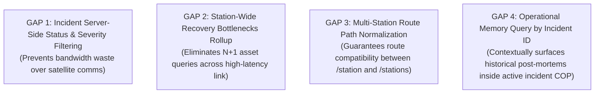

# PolarOps Backend Product Gaps & Additive Extensions

**Author:** Kshitij Parkhe (Product Owner & System Integration Lead)  
**Contributors:** Dhruv (Twin Lead), Tanvi (Decision Lead)  
**Date:** September 2026  
**Repository Branch:** `reimagine/product-blueprint`  
**Baseline:** `5c692ec` (`baseline/phase4-5c692ec`)  
**Target Repository Artifact:** `docs/reimagination/BACKEND_PRODUCT_GAPS.md`

---

## 1. Governance Principles for Backend Evolution

The PolarOps backend (FastAPI / PostgreSQL / SQLite / Pydantic v2) at baseline `5c692ec` is a proven, mathematically rigorous, deterministic calculation engine with **95 passing tests**.

To protect production stability and avoid frivolous backend churn:
1. **Frontend-Driven First:** If a presentation requirement can be achieved through pure frontend transformation or composition, backend modification is strictly **PROHIBITED**.
2. **Additive Only:** Any backend change must be purely additive. Zero breaking changes to existing endpoints, parameters, or schemas.
3. **No Unjustified Infrastructure:** Zero introduction of Kafka, Redis, Neo4j, or external vector databases.
4. **Data Honesty:** Every new or extended response must include the Universal Provenance Contract (`source`, `timestamp`, `freshness_seconds`, `quality`, `truth_type`, `confidence`).

---

## 2. Genuinely Missing Backend Capabilities

Following a comprehensive audit across all three team streams, exactly **Four Genuine Backend Gaps** were identified:



---

### Gap 1: Server-Side Status & Severity Filtering on Incidents

#### Current Capability
`GET /api/incidents?station_id=STATION-BHARATI` returns an unranked array of all historical incidents (Active, Contained, and Resolved) for the station.

#### Missing Capability
Filtering by lifecycle `status` (`ACTIVE`, `CONTAINED`, `RESOLVED`) and `severity` (`CRITICAL`, `MAJOR`, `MODERATE`, `MINOR`) directly in the database query.

#### Why It Matters
Workspace 1 (Situational Command) needs to immediately fetch only active, uncontained emergencies on console startup. In an operational setting with hundreds of archived incidents, downloading the entire historical ledger across a 48 kbps Iridium satellite link introduces unacceptable latency (3–6 seconds).

#### Why Frontend Transformation is Insufficient
Client-side array filtering still requires transmitting the entire payload over the constrained satellite pipe.

#### Proposed Backend Change
Add optional query parameters to `GET /api/incidents`:
```python
@router.get("", response_model=List[IncidentListItemResponse])
def list_incidents(
    station_id: str = Query("STATION-BHARATI", description="Station identifier"),
    status: Optional[IncidentStatus] = Query(None, description="Filter by lifecycle status"),
    severity: Optional[IncidentSeverity] = Query(None, description="Filter by severity tier"),
    db: Session = Depends(get_db),
) -> List[IncidentListItemResponse]:
    return get_all_incidents(db, station_id=station_id, status=status, severity=severity)
```

#### Impact Matrix
- **Data Model Impact:** None (filters existing columns `Incident.status` and `Incident.severity`).
- **API Impact:** Purely additive query parameters; 100% backward compatible.
- **Provenance Impact:** Retains existing `truth_type: MEASURED`.
- **Test Impact:** Add test case `test_list_incidents_filtered_by_status` in `backend/tests/test_day4_resilience.py`.

---

### Gap 2: Station-Wide Recovery Exposure Rollup

#### Current Capability
`GET /api/resources/recovery/{asset_id}` evaluates supply chain recovery exposure (work order blocker, required spare part number, warehouse stock, vessel ETA) for a single machine.

#### Missing Capability
A summary rollup indicating how many total station assets are currently blocked by warehouse stockouts.

#### Why It Matters
Workspace 3 (Life Support & Logistics) needs to display a high-level KPI: *"3 Critical Machines Blocked by Warehouse Stockouts"*.

#### Why Frontend Transformation is Insufficient
To calculate this on the frontend, the client would have to execute 24 sequential HTTP requests (one for every asset in the station) across a 600ms latency link, resulting in a 14-second loading cascade ($N+1$ query disaster).

#### Proposed Backend Change
Extend `GET /api/resources/inventory` response model (`InventoryOverviewResponse`) to include:
```python
class InventoryOverviewResponse(BaseModel):
    station_id: str
    total_spares_count: int
    critical_stockouts_count: int
    blocked_assets_count: int  # <-- Additive field
    items: List[InventorySpareItem]
    provenance: Provenance
```
Computed via an efficient single SQL join in `resource_service.py`:
$$\text{SELECT COUNT(DISTINCT asset\_id) FROM work\_orders WHERE status = 'BLOCKED\_PARTS'}$$

#### Impact Matrix
- **Data Model Impact:** None; leverages existing `WorkOrder` and `InventoryItem` tables.
- **API Impact:** Single additive integer field in `InventoryOverviewResponse`.
- **Provenance Impact:** `truth_type: DERIVED`.
- **Test Impact:** Update assertion in `backend/tests/test_day3_scenarios.py`.

---

### Gap 3: Route Path Normalization for Multi-Station Fleet Endpoints

#### Current Capability
The multi-station comparison endpoints are registered under prefix `/station`:
- `GET /api/station/comparison`
- `POST /api/station/comparison/evaluate`

Some legacy integration hooks and documentation referenced `/stations/compare`.

#### Missing Capability
Canonical route aliases ensuring both `/station/comparison` and `/stations/compare` resolve seamlessly.

#### Why It Matters
Prevents subtle 404 routing errors across cross-functional team branches without requiring client URL gymnastics.

#### Proposed Backend Change
Register route aliases in `backend/app/api/station.py`:
```python
@router.get("/stations/compare", include_in_schema=False)
@router.get("/station/comparison", response_model=StationComparisonResponse)
def get_station_comparison_endpoint(...):
    ...
```

#### Impact Matrix
- **Data Model Impact:** None.
- **API Impact:** Non-breaking alias.
- **Provenance Impact:** None.
- **Test Impact:** Verify in `backend/tests/test_day4_multi_station.py`.

---

### Gap 4: Operational Memory Filtering by Root Incident ID

#### Current Capability
`GET /api/memory?q=...` performs keyword search across stored operational memories and debrief lessons.

#### Missing Capability
Querying operational memories specifically associated with a specific root incident ID (`incident_id`).

#### Why It Matters
When an operator is triaging an active incident in Workspace 1 (e.g. `INC-2026-003: G-02 Vibration Surge`), the Common Operating Picture should automatically surface past post-mortems logged for that exact machine or incident history.

#### Why Frontend Transformation is Insufficient
Text keyword search (`q="G-02"`) returns noisy partial matches rather than the exact foreign-key linked debrief record.

#### Proposed Backend Change
Add optional `incident_id` parameter to `GET /api/memory`:
```python
@router.get("", response_model=MemorySearchResponse)
def search_memory(
    q: Optional[str] = Query(None, description="Keyword search query"),
    station_id: str = Query("STATION-BHARATI", description="Station identifier"),
    incident_id: Optional[str] = Query(None, description="Filter by associated incident ID"),
    db: Session = Depends(get_db),
) -> MemorySearchResponse:
    return search_operational_memory(db, query=q, station_id=station_id, incident_id=incident_id)
```

#### Impact Matrix
- **Data Model Impact:** None; filters existing column `OperationalMemory.incident_id`.
- **API Impact:** Additive query parameter.
- **Provenance Impact:** `truth_type: MEASURED`.
- **Test Impact:** Add test in `backend/tests/test_operational_intelligence.py`.

---
