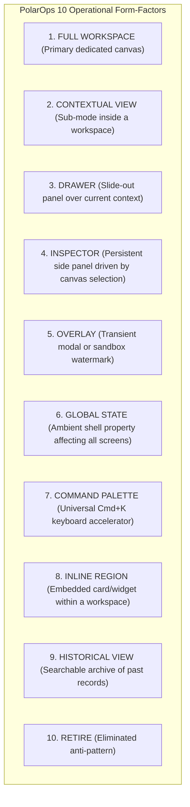

# PolarOps Capability Placement & Form-Factor Matrix

**Author:** Kshitij Parkhe (Product Owner & System Integration Lead)  
**Contributors:** Dhruv (Twin Lead), Tanvi (Decision Lead)  
**Date:** September 2026  
**Repository Branch:** `reimagine/product-blueprint`  
**Baseline:** `5c692ec` (`baseline/phase4-5c692ec`)  
**Target Repository Artifact:** `docs/reimagination/CAPABILITY_PLACEMENT_MATRIX.md`

---

## 1. Architectural Taxonomy

In complex industrial command systems, **not everything deserves to be a full-page route**. Forcing operators to leave their active viewport to check an alert, look up a spare part, or inspect a network packet induces severe cognitive context loss.

PolarOps classifies every capability into one of ten strictly defined operational form-factors:

---

## 2. Definitive Capability Placement Matrix

| # | Operational Capability | Architectural Classification | Host Component & Route | Authoritative Backend Binding | Primary User Trigger | Architectural Justification & Operational Rationale |
|---|---|---|---|---|---|---|
| **1** | **Station Situational Awareness** | `FULL WORKSPACE` | `Workspace 1: Situational Command` (`/command-center`) | `GET /api/station/overview` `GET /api/intelligence/narrative` | Console startup, shift handover, waking up to an alarm. | Requires full-screen command presence for Level 1 & 2 situational awareness, station health score, ambient blizzard alert, and reserve margin dials. |
| **2** | **Active Incident Triage & Common Operating Picture** | `INLINE REGION` (Primary) | `Workspace 1: Active Incident COP` | `GET /api/incidents` `GET /api/incidents/{id}` | Anomaly detection, threshold breach, declared incident. | Must NOT be on a disconnected `/alerts` page. Triage must live directly alongside station headroom to prevent split-attention failure during an emergency. |
| **3** | **Incident Action Execution Ledger** | `INLINE REGION` | `Workspace 1: Incident Action Ledger` | `POST /api/incidents/{id}/actions` `PATCH /api/incidents/{id}/status` | Executing work order, recording physical action, containing incident. | Immutable audit trail attached directly to the active incident COP. |
| **4** | **Living Systems Topology Canvas** | `FULL WORKSPACE` (Canvas) | `Workspace 2: Systems Twin` (`/digital-twin`) | `GET /api/assets/{id}/dependencies` | Deep root-cause investigation, tracing cascading blast radius. | Demands an expansive interactive DAG canvas with dual-flow tracing (upstream power vs downstream life-support consumers). |
| **5** | **Asset Inspector & Telemetry Sparklines** | `INSPECTOR` (Side Panel) | `Workspace 2: Contextual Asset Inspector` | `GET /api/assets/{id}` `GET /api/assets/{id}/telemetry` | Clicking any asset node on the topology canvas. | 380px persistent right-hand panel driven by canvas selection. Displays nameplate specs, $N-1$ redundancy state, and 50-pt SVG sparklines with threshold bands. |
| **6** | **6-Factor Explainable Risk Ladder** | `INSPECTOR` (Embedded) | `Workspace 2: Contextual Asset Inspector` | `GET /api/assets/{id}/risk` | Inspecting degrading asset in Systems Twin. | Ranked vertical driver ladder displaying exact physical evidence strings and mathematical derivation rules. |
| **7** | **5-Stage Causal Explanation** | `DRAWER` | `Global 5-Stage Explanation Drawer` (`Radix Sheet`) | `GET /api/explain/{domain}/{id}` | Clicking "WHY?" or "INSPECT CAUSAL TRACE" from any asset or incident. | Deep-dive explanation (Anomaly, Mechanism, Blast Radius, Logistics, Countermeasures) slides out over the active screen without unmounting context. |
| **8** | **Fuel Autonomy Runway & Thermal Balance** | `FULL WORKSPACE` | `Workspace 3: Life Support & Logistics` (`/resources`) | `GET /api/resources/fuel` `GET /api/resources/energy` | Weekly fuel sounding, approaching blizzard, energy conservation planning. | Tightly couples thermodynamics with diesel burn rates and winter runway days in a unified life-support model. |
| **9** | **Warehouse Critical Spares Inventory** | `INLINE REGION` & `INSPECTOR` | `Workspace 3: Warehouse Ledger` & `Workspace 2 Inspector` | `GET /api/resources/inventory` `GET /api/resources/recovery/{id}` | Requisitioning spare part, verifying maintenance work order readiness. | Embedded inside Workspace 3 for full stock audits, and surfaced contextually in Workspace 2 when inspecting an asset with an active work order. |
| **10** | **Maritime Resupply Vessel Tracking** | `INLINE REGION` | `Workspace 3: Maritime Resupply Tracker` | `GET /api/resources/resupply` | Checking resupply voyage ETA (*MV Vasiliy Golovnin*). | Displays pack-ice navigation progress, inbound spare parts, and delivery confidence badges. |
| **11** | **Science Continuity & Payload Buffering** | `INLINE REGION` | `Workspace 3: Science Continuity Panel` | `GET /api/science/instruments` `POST /api/science/observations/buffer` | Grid overload, load-shedding warning, auroral observation watch. | Allows Science Officer to throttle radar transmission and buffer observations locally, preserving science data during grid conservation. |
| **12** | **Counterfactual Scenario Simulation Engine** | `FULL WORKSPACE` (Mode A) | `Workspace 4: Decision Studio` (`/scenarios`) | `POST /api/scenarios/simulate` | Stress-testing generator trips, polar vortex, or load-shedding options. | A non-destructive sandbox with side-by-side delta matrices, reserve margin collapse/expansion gauges, and vetted decision packages. |
| **13** | **Multi-Station Fleet Coordination & Mutual Aid** | `CONTEXTUAL VIEW` (Mode B) | `Workspace 4: Multi-Station Fleet Tab` | `GET /api/station/comparison` `POST /api/station/comparison/evaluate` `POST /scenarios/cross-station` | Regional logistics coordination, emergency mutual aid between Bharati and Maitri. | Eliminates the disconnected `/stations` route. Consolidates fleet comparison and polar traverse airlift simulations into Strategic Planning. |
| **14** | **Institutional Memory & Knowledge Archive** | `HISTORICAL VIEW` (Mode C) | `Workspace 4: Memory Archive Tab` | `GET /api/memory` `POST /api/memory` | Post-incident debrief, searching past expedition failure modes. | Replaces fake `/reports` table with real backend searchable operational memory (`/memory?q=...`) and structured post-mortem authoring. |
| **15** | **Resilience & Edge Continuity Cockpit** | `DRAWER` & `GLOBAL STATE` | `Global Resilience Drawer` & Header Link Pill | `GET /api/resilience/status` `GET /api/resilience/queue` `POST /api/resilience/restore` | Satellite link degradation, inspecting pending store-and-forward queue. | Eliminates standalone `/resilience` route. Connectivity is an ambient header property; drawer provides deep inspection of P0–P3 queue and SHA-256 hashes. |
| **16** | **Offline Edge Autonomy Mode** | `GLOBAL STATE` | Universal Application Shell | Local SQLite Edge Database + Browser Cache | Satellite signal loss, carrier blackout. | Eliminates standalone `/offline` route. When comms drop, the entire application seamlessly runs in local edge mode with zero modal interruptions. |
| **17** | **Operational Event Stream** | `INLINE REGION` | `Workspace 1: Live Activity Stream` | `GET /api/events` | Monitoring real-time station state transitions and operator commands. | High-density chronologically sorted event ledger with severity pills and truth-type indicators. |
| **18** | **Universal Search & Command Palette** | `COMMAND PALETTE` | Global Modal (`cmdk` / `Cmd+K` or `Ctrl+K`) | Client Fuzzy Index over Assets, Incidents, and Workspaces | Instant keyboard jump to any machine, incident, or tool. | Power-user accelerator bypassing all nested menus. |
| **19** | **Human-in-the-Loop Decision Verification** | `OVERLAY` (Modal Dialog) | Accessible Confirmation Dialog (`Radix Dialog`) | Client Approval Guard + Backend Action Dispatch | Clicking "AUTHORIZE MITIGATION PACKAGE" or "DISPATCH LOAD SHEDDING". | Critical safety gate enforcing two-step confirmation, showing blast-radius impact preview and disclaimer before state mutation. |
| **20** | **Legacy Marketing Landing Page** | `RETIRE` | `/` (Replaced with Station Gateway) | N/A | Initial access to PolarOps. | Marketing copy, generic hero banners, and "Enter System" buttons are purged. Replaced with immediate mission gateway. |
| **21** | **Standalone Settings Page** | `RETIRE` | `/settings` (Replaced with Developer Flyout) | N/A | Developer demo reset, seed toggles. | Cluttered demo buttons removed from primary navigation; accessible via developer command in `Cmd+K`. |

---
