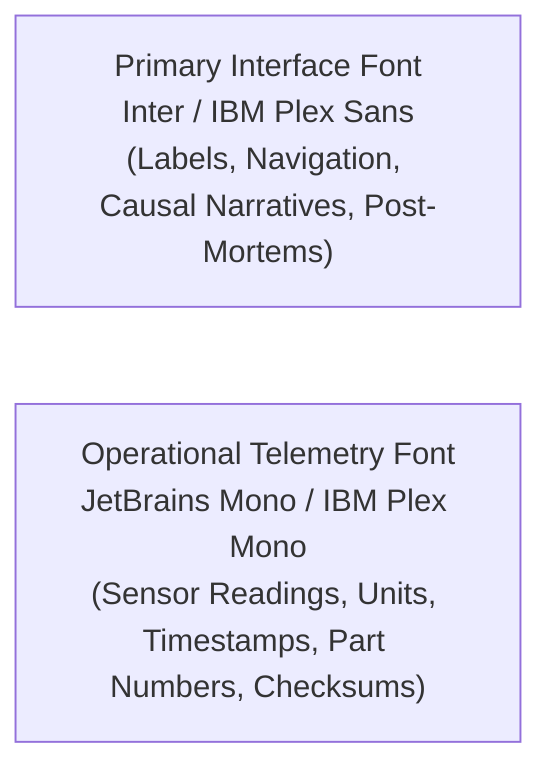

# PolarOps Design System Specification (Polaris Industrial 2.0)

**Author:** Kshitij Parkhe (Product Owner & System Integration Lead)  
**Contributors:** Dhruv (Twin Lead), Tanvi (Decision Lead)  
**Date:** September 2026  
**Repository Branch:** `reimagine/product-blueprint`  
**Baseline:** `5c692ec` (`baseline/phase4-5c692ec`)  
**Target Repository Artifact:** `docs/reimagination/DESIGN_SYSTEM_SPEC.md`

---

## 1. Design Philosophy & Visual Identity

PolarOps is mission-critical industrial software designed for the extreme environment of Antarctica. Its visual identity is **scientific, industrial, operational, and uncompromisingly high-reliability**.

### Explicit Design Anti-Patterns (What PolarOps is NOT)
- ❌ **NOT a generic SaaS marketing dashboard:** No giant purple gradients, floating glassmorphic cards, or vanity KPI banners.
- ❌ **NOT sci-fi / cyberpunk / hacker UI:** No gratuitous glowing wireframes, fake terminal green scans, or pulsating decorative grids.
- ❌ **NOT decorative 3D:** No spinning 3D station exteriors or particle exhaust animations that consume GPU memory on low-power rugged laptops.
- ❌ **NOT a metric graveyard:** No rows of disconnected numbers without thresholds, trends, or physical meaning.

### Positive Design Tenets
- ✔ **Physical Realism:** Visual representations reflect actual engineering assemblies (generators, switchgear, heat exchangers, hydronic loops).
- ✔ **Signal-to-Noise Purity:** 90% of screen pixels convey actionable operational state, headroom margins, or causal evidence.
- ✔ **Triple-Encoded Status:** Color is never the sole communicator of state (Icon + Explicit Label + Semantic Color).
- ✔ **Dark-Slate Polar Architecture:** High-contrast palette engineered for low-light control rooms and zero night-blindness during the polar winter.

---

## 2. Typography & Numerical Representation

To ensure absolute legibility under extreme fatigue and glare, PolarOps uses a dual-font typographic system:

### Type Scale & Hierarchy
| Token | Font Family | Size | Weight | Line Height | Usage |
|---|---|---|---|---|---|
| `font-headline` | Inter | 24px (1.5rem) | 700 (Bold) | 1.2 | Workspace titles, primary incident headers |
| `font-subhead` | Inter | 18px (1.125rem) | 600 (Semibold) | 1.3 | Panel titles, subsystem group headers |
| `font-body` | Inter | 14px (0.875rem) | 400 (Regular) | 1.5 | Explanation text, incident descriptions |
| `font-body-sm` | Inter | 12px (0.75rem) | 500 (Medium) | 1.4 | Table column headers, metadata labels |
| `font-mono-lg` | JetBrains Mono | 20px (1.25rem) | 700 (Bold) | 1.2 | Primary reserve margin kW, fuel runway days |
| `font-mono-base` | JetBrains Mono | 14px (0.875rem) | 600 (Semibold) | 1.4 | Live sensor readings, threshold values |
| `font-mono-sm` | JetBrains Mono | 11px (0.6875rem) | 400 (Regular) | 1.3 | UTC timestamps, SHA-256 hashes, part numbers |

**Rule of Numbers:** Every physical quantity must explicitly render its engineering unit in uppercase monospaced text (e.g. `4.8 mm/s`, `98.2 °C`, `350 kW`, `142,500 L`).

---

## 3. Color Architecture & Semantic Palette

PolarOps operates exclusively on an **Industrial Dark-Slate** foundation, meeting WCAG 2.2 AA contrast standards ($\ge 4.5:1$ for text, $\ge 3:1$ for graphical UI boundaries).

### 3.1 Background & Surface Tiers
- **`bg-canvas` (`#070B12`):** Root application background; deepest obsidian slate.
- **`bg-surface-1` (`#0F172A`):** Primary panel and card surfaces; rich navy-slate.
- **`bg-surface-2` (`#1E293B`):** Nested containers, table rows, and inspector drawers.
- **`bg-surface-elevated` (`#334155`):** Hover states, popovers, dropdown menus, and command palettes.
- **`border-subtle` (`#1E293B`):** Standard 1px panel dividers.
- **`border-strong` (`#334155`):** Active card borders and input focus boundaries.

### 3.2 Typography Colors
- **`text-primary` (`#F8FAFC`):** Primary headlines, active metric values (Contrast: 16.5:1).
- **`text-secondary` (`#94A3B8`):** Field labels, descriptive text, table headers (Contrast: 7.2:1).
- **`text-muted` (`#64748B`):** Inactive elements, unit labels, secondary timestamps (Contrast: 4.6:1).

### 3.3 Semantic Status Palette (Triple-Encoded)
Status colors are mathematically calibrated for dark backgrounds, avoiding harsh neon saturation:

| Semantic State | Hex Code | Icon Glyph | Text Label Requirement | Operational Meaning |
|---|---|---|---|---|
| **`CRITICAL`** | `#EF4444` | `AlertTriangle` | Must display `CRITICAL` | Single-point-of-failure breached; life support jeopardized; immediate intervention. |
| **`WARNING` / `DEGRADED`** | `#F59E0B` | `AlertCircle` | Must display `WARNING` or `DEGRADED` | Reserve margin compressed; redundancy lost; maintenance required. |
| **`NOMINAL` / `ONLINE`** | `#10B981` | `CheckCircle2` | Must display `NOMINAL` or `ONLINE` | Operating within normal physical envelope; full $N-1$ redundancy. |
| **`INFO` / `ADVISORY`** | `#0EA5E9` | `Info` | Must display `INFO` or `ADVISORY` | Operational event, shift handover, routine diagnostic note. |
| **`OFFLINE` / `STORED`** | `#8B5CF6` | `CloudOff` | Must display `OFFLINE` or `LOCAL EDGE` | Local edge autonomy active; actions queued for store-and-forward. |

### 3.4 Physical Engineering Edge Semantics (Topology Graph)
In the dependency graph, edge colors represent the physical conduit type:
- **`ELECTRICAL` (`#E5A93C` — Industrial Gold):** High-voltage busbars, generator feeds, circuit breakers. Animated directional dash indicates active power flow.
- **`THERMAL` (`#E05252` — Hydronic Crimson):** Glycol exhaust recovery loops, boiler feeds, space-heating manifolds. Stroke width indicates kW thermal transfer.
- **`FUEL` (`#D97706` — Diesel Amber):** Arctic-grade diesel supply piping, day tank transfer valves.
- **`DATA` (`#0EA5E9` — Telemetry Cyan):** SCADA sensor loops, PLC busbars, serial instrument data feeds.
- **`PHYSICAL` (`#64748B` — Structural Slate):** Mechanical shaft couplings, skid mountings, fire containment bulkheads.

---

## 4. Provenance Semantics (Data Honesty Badges)

In accordance with repository operating principles, every operational number must state its scientific truth type:

| Truth Type | Badge Style | Operational Definition |
|---|---|---|
| **`MEASURED`** | Solid Emerald Pill (`bg-emerald-950 text-emerald-400 border-emerald-800`) | Direct physical telemetry from calibrated station transducer or physical sounding. |
| **`DERIVED`** | Solid Slate Pill (`bg-slate-900 text-slate-300 border-slate-700`) | Deterministic mathematical calculation from verified physical equations (e.g. $Q_{th} = 5.2 \times \Delta T$). |
| **`SIMULATED`** | Striped Amber Pill (`bg-amber-950 text-amber-300 border-amber-800`) | Hypothetical counterfactual projection generated by the simulation engine. Zero physical reality. |
| **`ESTIMATED`** | Dotted Cyan Pill (`bg-sky-950 text-sky-300 border-sky-800`) | Projection based on external voyage schedules (e.g. *MV Vasiliy Golovnin* AIS tracking). |
| **`OVERRIDDEN`** | High-Contrast Purple Pill (`bg-purple-950 text-purple-300 border-purple-800`) | Manual operator override value entered to bypass a faulty sensor. |

---

## 5. Density Tiers & Layout Grid

PolarOps implements three strict industrial density tiers:

### 5.1 High-Density Compact Tier (32px Row Height)
- **Used For:** Telemetry tables, spare parts catalogs, offline sync queue lists, dependency treegrids.
- **Specifications:** Padding: `px-3 py-1.5`; Font: `font-mono-sm`; Action buttons: `h-7 px-2`.
- **Purpose:** Maximize information density per viewport so operators never have to scroll during an active emergency.

### 5.2 Standard Operational Tier (48px Row Height)
- **Used For:** Active incident cards, station overview cards, scenario delta comparisons, equipment nameplates.
- **Specifications:** Padding: `px-4 py-3`; Font: `font-body-sm`; Icon size: `18px`.
- **Purpose:** Balanced readability and rapid visual scannability.

### 5.3 Diagnostic Expanded Tier (64px+ Row Height)
- **Used For:** 5-Stage Explanation Drawer, Decision Options with trade-off matrices, and post-mortem debrief cards.
- **Specifications:** Padding: `p-6`; Font: `font-body`; Generous leading (`leading-relaxed`) for deep technical reading.

---

## 6. Surfaces, Borders & Corner Radii

- **Corners:** Crisp, industrial geometry. Strictly `rounded-sm` (2px) or `rounded-md` (4px). Massive pill cards or bubbly rounded-2xl containers are prohibited.
- **Borders:** Subtle 1px solid slate borders (`border border-slate-800/80`). Dividers use clean single-pixel hairline rules.
- **Elevation & Shadows:** Minimalist ambient shadows (`shadow-sm shadow-black/40`). Zero floating drop shadows. Panels feel physically embedded into the console chassis.

---

## 7. Motion, Transition & Interaction Physics

- **Functional Only:** Motion exists solely to convey spatial orientation and system state transitions. Bouncy spring animations, parallax scrolling, and playful physics are forbidden.
- **Drawers & Sheets:** Fast, decisive 150ms ease-out slide (`cubic-bezier(0.16, 1, 0.3, 1)`).
- **Hazard Pulsing:** When an asset is in `CRITICAL` state or acts as an active Single-Point-of-Failure ($N-0$), it emits a subtle 1.5-second linear pulsing border halo (`box-shadow: 0 0 12px rgba(239, 68, 68, 0.4)`).
- **Telemetry Sparkline Hover:** Instantaneous 0ms crosshair cursor revealing precise timestamp, value, and deviation from threshold.

---

## 8. Data Visualization Standards

### 8.1 50-Point Telemetry Sparklines
- **Width:** 180px–240px; **Height:** 36px–48px.
- **Stroke Width:** 1.5px high-contrast vector stroke.
- **Threshold Reference Bands:** Dotted red horizontal line at Critical threshold; dotted amber line at Warning threshold; light slate baseline.
- **Trend Chevrons:** Explicit trend indicators: `↑ RISING (+1.2°C/min)` | `↓ FALLING (-0.4 bar/h)` | `→ STABLE`.

### 8.2 Operational Headroom Circular Gauges
- **Style:** 180° semi-circular arc gauge or dual-concentric ring gauge.
- **Ticks:** Major ticks at 0%, 50%, 80%, and 100% rated capacity.
- **Zones:** Green arc (Normal operating envelope), Amber arc (Compressed reserve), Crimson arc (Critical trip danger zone).

### 8.3 Tabular Alternate for Visual Graphs
- Every topological diagram must provide an accessible, 1-click **TreeGrid Alternative** (`aria-label="Dependency Matrix"`) providing keyboard navigation and full screen-reader support.

---

## 9. Accessibility & Rugged Field Controls

- **WCAG 2.2 SC 2.4.11 / 2.4.13 Focus Appearance:** High-contrast 2px solid cyan ring (`outline: 2px solid #0EA5E9; outline-offset: 2px`) on all focused elements. Focus is never suppressed.
- **WCAG 2.2 SC 2.5.8 Target Sizing:** Minimum clickable target area is $24 \times 24\text{ px}$. Primary emergency dispatches, load-shedding toggles, and modal confirmations are $\ge 44 \times 44\text{ px}$ to accommodate gloved hands.
- **WCAG 2.2 SC 4.1.3 Status Announcements:** Telemetry threshold breaches and offline sync updates announce silently to screen readers via `
`.

---
