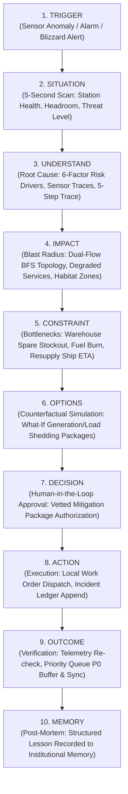
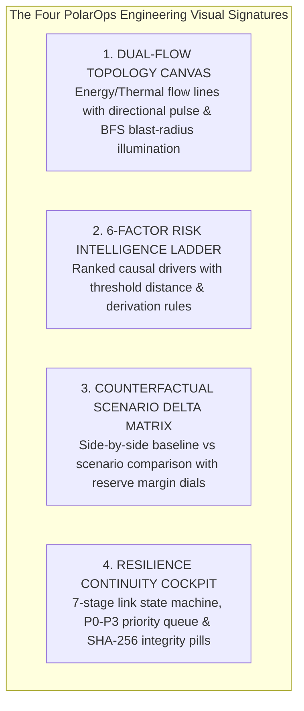

# PolarOps Unified Experience Architecture

**Author:** Kshitij Parkhe (Product Owner & System Integration Lead)  
**Contributors:** Dhruv (Twin Lead), Tanvi (Decision Lead)  
**Date:** September 2026  
**Repository Branch:** `reimagine/product-blueprint`  
**Baseline:** `5c692ec` (`baseline/phase4-5c692ec`)  
**Target Repository Artifact:** `docs/reimagination/EXPERIENCE_ARCHITECTURE.md`

---

## 1. Executive Vision: The 03:00 AM Antarctic Crisis Standard

> *"What should PolarOps feel like when an operator opens it during a real operational emergency at 03:00 AM during an Antarctic winter blizzard?"*

In commercial software, "user experience" is often equated with aesthetic whitespace, smooth animations, or conversion funnels. At **Bharati Station** (Larsemann Hills) and **Maitri Station** (Schirmacher Oasis), UX is a **life-support function**.

When an alarm sounds at 03:00 AM:
- Ambient temperature is **-42°C**, wind is howling at **55 knots** (Blizzard Severity 2).
- The station is physically isolated for the next **6 months**; no rescue plane can land on the blue-ice runway.
- An operator running to the console is cold, sleep-deprived, and experiencing high autonomic stress.
- The satellite uplink is degraded, suffering packet loss and 2,400 ms latency.

In that defining moment, **PolarOps must not feel like a SaaS web app**. It must feel like an **aircraft cockpit or nuclear power plant control console**:
1. **Zero Ambiguity (5-Second Scan):** Immediate comprehension of station survivability, available electrical reserve (kW), thermal hold time (hours), and active life-support hazards.
2. **Deterministic Physics over Generic CRUD:** Power generation and thermal heating are inextricably coupled. Generator G-02 is not a database record; it is 350 kW of electricity and 210 kW of habitat heating.
3. **Unbroken Operational Chain:** The operator moves seamlessly from anomaly detection to root-cause investigation, downstream blast radius, supply chain blockers, counterfactual simulation, human authorization, and cryptographic audit logging without ever losing context or re-entering data.
4. **Honest Data Provenance:** Every metric explicitly discloses whether it is `MEASURED` by physical sensors, `DERIVED` by deterministic physics models, or `SIMULATED` as a counterfactual hypothesis.
5. **Calm, High-Contrast Authority:** High-density, dark-slate visual architecture engineered for dark control rooms, non-glare legibility, and full keyboard/gloved-hand accessibility.

---

## 2. The Universal Operational Loop

Every workflow in PolarOps adheres strictly to the **10-Stage Operational Loop**:

$$\text{TRIGGER} \longrightarrow \text{SITUATION} \longrightarrow \text{UNDERSTAND} \longrightarrow \text{IMPACT} \longrightarrow \text{CONSTRAINT} \longrightarrow \text{OPTIONS} \longrightarrow \text{DECISION} \longrightarrow \text{ACTION} \longrightarrow \text{OUTCOME} \longrightarrow \text{MEMORY}$$

---

## 3. The 11 Core End-to-End Operational User Journeys

### Journey 1: Asset Anomaly (Vibration Surge on Primary Generator G-02)
- **1. Trigger:** SCADA accelerometer transducer `SENS-G02-VIB` breaches warning threshold (4.8 mm/s vs 3.5 mm/s limit).
- **2. Situation:** Situational Command flags `STATION-BHARATI` as `DEGRADED`. Generation reserve warns: 400 kW $\rightarrow$ 50 kW if G-02 trips.
- **3. Understand:** Engineer inspects G-02. Risk Intelligence 2.0 ranks top driver: `VIBRATION_SEVERITY` (Score 91/100, Tribological bearing degradation). 5-Stage Explanation Drawer confirms stator temp rising at 1.2°C/min.
- **4. Impact:** Downstream topology highlights electrical busbar `BUS-01` and thermal exhaust loop to `HVAC-02`. Single-point-of-failure ($N-0$) link to Habitat Heating Zone 2 pulses amber.
- **5. Constraint:** Recovery exposure indicates spare bearing kit `SK-402` has **0 units available** in Warehouse Bin M-2. Active work order `MWO-2026-089` is blocked. Inbound vessel *MV Vasiliy Golovnin* is 11 days away in pack ice.
- **6. Options:** Scenario engine projects G-02 trip under current -38°C weather: thermal hold time is 3.8 hours before pipe freezing. Generates countermeasure package: Dispatch standby Generator G-01 + Preheat auxiliary Boiler B-01 + Shed non-critical science radar.
- **7. Decision:** Chief Engineer reviews trade-off matrix: Science continuity sacrificed (P2), but Habitat life support maintained ($N-1$ restored). Approves package.
- **8. Action:** Work order updated; technician dispatched to powerhouse for G-01 pre-start check.
- **9. Outcome:** G-01 synchronization successful; G-02 load throttled to 35%; vibration stabilizes at 3.1 mm/s.
- **10. Memory:** Event logged to Operational Memory: "Throttling G-02 to 35% reduces bearing shear strain sufficiently to buy 14 days runway until maritime resupply."

---

### Journey 2: Dependency Failure (Switchgear Busbar Breaker Trip)
- **1. Trigger:** High-voltage circuit breaker `CB-MAIN-01` trips unexpectedly on ground fault.
- **2. Situation:** Workspace 1 flashes `CRITICAL` alert: Station generation capacity drops to 0 kW on primary bus; emergency battery UPS activates with 42 minutes runway.
- **3. Understand:** Engineer opens Systems Twin Topology. Busbar `BUS-01` is marked `OFFLINE`. Upstream supply from all three generators is severed at the tie.
- **4. Impact:** Dual-flow BFS traversal instantly illuminates cascading blast radius: Water Treatment Plant `WTP-01`, Main Galley, and Communication Transceiver array are unpowered. Life support survival clock begins ticking down.
- **5. Constraint:** Transfer switch `ATS-02` cannot be remotely toggled due to blown auxiliary control fuse. Replacement fuse is in Powerhouse sub-panel.
- **6. Options:** Simulation recommends manual isolation of faulty bus segment and manual bypass via Tie Contactor `TIE-02`.
- **7. Decision:** Station Commander authorizes immediate manual tie breaker closure.
- **8. Action:** Power technician enters high-voltage bay with insulated PPE and manually throws bypass switch.
- **9. Outcome:** Secondary bus energizes; life-support circuits recover; UPS begins recharging.
- **10. Memory:** Root-cause debrief records: "Inspect busbar condensation seals monthly during transition from summer to winter."

---

### Journey 3: Spare Parts Stockout (Critical Water Treatment Valve)
- **1. Trigger:** Solenoid valve `VLV-WTP-04` fails open; reverse osmosis skid shuts down.
- **2. Situation:** Workspace 3 (Life Support & Logistics) indicates potable water production halted. Reserve tank volume: 14,200 liters (18 days consumption at 40 L/person-day).
- **3. Understand:** Equipment card indicates mechanical seal erosion. Part number `SP-RO-VLV-12` has inventory count = 0.
- **4. Impact:** Inability to produce fresh water forces emergency rationing protocol within 7 days.
- **5. Constraint:** No resupply vessel scheduled for 5 months. Maitri Station is 3,000 km away across the polar plateau.
- **6. Options:** Decision Studio simulates inter-station mutual aid query (`POST /api/scenarios/cross-station`): Maitri has 2 compatible spare valves in stock; Basler BT-67 polar aircraft can execute traverse flight if wind < 30 knots.
- **7. Decision:** Station Commander requests NCPOR authorization for inter-station spare airlift.
- **8. Action:** Joint dispatch logged in cross-station ledger; Maitri ground crew preps cargo crate.
- **9. Outcome:** Flight arrives during 24-hour weather window; valve replaced; RO skid online.
- **10. Memory:** Recorded in `/memory`: "Maitri RO valve standardization enables cross-station mutual aid survival buffer."

---

### Journey 4: Fuel / Energy Constraint (Blizzard Polar Vortex Surge)
- **1. Trigger:** Satellite weather forecasting warns of approaching Category 3 polar vortex: temperature dropping to -48°C, winds sustained at 70 knots for 96 hours.
- **2. Situation:** Energy model recalculates thermal demand: Heat loss surges from 180 kW to 353 kW. Diesel burn rate accelerates from 45 L/h to 78 L/h.
- **3. Understand:** Fuel runway drops from 220 days to 164 days, breaching the mandatory 180-day winter buffer policy.
- **4. Impact:** Auxiliary electric immersion heaters will fire continuously, consuming all generation reserve margin (reserve kW drops to 12 kW).
- **5. Constraint:** External fuel transfer from bulk bladders to day tanks is physically impossible during a 70-knot blizzard due to safety regulations.
- **6. Options:** Decision Studio simulates building zone setbacks: Lower Living Quarters setpoint from 21°C to 18°C; isolate unused science laboratories; transfer day tank fuel prior to storm onset.
- **7. Decision:** Commander approves Blizzard Energy Conservation Plan.
- **8. Action:** Building automation setback commanded; day tanks filled to 100% capacity (4,800 L buffer).
- **9. Outcome:** Fuel consumption during blizzard held to 58 L/h; winter runway preserved at 192 days.
- **10. Memory:** Recorded in `/memory`: "Pre-storm thermal setback saves 20 L/h and prevents hazardous mid-blizzard fuel transfers."

---

### Journey 5: Communication Degradation & Edge Continuity (Satellite Severance)
- **1. Trigger:** Heavy snow accumulation on radome combined with geomagnetic storm severs Ku-band satellite carrier link.
- **2. Situation:** Persistent Global Shell transitions link badge from `ONLINE (580ms)` to `OFFLINE (Local Operation Active)`. Ambient UI shifts seamlessly to Edge Autonomy.
- **3. Understand:** Zero modal popups or error screens appear. The system continues operating off the local SQLite database.
- **4. Impact:** Central NCPOR headquarters in Goa loses live telemetry feed; local station operations proceed without interruption.
- **5. Constraint:** Remote approval from Goa is unavailable; station commander exercises full local decision authority.
- **6. Options:** Engineer logs two maintenance actions and an inventory update. Edge Continuity cockpit routes actions into the **P0 / P1 Priority Queue** with canonical SHA-256 hashes.
- **7. Decision:** Local incident containment authorized autonomously.
- **8. Action:** Actions executed locally; store-and-forward queue accumulates 14 verified packets.
- **9. Outcome:** 6 hours later, satellite link locks carrier (`RESTORING`). System initiates priority handshake; P0 packets sync first; SHA-256 checksums verified; database reconciled.
- **10. Memory:** Audit event recorded: "Store-and-forward reconciled 14 packets with zero loss and zero manual conflict resolution."

---

### Journey 6: Operational Incident Lifecycle (Active Fire Alarm in Battery Room)
- **1. Trigger:** Thermal ionization sensor detects rapid temperature rise in UPS Battery Bay 2.
- **2. Situation:** Workspace 1 flashes Emergency Incident `INC-2026-004: Battery Thermal Runaway`. Auditory tone sounds; Common Operating Picture dominates screen.
- **3. Understand:** Incident COP outlines: Root asset `BATT-UPS-02`, affected zone `Z-POWER-LOWER`, modeled station risk = 98/100.
- **4. Impact:** Halon suppression release will vent zone; primary UPS offline; electrical switchgear vulnerable to power transients.
- **5. Constraint:** Crew safety: Zone must be evacuated within 60 seconds before suppression gas discharge.
- **6. Options:** COP surfaces emergency response options: (A) Trigger Halon Discharge & Isolate DC Breaker, (B) Switch essential loads to Generator Direct Feed.
- **7. Decision:** Commander clicks "AUTHORIZE EMERGENCY ISOLATION & HALON".
- **8. Action:** Immutable Action Ledger logs commander's identity, timestamp, and command. DC breaker tripped; fire suppressed.
- **9. Outcome:** Incident transitions to `CONTAINED`. Thermal sensors confirm cooling. Essential circuits remain powered via direct generator bus.
- **10. Memory:** Post-incident review logged: "Annual battery impedance testing must be scheduled before polar winter onset."

---

### Journey 7: What-If Counterfactual Investigation (Simulating Winter Generator Overhaul)
- **1. Trigger:** Chief Engineer plans mandatory 5,000-hour overhaul of Generator G-01 during polar night.
- **2. Situation:** Station is operating on G-01 + G-02 with G-03 in reserve.
- **3. Understand:** Engineer opens Workspace 4 (Decision Studio) and seeds scenario: "Trip G-01 for 120 hours under ambient -35°C."
- **4. Impact:** Simulation Delta Matrix reveals:
  - Generation capacity drops from 750 kW to 500 kW.
  - Reserve margin drops from 220 kW (44%) to 95 kW (19%).
  - If G-02 experiences an unexpected trip during the overhaul, station generation drops to G-03 alone (250 kW), causing immediate 80 kW electrical deficit.
- **5. Constraint:** Overhaul requires continuous 5-day downtime; cannot be aborted once engine block is disassembled.
- **6. Options:** Decision Studio generates mitigation packages: Pre-warm G-03 to standby readiness; postpone overhaul until ambient temperature rises above -25°C in October; or implement 40 kW pre-emptive load shedding.
- **7. Decision:** Chief Engineer defers overhaul by 3 weeks until weather window stabilizes.
- **8. Action:** Overhaul schedule in maintenance ledger updated to October 15.
- **9. Outcome:** Station avoids high-risk single-generator exposure during polar vortex season.
- **10. Memory:** Scenario simulation report archived in operational memory for next expedition's engineering team.

---

### Journey 8: Human-in-the-Loop Decision Execution (Load Shedding During Grid Overload)
- **1. Trigger:** Auxiliary snow melter kicks in while two galley ovens are firing; station total electrical load surges to 475 kW against 500 kW capacity (reserve margin compressed to 25 kW / 5%).
- **2. Situation:** Warning banner triggers: "OPERATIONAL HEADROOM COMPRESSED — RISK OF CASCADING BREAKER TRIP."
- **3. Understand:** Engineer inspects real-time consumer breakdown in Systems Twin: Galley (85 kW), Snow Melter (90 kW), Upper Atmosphere Radar (65 kW), Habitats (180 kW).
- **4. Impact:** If total load exceeds 500 kW, main generator breaker will trip on overcurrent, causing total station blackout.
- **5. Constraint:** Crew comfort vs life support vs scientific data loss.
- **6. Options:** Decision Studio surfaces ranked load-shedding tiers:
  - *Tier 1 (Safe):* Shed Snow Melter (recovers 90 kW; zero scientific or habitat impact).
  - *Tier 2 (Moderate):* Shed Upper Atmosphere Radar (recovers 65 kW; buffers scientific observation in local edge queue).
- **7. Decision:** Engineer selects Tier 1: Shed Snow Melter. System presents explicit verification modal showing load drop preview.
- **8. Action:** Engineer clicks "EXECUTE LOAD SHEDDING". Command sent to building management PLC.
- **9. Outcome:** Total load drops to 385 kW; generation reserve margin expands back to 115 kW (23%); station returns to `NOMINAL`.
- **10. Memory:** Action ledger records load-shedding execution time (14 seconds from alert to resolution).

---

### Journey 9: Science Continuity & Payload Buffering
- **1. Trigger:** During power conservation mode, Science Officer is notified that Upper Atmosphere Seismograph and MST Radar are scheduled for load shedding.
- **2. Situation:** MST Radar is capturing once-in-a-decade auroral ionospheric event. Cutting power means unrecoverable scientific loss.
- **3. Understand:** Science Officer checks Workspace 3 (Science & Resource Continuity). Backend endpoint `GET /api/science/instruments` indicates buffer memory has 48 hours local capacity.
- **4. Impact:** Cutting satellite transmission bandwidth is acceptable; cutting instrument sensor power is disastrous.
- **5. Constraint:** Radar transmitter draws 45 kW; instrument data logger draws only 800 W.
- **6. Options:** Science Officer configures "Low-Power Observation Buffer Mode": Radar transmission pulse power throttled to passive reception; raw sensor observations buffered locally via `POST /api/science/observations/buffer`.
- **7. Decision:** Station Commander approves instrument low-power retention.
- **8. Action:** Power draw drops from 45 kW to 800 W; scientific observations saved to local solid-state buffer.
- **9. Outcome:** Scientific data fully preserved; station electrical load reduced by 44.2 kW.
- **10. Memory:** Protocol logged: "Low-power passive science buffering preserves auroral data during grid conservation."

---

### Journey 10: Cross-Station Resource Coordination (Bharati $\leftrightarrow$ Maitri Mutual Aid)
- **1. Trigger:** Bharati Station fuel sounding reveals a suspected subterranean pipe leak; fuel runway drops below winter survivability limit.
- **2. Situation:** Station Commander opens Workspace 4, switching to **Multi-Station Fleet Coordination**.
- **3. Understand:** System queries `GET /api/station/comparison`. Side-by-side portfolio reveals:
  - Bharati Station: 112 days fuel runway (Deficit: 68 days).
  - Maitri Station: 245 days fuel runway (Surplus: 65 days).
- **4. Impact:** Bharati cannot survive through October without external fuel augmentation.
- **5. Constraint:** 3,000 km overland traverse across Queen Maud Land requires 22 days by PistenBully convoys; winter traverse impossible due to crevasse fields. Only air traverse during summer or emergency air-drop is feasible.
- **6. Options:** Decision Studio simulates cross-station scenario (`POST /api/scenarios/cross-station`): Evaluate emergency air-drop of 20,000 L arctic fuel vs temporary evacuation of non-essential personnel to Maitri.
- **7. Decision:** NCPOR Mission Director in Goa convenes emergency multi-station council; selects Personnel Evacuation Option for 8 non-wintering scientists.
- **8. Action:** Joint flight manifest generated; Maitri preps spare accommodation modules.
- **9. Outcome:** Bharati headcount reduced from 24 to 16; daily fuel burn rate drops by 32%; fuel runway extends back to 184 days.
- **10. Memory:** Cross-station operational memory updated with evacuation fuel-reduction coefficients.

---

### Journey 11: Post-Event Review & Institutional Memory Search
- **1. Trigger:** End-of-season operational debrief; newly appointed Station Commander prepares for winter handover.
- **2. Situation:** Commander wants to understand historical failure modes and previous mitigation decisions made during winter polar night.
- **3. Understand:** Commander opens **Institutional Memory & Knowledge Archive** in Workspace 4.
- **4. Impact:** Avoids repeating unvetted experiments or hazardous operating configurations.
- **5. Constraint:** Search must work instantaneously in offline edge mode without internet.
- **6. Options:** Commander queries: `"generator vibration winter blizzard"`.
- **7. Decision:** System returns structured memory records:
  - *Record MEM-2025-012:* G-02 bearing vibration surge during July blizzard. Throttled to 35% load. Maintained lubrication temp above 55°C.
  - *Record MEM-2024-008:* Boiler B-01 burner flameout due to fuel waxing at -45°C. Remedied by blending kerosene additive.
- **8. Action:** Commander incorporates historical fuel preheating guidelines into the upcoming winter SOP.
- **9. Outcome:** Station operates through next winter season with zero generator trips or fuel waxing incidents.
- **10. Memory:** Knowledge continuity maintained across rotating expedition teams.

---

## 4. Visual Signatures of PolarOps

PolarOps possesses **Four Genuine Engineering Visual Signatures**, derived directly from its physics engines and data models:

1. **Dual-Flow Living Topology Canvas:**
   - Direct visual encoding of physical energy flow: Golden electrical lines ($11\text{ kV} / 415\text{ V}$) and crimson thermal hydronic loops ($85^\circ\text{C}$ supply / $65^\circ\text{C}$ return).
   - Instant toggle between *Upstream Supply Lineage* (cyan) and *Downstream Blast Radius* (amber/red pulsing).
2. **6-Factor Risk Intelligence 2.0 Driver Ladder:**
   - Ranked vertical ladder of physical degradation drivers (Thermal, Vibration, Oil, Overhaul, Load, Weather).
   - Each driver displays current value, critical threshold, trend chevron, and mathematical derivation rule.
3. **Counterfactual Scenario Delta Matrix:**
   - Real-time side-by-side comparison of active reality vs simulated hypothesis.
   - Dual-ring circular gauges showing instant reserve margin expansion/collapse ($+120\text{ kW}$ or $-180\text{ kW}$) and fuel runway shift.
4. **Edge Resilience Continuity Cockpit:**
   - Visual 7-stage state machine disclosing satellite link latency, packet health, and offline store-and-forward status.
   - Live P0–P3 priority packet inspector with green cryptographic SHA-256 checksum verification badges.

---
