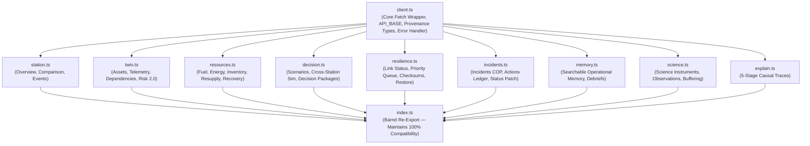

# PolarOps Final API Client Architecture & Domain Ownership

**Author:** Kshitij Parkhe (Product Owner & System Integration Lead)  
**Contributors:** Dhruv (Twin Lead), Tanvi (Decision Lead)  
**Date:** September 2026  
**Status:** AUTHORITATIVE & FINAL  
**Repository Branch:** `reimagine/product-blueprint`  
**Baseline:** `5c692ec` (`baseline/phase4-5c692ec`)  
**Target Repository Artifact:** `docs/reimagination/FINAL_API_OWNERSHIP.md`

---

## 1. Modularization Rationale: Eliminating Monolithic Merge Conflicts

At baseline `5c692ec`, all 41 endpoints across 13 backend domains are defined in a single monolithic file: `frontend/src/lib/api.ts` (1,278 lines, 41 KB).

As identified by Dhruv and Tanvi, having three developers concurrently edit `api.ts` during parallel feature work invites continuous Git merge conflicts, broken imports, and typing collisions.

### Structural Decision
In Phase 1, `frontend/src/lib/api.ts` is refactored into a **Domain-Modular Package** under `frontend/src/lib/api/`, with a master `index.ts` re-exporting all types and functions to maintain **100% backward compatibility** with existing hooks and routes:



---

## 2. Domain Module Specification & File Ownership

| Module File | Lead Owner | Backend Endpoints Covered | Primary Client Functions |
|---|---|---|---|
| `client.ts` | **Kshitij** | N/A (Core infrastructure) | Base `apiFetch()`, `Provenance` interface, RFC 7807 error parser. |
| `station.ts` | **Kshitij** | `GET /station/overview`<br>`GET /station/comparison`<br>`POST /station/comparison/evaluate`<br>`GET /events` | `fetchStationOverview()`, `fetchStationComparison()`, `evaluateStationComparison()`, `fetchOperationalEvents()`. |
| `explain.ts` | **Kshitij** | `GET /explain/{domain}/{id}` | `fetchExplanation(domain, id, stationId)`. |
| `twin.ts` | **Dhruv** | `GET /assets`<br>`GET /assets/{id}`<br>`GET /assets/{id}/dependencies`<br>`GET /assets/{id}/telemetry`<br>`GET /assets/{id}/risk` | `fetchAssets()`, `fetchAssetDetail()`, `fetchAssetDependencies()`, `fetchAssetTelemetry()`, `fetchAssetRisk()`. |
| `resources.ts` | **Tanvi** | `GET /resources/fuel`<br>`GET /resources/inventory`<br>`GET /resources/resupply`<br>`GET /resources/energy`<br>`GET /resources/recovery/{id}` | `fetchFuelStatus()`, `fetchInventory()`, `fetchResupply()`, `fetchEnergyModel()`, `fetchRecoveryExposure()`. |
| `decision.ts` | **Tanvi** | `POST /scenarios/simulate`<br>`POST /scenarios/cross-station` | `simulateScenario()`, `simulateCrossStationScenario()`. |
| `resilience.ts` | **Tanvi** | `GET /resilience/status`<br>`GET /resilience/queue`<br>`POST /resilience/simulate-offline`<br>`POST /resilience/restore`<br>`POST /resilience/events`<br>`POST /resilience/retry/{id}`<br>`POST /resilience/reset` | `fetchResilienceStatus()`, `fetchSyncQueue()`, `simulateOffline()`, `restoreAndSync()`, `createResilienceEvent()`, `retryQueueItem()`, `resetResilienceSimulation()`. |
| `incidents.ts` | **Tanvi** | `GET /incidents`<br>`GET /incidents/{id}`<br>`POST /incidents`<br>`POST /incidents/{id}/actions`<br>`PATCH /incidents/{id}/status` | `fetchIncidents()`, `fetchIncidentDetail()`, `createIncident()`, `logIncidentAction()`, `updateIncidentStatus()`. |
| `memory.ts` | **Tanvi** | `GET /memory`<br>`POST /memory` | `searchOperationalMemory()`, `recordOperationalMemory()`. |
| `science.ts` | **Tanvi** | `GET /science/instruments`<br>`GET /science/instruments/{id}/observations`<br>`POST /science/observations/buffer` | `fetchScienceInstruments()`, `fetchInstrumentObservations()`, `bufferScienceObservation()`. |
| `index.ts` | **Kshitij** | Barrel re-export | Aggregates all above modules. |

---

## 3. Backward Compatibility Guarantee

Existing code importing from `frontend/src/lib/api.ts` will continue to compile without modification:
```typescript
// Legacy import pattern (STILL 100% VALID):
import { fetchStationOverview, fetchAssets, simulateScenario } from "@/lib/api";

// New modular import pattern (ENCOURAGED FOR ISOLATION):
import { fetchAssets, fetchAssetDependencies } from "@/lib/api/twin";
import { simulateScenario } from "@/lib/api/decision";
```

This guarantees zero migration risk while allowing Dhruv and Tanvi to add domain-specific types and helpers inside their owned files without touching each other's code.

---
