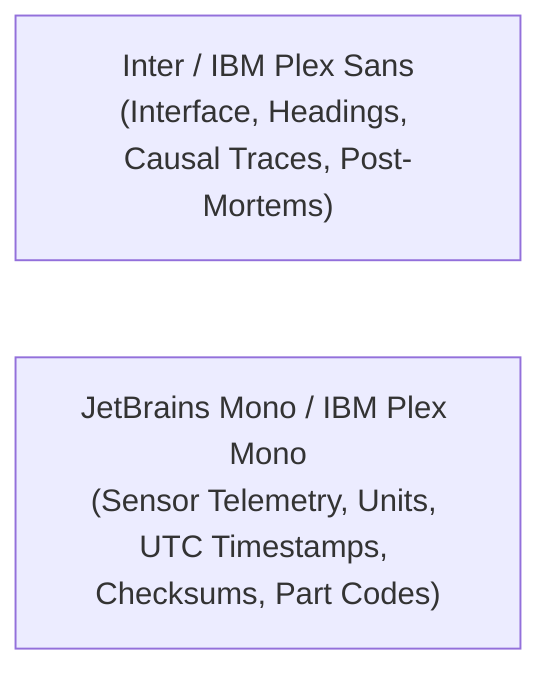

# PolarOps Final Design System Specification (Polaris Industrial 2.0)

**Author:** Kshitij Parkhe (Product Owner & System Integration Lead)  
**Contributors:** Dhruv (Twin Lead), Tanvi (Decision Lead)  
**Date:** September 2026  
**Status:** AUTHORITATIVE & FINAL  
**Repository Branch:** `reimagine/product-blueprint`  
**Baseline:** `5c692ec` (`baseline/phase4-5c692ec`)  
**Target Repository Artifact:** `docs/reimagination/FINAL_DESIGN_SYSTEM_SPEC.md`

---

## 1. Visual Identity & Philosophical Core

PolarOps rejects consumer web design conventions in favor of **mission-critical polar engineering standards**.

### Prohibited Aesthetic Paradigms
- ❌ **Generic SaaS Marketing:** No purple gradient fills, floating bubbly cards, or decorative hero banners.
- ❌ **Cyberpunk / Sci-Fi HUD:** No faux-hacker glowing wireframes, scanlines, or neon green text.
- ❌ **Glassmorphism:** No blurred semi-transparent backdrops that degrade text contrast and legibility under glare.
- ❌ **Cosmetic 3D:** No WebGL particle effects, rotating station exterior meshes, or GPU-heavy animations.

### Authoritative Visual Pillars
- ✔ **Antarctic Industrial Minimalism:** Deep obsidian slate foundation with clean 1px structural hairline dividers.
- ✔ **High-Density Signal Purity:** Every pixel serves operational comprehension, reserve margin tracking, or causal evidence.
- ✔ **Triple-Encoded Status:** Universal compliance with WCAG 2.2 SC 1.4.1 (Color + Icon + Explicit Label).
- ✔ **Rugged Field Ergonomics:** Optimized for 1024×768 displays, gloved hands ($\ge 48\text{px}$ targets), and zero night-vision degradation.

---

## 2. Typography & Numerical Standards

### Type Hierarchy Specifications
| Token | Family | Size | Weight | Line Height | Usage |
|---|---|---|---|---|---|
| `font-headline` | Inter | 22px (1.375rem) | 700 (Bold) | 1.2 | Workspace titles, active incident headers |
| `font-subhead` | Inter | 16px (1.0rem) | 600 (Semibold) | 1.3 | Panel headers, subsystem section titles |
| `font-body` | Inter | 13px (0.8125rem) | 400 (Regular) | 1.5 | Explanation narratives, incident descriptions |
| `font-body-sm` | Inter | 11px (0.6875rem) | 500 (Medium) | 1.4 | Table column headers, metadata labels |
| `font-mono-xl` | JetBrains Mono | 24px (1.5rem) | 700 (Bold) | 1.1 | Generation reserve kW, fuel runway days |
| `font-mono-base` | JetBrains Mono | 13px (0.8125rem) | 600 (Semibold) | 1.4 | Live sensor readings, threshold values |
| `font-mono-sm` | JetBrains Mono | 10px (0.625rem) | 400 (Regular) | 1.3 | UTC timestamps, SHA-256 hashes, part numbers |

**Numerical Integrity Rule:** Every physical quantity must explicitly render its engineering unit in uppercase monospaced text (e.g. `4.8 mm/s`, `98.2 °C`, `350 kW`, `142,500 L`).

---

## 3. Color Architecture & Contrast

### 3.1 Background & Surface Tiers
- **`bg-canvas` (`#070B12`):** Root dark obsidian background.
- **`bg-surface-1` (`#0F172A`):** Primary card and panel containers.
- **`bg-surface-2` (`#1E293B`):** Nested table rows, inspector panels, and input fields.
- **`bg-surface-elevated` (`#334155`):** Hover states, popovers, and command palettes.
- **`border-hairline` (`#1E293B`):** 1px structural container borders.
- **`border-strong` (`#334155`):** Active card borders and focused inputs.

### 3.2 Typography Colors
- **`text-primary` (`#F8FAFC`):** Primary headlines, metric values (Contrast: 16.5:1 against canvas).
- **`text-secondary` (`#94A3B8`):** Field labels, descriptive text, table headers (Contrast: 7.2:1).
- **`text-muted` (`#64748B`):** Inactive elements, unit labels, secondary timestamps (Contrast: 4.6:1).

### 3.3 Semantic Status Palette (Triple-Encoded)
Status colors are calibrated for dark backgrounds without chromatic vibration:

| Semantic State | Hex Code | Icon Glyph | Text Label Requirement | Operational Meaning |
|---|---|---|---|---|
| **`CRITICAL`** | `#EF4444` | `AlertTriangle` | Must display `CRITICAL` | Single-point-of-failure breached; life support jeopardized; immediate intervention. |
| **`WARNING` / `DEGRADED`** | `#F59E0B` | `AlertCircle` | Must display `WARNING` or `DEGRADED` | Reserve margin compressed; redundancy lost; maintenance required. |
| **`NOMINAL` / `ONLINE`** | `#10B981` | `CheckCircle2` | Must display `NOMINAL` or `ONLINE` | Operating within normal physical envelope; full $N-1$ redundancy. |
| **`INFO` / `ADVISORY`** | `#0EA5E9` | `Info` | Must display `INFO` or `ADVISORY` | Operational event, shift handover, routine diagnostic note. |
| **`OFFLINE` / `STORED`** | `#8B5CF6` | `CloudOff` | Must display `OFFLINE` or `LOCAL EDGE` | Local edge autonomy active; actions queued for store-and-forward. |

### 3.4 Physical Engineering Edge Semantics (Living Topology DAG)
- **`ELECTRICAL` (`#E5A93C` — Industrial Gold):** High-voltage busbars, generator feeds, circuit breakers. Animated directional dash indicates active power flow.
- **`THERMAL` (`#E05252` — Hydronic Crimson):** Glycol exhaust recovery loops, boiler feeds, space-heating manifolds. Stroke width indicates kW thermal transfer.
- **`FUEL` (`#D97706` — Diesel Amber):** Arctic-grade diesel supply piping, day tank transfer valves.
- **`DATA` (`#0EA5E9` — Telemetry Cyan):** SCADA sensor loops, PLC busbars, serial instrument data feeds.
- **`PHYSICAL` (`#64748B` — Structural Slate):** Mechanical shaft couplings, skid mountings, fire containment bulkheads.

---

## 4. Provenance Semantics (Data Honesty Badges)

Every metric in the system renders an explicit truth badge:

| Truth Type | Badge Styling | Operational Meaning |
|---|---|---|
| **`MEASURED`** | Solid Emerald Pill (`bg-emerald-950 text-emerald-400 border-emerald-800`) | Direct physical telemetry from calibrated station transducer or physical sounding. |
| **`DERIVED`** | Solid Slate Pill (`bg-slate-900 text-slate-300 border-slate-700`) | Deterministic mathematical calculation from verified physical equations (e.g. $Q_{th} = 5.2 \times \Delta T$). |
| **`FORECAST`** | Dotted Cyan Pill (`bg-sky-950 text-sky-300 border-sky-800`) | Statistical meteorological projection (e.g. blizzard wind speed models). |
| **`SCENARIO`** | Striped Amber Pill (`bg-amber-950 text-amber-300 border-amber-800`) | Hypothetical counterfactual projection generated by the simulation engine. Zero physical reality. |
| **`ESTIMATED`** | Dotted Slate Pill (`bg-slate-900 text-slate-400 border-slate-700`) | Projection based on external voyage schedules (e.g. *MV Vasiliy Golovnin* AIS tracking). |
| **`OVERRIDDEN`** | High-Contrast Purple Pill (`bg-purple-950 text-purple-300 border-purple-800`) | Manual operator override value entered to bypass a faulty sensor. |

---

## 5. Industrial Density Tiers & Surfaces

### 5.1 High-Density Compact Tier (32px Row Height)
- **Used For:** Telemetry tables, spare parts catalogs, offline sync queue lists, dependency treegrids.
- **Specifications:** Padding: `px-3 py-1.5`; Font: `font-mono-sm`; Action buttons: `h-7 px-2`.

### 5.2 Standard Operational Tier (48px Row Height)
- **Used For:** Active incident cards, station overview cards, scenario delta comparisons, equipment nameplates.
- **Specifications:** Padding: `px-4 py-3`; Font: `font-body-sm`; Icon size: `18px`.

### 5.3 Diagnostic Expanded Tier (64px+ Row Height)
- **Used For:** 5-Stage Explanation Drawer, Decision Options with trade-off matrices, and post-mortem debrief cards.
- **Specifications:** Padding: `p-6`; Font: `font-body`; Generous leading (`leading-relaxed`) for deep technical reading.

---

## 6. Accessibility & Ruggedized Device Standards

1. **Target Display Resolution:** Explicitly optimized for **1024×768** rugged field laptops and Panasonic Toughbook tablets.
2. **Emergency Touch Targets:** Primary emergency dispatches, load-shedding toggles, and modal confirmations are $\ge 48 \times 48\text{ px}$ to accommodate gloved hands.
3. **High-Visibility Keyboard Focus:** WCAG 2.2 SC 2.4.11 compliant 2px solid cyan focus ring (`outline: 2px solid #0EA5E9; outline-offset: 2px`) on all focused elements.
4. **Non-Disruptive Screen-Reader Announcements:** Telemetry threshold breaches and offline sync updates announce silently via `
`.
5. **Emergency Action UX:** High-impact mitigation commands utilize a **Hold-to-Confirm Button** (1.5-second continuous press with visual progress ring) to eliminate accidental clicks while avoiding multi-step dialog panic.

---
