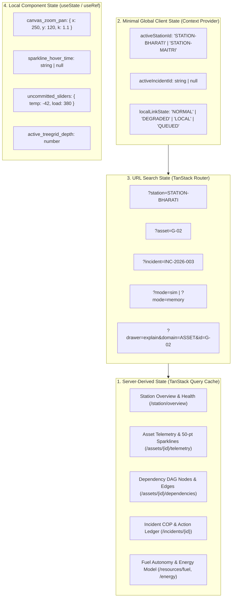

# PolarOps Final Entity Context Engine & State Architecture

**Author:** Kshitij Parkhe (Product Owner & System Integration Lead)  
**Contributors:** Dhruv (Twin Lead), Tanvi (Decision Lead)  
**Date:** September 2026  
**Status:** AUTHORITATIVE & FINAL  
**Repository Branch:** `reimagine/product-blueprint`  
**Baseline:** `5c692ec` (`baseline/phase4-5c692ec`)  
**Target Repository Artifact:** `docs/reimagination/FINAL_ENTITY_CONTEXT_MODEL.md`

---

## 1. Executive Summary & Design Constraints

A critical flaw in early prototypes was **context amnesia**: navigating between pages wiped out the operator's selected asset, active incident, and filter parameters. Conversely, an over-engineered global state store (e.g. monolithic Redux/Zustand containing hundreds of cached server objects) introduces stale state bugs, race conditions, and synchronization nightmares.

PolarOps implements a **Strict Hybrid State Architecture**:
1. **Server State is Master:** All operational metrics, telemetry points, dependency topologies, and risk scores are owned by the FastAPI backend and managed on the client exclusively via **TanStack Query** (React Query).
2. **Minimal Global Client State:** Restricted to three universal operational variables: `activeStationId`, `activeIncidentId`, and `localLinkState`.
3. **URL Search Parameters for Deep Linking:** Entity selection (`?asset=...`), workspace sub-modes (`?mode=...`), and drawer states (`?drawer=...`) are synchronized to the URL.
4. **Transient View State:** Purely visual UI variables (canvas zoom/pan, tooltip crosshairs, expanded accordion rows) remain isolated in local component state.



---

## 2. Definitive Conceptual Context Mapping

| Context Dimension | Primary Storage Location | Default Value | Synchronization Behavior |
|---|---|---|---|
| **`activeStationId`** | Global Client Context & URL (`?station=...`) | `"STATION-BHARATI"` | Changing station in shell re-keys all React Query hooks, re-fetching all station data. |
| **`activeEntityId`** | URL Search Param (`?asset=...`) | `null` | Clicking an asset node in `/twin` updates URL. Persists when switching to `/continuity` or `/cockpit`. |
| **`activeIncidentId`** | Global Client Context & URL (`?incident=...`) | `null` | Deep-links directly into active incident COP. Surfaces incident alert banner in shell. |
| **`activeSituation`** | Server-Derived (`StationOverview.ambient_weather`) | Computed from SCADA | Automatically updates reserve headroom and blizzard alert status. |
| **`activeWorkflow`** | Route Path (`/twin` vs `/cockpit` vs `/continuity`) | `"/twin"` | Defined by primary workspace navigation. |
| **`activeInvestigation`** | Local Component State (Workspace 1) | `"DOWNSTREAM"` | Toggles between Upstream Supply Lineage and Downstream Blast Radius. |
| **`activeDecision`** | Local Sandbox State (Workspace 2) | `null` | Selected decision package in counterfactual sandbox; committed upon Hold-to-Confirm. |

---

## 3. URL Schema Validation & Fallback Guards

To prevent routing crashes or broken links when malformed URLs are shared or entered:

```typescript
import { z } from "zod";

export const SearchParamsSchema = z.object({
  station: z.enum(["STATION-BHARATI", "STATION-MAITRI"]).default("STATION-BHARATI"),
  asset: z.string().optional(),
  incident: z.string().optional(),
  mode: z.enum(["active", "sim", "memory"]).default("active"),
  tab: z.enum(["fuel", "spares", "resupply", "resilience"]).default("fuel"),
  drawer: z.enum(["explain", "resilience"]).optional(),
  domain: z.enum(["ASSET", "INCIDENT", "STATION"]).optional(),
  id: z.string().optional(),
});

export type SearchParams = z.infer<typeof SearchParamsSchema>;
```

### Deterministic Fallback Rules
1. **Invalid `station`:** Resets silently to `STATION-BHARATI`.
2. **Invalid or Non-Existent `asset`:** Clears `?asset` and renders default station-wide overview.
3. **Invalid `drawer`:** Silently ignores parameter and keeps drawer closed.
4. **Drawer Dismissal:** Uses `router.navigate({ search: (prev) => ({ ...prev, drawer: undefined }), replace: true })` to prevent polluting browser history.

---

## 4. Cross-Workspace Journey Continuity Walkthrough

```
[OPERATOR IN WORKSPACE 1: /twin?station=STATION-BHARATI&asset=G-02]
  │  Operator selects G-02; reviews vibration surge & missing bearing SK-402
  │  Context: activeStationId = "STATION-BHARATI", activeEntityId = "G-02"
  ▼
[CLICKS "CHECK SPARE PARTS IN LOGISTICS"]
  │  Router navigates to /continuity?station=STATION-BHARATI&asset=G-02&tab=spares
  │  Workspace 3 reads asset="G-02" from URL; auto-focuses on Warehouse Bin M-2
  ▼
[CLICKS "SIMULATE G-02 TRIP UNDER BLIZZARD"]
  │  Router navigates to /cockpit?station=STATION-BHARATI&asset=G-02&mode=sim
  │  Workspace 2 reads asset="G-02"; pre-seeds counterfactual scenario with target_asset_id="G-02"
  ▼
[EXECUTES HOLD-TO-CONFIRM ON DECISION PACKAGE]
  │  Command dispatched to backend; action appended to active incident
  │  Router navigates back to /twin?station=STATION-BHARATI&asset=G-02
  │  G-02 remains focused; updated nominal telemetry reflects throttled load
```

**Context is fully preserved throughout the entire loop with zero re-entry.**

---
