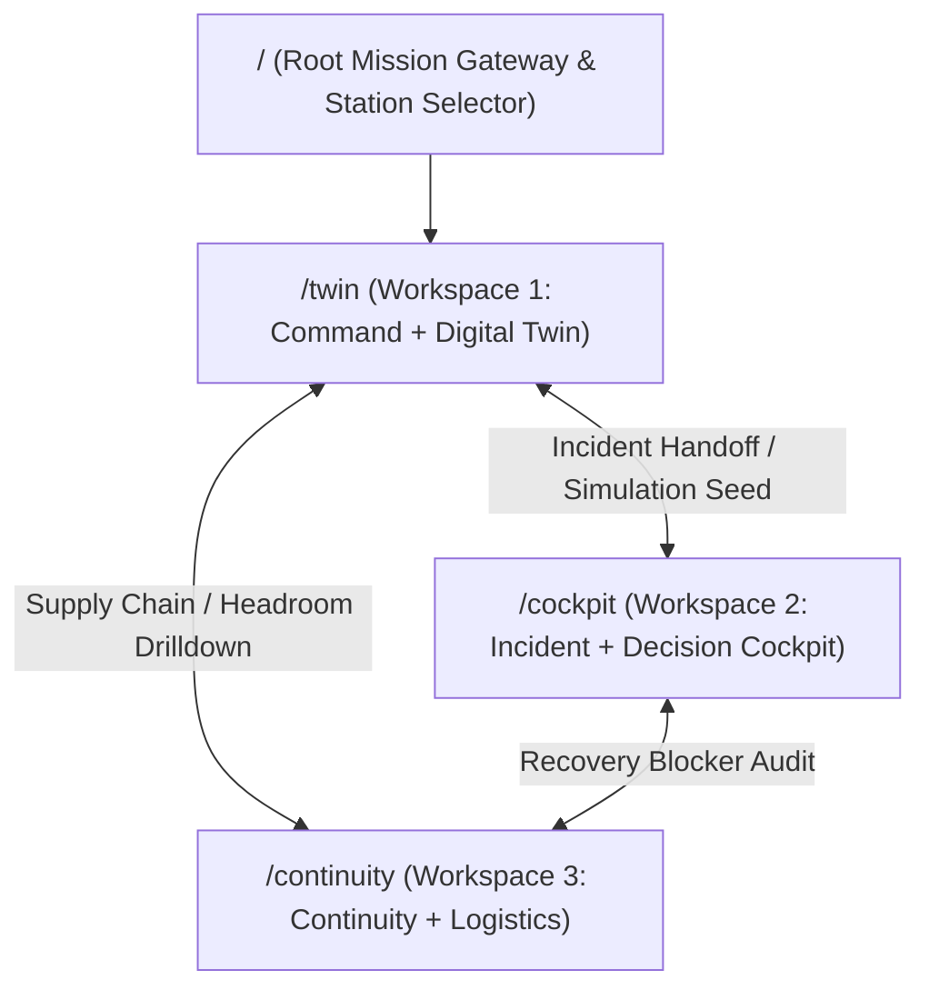

# PolarOps Final Information Architecture Specification

**Author:** Kshitij Parkhe (Product Owner & System Integration Lead)  
**Contributors:** Dhruv (Twin Lead), Tanvi (Decision Lead)  
**Date:** September 2026  
**Status:** AUTHORITATIVE & FINAL (Supersedes all prior draft IA documents)  
**Repository Branch:** `reimagine/product-blueprint`  
**Baseline:** `5c692ec` (`baseline/phase4-5c692ec`)  
**Target Repository Artifact:** `docs/reimagination/FINAL_INFORMATION_ARCHITECTURE.md`

---

## 1. Minimal Route Architecture

The legacy 11-page route structure is completely dismantled. The entire application is delivered through **Three Clean Macro-Routes** plus a **Root Mission Gateway**:

---

## 2. Definitive Capability Classification: What is NOT a Page

Every feature and capability is formally classified into an industrial operational form-factor:

| Capability | Form-Factor Classification | Host Location | Authoritative Backend Binding | Rationale |
|---|---|---|---|---|
| **Station Health & Posture** | `FULL WORKSPACE` (Header Tier) | `Workspace 1 (/twin)` | `GET /api/station/overview` | Primary entry view answering: "Is the station safe right now?" |
| **Living Systems Topology** | `FULL WORKSPACE` (Canvas) | `Workspace 1 (/twin)` | `GET /api/assets/{id}/dependencies` | High-density interactive DAG showing energy flows and blast radius. |
| **Asset Details & Telemetry** | `INSPECTOR` (Side Panel) | `Workspace 1 Inspector` (380px) | `GET /api/assets/{id}` `GET /api/assets/{id}/telemetry` | Driven by canvas node click; displays specs and 50-pt SVG sparklines. |
| **6-Factor Risk Drivers** | `INSPECTOR` (Embedded) | `Workspace 1 Inspector` | `GET /api/assets/{id}/risk` | Ranked ladder of physical degradation drivers with mathematical derivation rules. |
| **Active Incident COP** | `INLINE REGION` (Primary) | `Workspace 2 (/cockpit)` | `GET /api/incidents` `GET /api/incidents/{id}` | Dominates Workspace 2 during an emergency, showing blast radius and affected services. |
| **Action Execution Ledger** | `TIMELINE` | `Workspace 2 (/cockpit)` | `POST /api/incidents/{id}/actions` `PATCH /api/incidents/{id}/status` | Chronological, immutable audit trail of physical operator commands. |
| **What-If Simulation Sandbox** | `CONTEXTUAL MODE` (Sub-view) | `Workspace 2 (/cockpit?mode=sim)` | `POST /api/scenarios/simulate` | Non-destructive counterfactual sandbox with side-by-side delta matrices. |
| **Institutional Memory** | `HISTORICAL VIEW` (Sub-view) | `Workspace 2 (/cockpit?mode=memory)` | `GET /api/memory` `POST /api/memory` | Searchable knowledge archive (`/memory?q=...`) + contextual incident precedent. |
| **Fuel Autonomy Runway** | `INLINE REGION` (Primary Gauge) | `Workspace 3 (/continuity)` | `GET /api/resources/fuel` | Massive circular countdown gauge showing days of survival vs winter policy. |
| **Coupled Energy Balance** | `INLINE REGION` (Interactive) | `Workspace 3 (/continuity)` | `GET /api/resources/energy` | Models ambient temperature impact on electrical demand and diesel burn rate. |
| **Warehouse Spares Inventory** | `INLINE REGION` (Table) | `Workspace 3 (/continuity)` | `GET /api/resources/inventory` `GET /api/resources/recovery/{id}` | Filterable bin catalog + contextual recovery blockers attached to assets. |
| **Maritime Resupply Tracker** | `INLINE REGION` | `Workspace 3 (/continuity)` | `GET /api/resources/resupply` | Tracks pack-ice navigation progress of *MV Vasiliy Golovnin*. |
| **Multi-Station Mutual Aid** | `INLINE REGION` | `Workspace 3 (/continuity)` | `GET /api/station/comparison` `POST /api/scenarios/cross-station` | Cautious polar traverse airlift feasibility (Bharati vs Maitri). |
| **Resilience Link State** | `GLOBAL STATE` & `DRAWER` | Header Link Pill & Slide-out Drawer | `GET /api/resilience/status` `GET /api/resilience/queue` `POST /api/resilience/restore` | Ambient link state pill in shell; drawer exposes 7-stage state and SHA-256 hashes. |
| **5-Stage Causal Explanation** | `DRAWER` | Global Explanation Drawer (`Radix Sheet`) | `GET /api/explain/{domain}/{id}` | Slides out from any asset or incident without unmounting active screen. |
| **Universal Command Palette** | `COMMAND PALETTE` | Modal (`cmdk` / `Cmd+K`) | Client Fuzzy Index | Instant keyboard jump to any machine, incident, or workspace. |
| **Emergency Confirmation** | `OVERLAY` (Hold-to-Confirm) | Modal Action Guard | Client Guard + Backend Action | 1.5-second physical press required before dispatching high-impact load shedding. |
| **Legacy Alerts Page** | `RETIRED` | Merged into Workspace 2 | N/A | Split-attention anti-pattern eradicated. |
| **Legacy Offline Page** | `RETIRED` | Universal Application State | N/A | "Wi-Fi page" anti-pattern eradicated. |
| **Legacy Settings Page** | `RETIRED` | Relocated to `Cmd+K` | N/A | Cluttered demo buttons removed from primary navigation. |

---

## 3. Comprehensive Route Specifications

### 3.1 Route `/` — Mission Gateway & Station Selector
- **Purpose:** Fast mission authentication, active station selection, and direct operational pass-through.
- **Entry Trigger:** Application launch or browser refresh.
- **Primary Job:** Select operational station (`STATION-BHARATI` vs `STATION-MAITRI`) and enter active operations.
- **URL State:** Clean root URL. Redirects immediately to `/twin?station=STATION-BHARATI` upon station confirmation.
- **Mobile Behavior:** Centered station selection cards with high-contrast touch targets ($\ge 48\text{px}$).

---

### 3.2 Route `/twin` — Workspace 1: Command + Digital Twin
- **Purpose:** Immediate comprehension of station health, live telemetry, and topological blast-radius tracing.
- **Entry Trigger:** Default operational view on login; deep-link from incident asset code.
- **Primary Job:** Monitor operational headroom, diagnose sensor anomalies, and inspect multi-hop physical relationships.
- **URL State:**
  - `?station=STATION-BHARATI` (Required)
  - `?asset=G-02` (Optional: Focuses asset node and opens right-hand inspector)
  - `?view=topology` | `?view=schematic` | `?view=matrix` (View toggle)
- **Child / Contextual Views:**
  1. *Living Topology DAG (Default Canvas):* Interactive node-link graph with animated energy conduits.
  2. *2D Isometric Station Schematic:* Architectural cross-section showing physical module locations and blizzard windward exposure.
  3. *Tabular TreeGrid:* Accessible, keyboard-navigable matrix for screen readers and low-bandwidth terminals.
- **Back Navigation:** Preserves selected station and zoom state.
- **Mobile Behavior (1024×768 Standard):** Canvas remains full-width; inspector collapses into a sliding bottom drawer toggleable via button.

---

### 3.3 Route `/cockpit` — Workspace 2: Incident + Decision Cockpit
- **Purpose:** Investigate active crises, stress-test counterfactual failure scenarios, and authorize vetted mitigation decisions.
- **Entry Trigger:** Flashing incident alert in header; clicking "INVESTIGATE CRISIS" from Workspace 1; scheduled scenario review.
- **Primary Job:** Contain active anomalies, compare what-if consequences, and record physical commands to the immutable ledger.
- **URL State:**
  - `?station=STATION-BHARATI` (Required)
  - `?incident=INC-2026-003` (Optional: Pre-hydrates active incident COP)
  - `?mode=active` | `?mode=sim` | `?mode=memory` (Sub-view toggle)
- **Child / Contextual Views:**
  1. *Mode A: Active Incident COP & Action Ledger (`?mode=active`):* Primary crisis common operating picture.
  2. *Mode B: Counterfactual Simulation Sandbox (`?mode=sim`):* Isolated what-if sandbox with amber watermark and delta dials.
  3. *Mode C: Institutional Memory Archive (`?mode=memory`):* Searchable historical lessons learned (`/memory?q=...`).
- **Back Navigation:** Explicit "Exit Sandbox" button returns safely to active incident without state contamination.
- **Mobile Behavior:** Stacked single-column layout; sticky emergency action bar pinned to bottom of viewport.

---

### 3.4 Route `/continuity` — Workspace 3: Continuity + Logistics
- **Purpose:** Monitor long-horizon life-support resources, thermodynamic energy balance, warehouse critical spares, and satellite edge resilience.
- **Entry Trigger:** Weekly fuel tank sounding; approaching storm warning; checking resupply vessel ETA; inspecting offline sync queue.
- **Primary Job:** Eliminate winter survival bottlenecks; audit spare parts availability; verify cryptographic store-and-forward packets.
- **URL State:**
  - `?station=STATION-BHARATI` (Required)
  - `?tab=fuel` | `?tab=spares` | `?tab=resupply` | `?tab=resilience` (Section toggle)
- **Child / Contextual Views:**
  1. *Fuel & Thermal Energy Balance:* Live fuel runway gauge + Coupled heat loss model with projection sensitivity slider.
  2. *Warehouse Spares & Recovery Exposure:* Filterable bin catalog with active work order blockers.
  3. *Maritime Resupply & Mutual Aid:* Pack-ice vessel tracker (*MV Vasiliy Golovnin*) + polar traverse feasibility.
  4. *Edge Continuity Cockpit:* 7-stage state machine + P0–P3 priority packet inspector.
- **Back Navigation:** Returns to previous tab without reloading.
- **Mobile Behavior:** Swipeable card deck for fuel, energy, and spares; compact table mode with horizontal scrolling.

---
