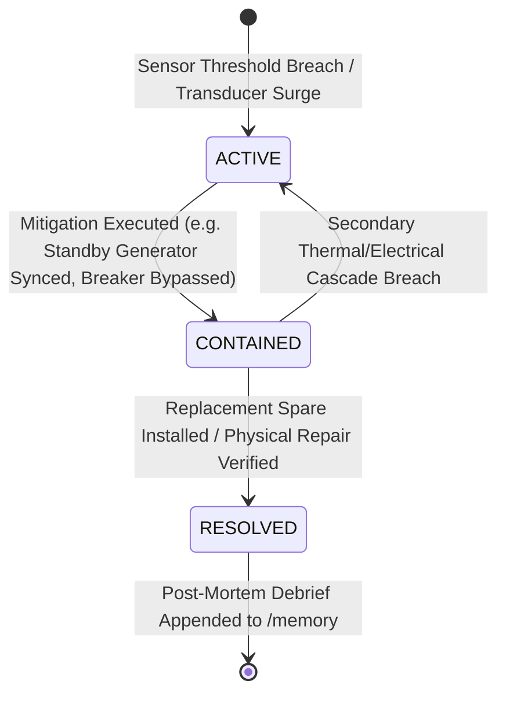
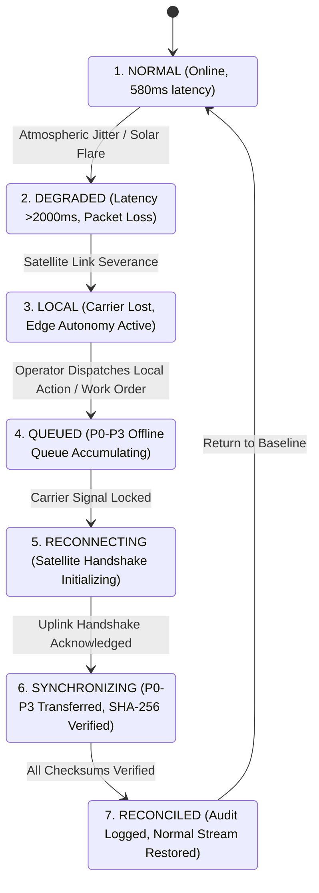
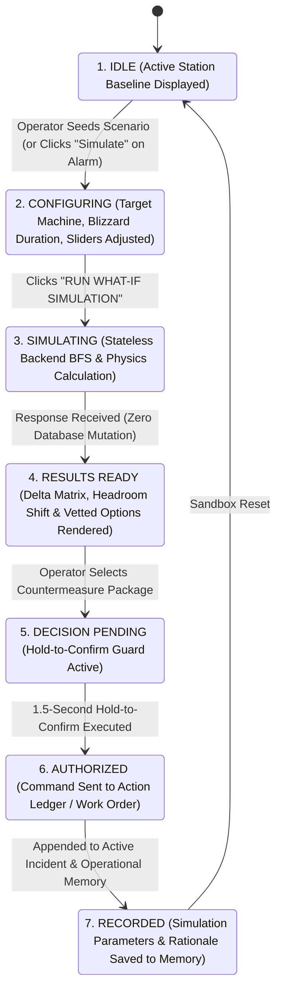
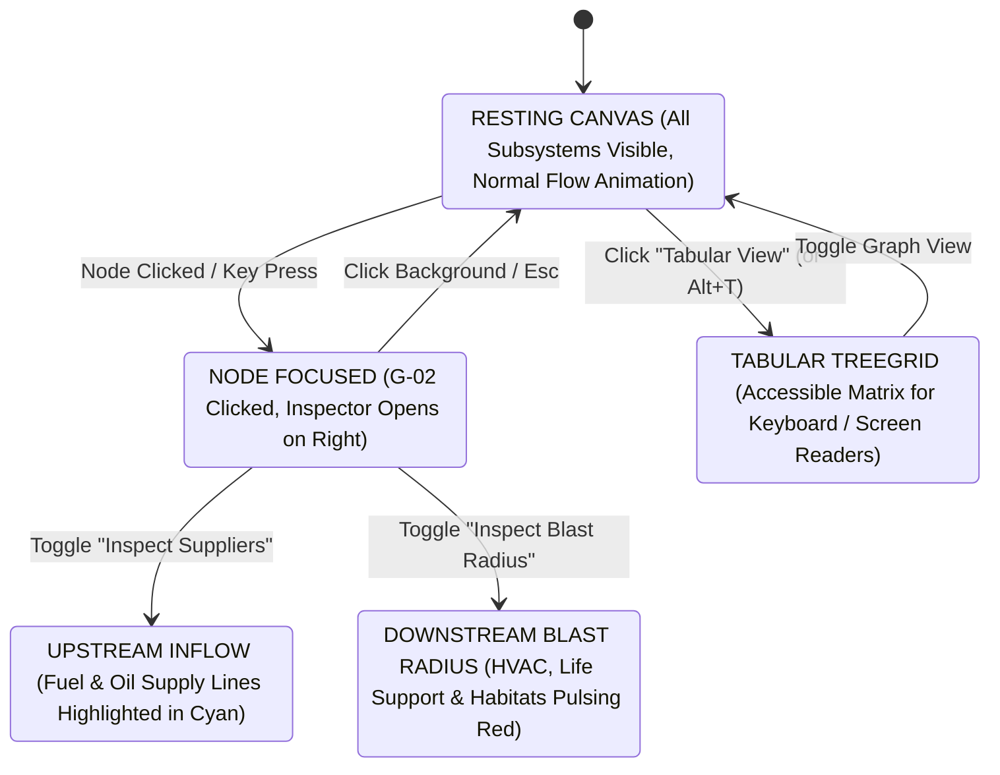
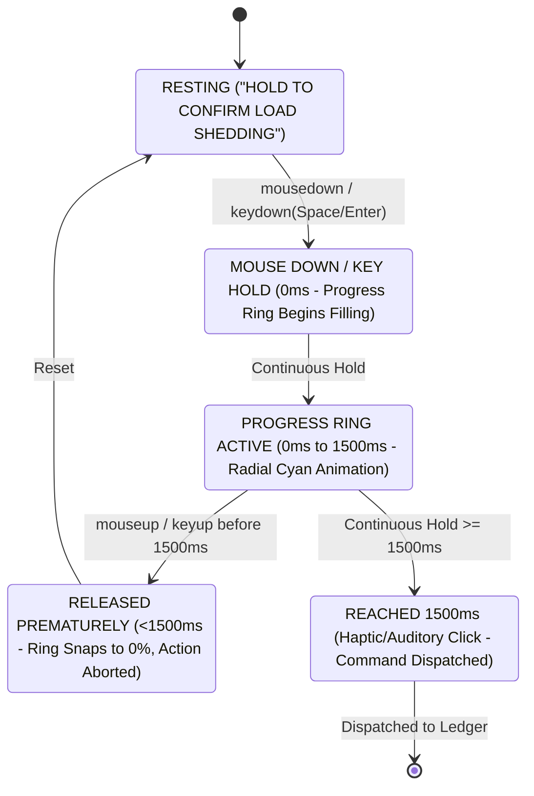

# PolarOps Final Interaction State & Lifecycle Model

**Author:** Kshitij Parkhe (Product Owner & System Integration Lead)  
**Contributors:** Dhruv (Twin Lead), Tanvi (Decision Lead)  
**Date:** September 2026  
**Status:** AUTHORITATIVE & FINAL  
**Repository Branch:** `reimagine/product-blueprint`  
**Baseline:** `5c692ec` (`baseline/phase4-5c692ec`)  
**Target Repository Artifact:** `docs/reimagination/FINAL_INTERACTION_MODEL.md`

---

## 1. Executive Summary

In mission-critical Antarctic systems, **interaction state must be deterministic, non-destructive, and resilient to packet loss**. An operator executing a load-shedding command or simulating a generator failure must know with certainty:
1. Whether an action has physically mutated station equipment or merely updated an in-memory sandbox.
2. Whether an action has been committed locally or synchronized across the satellite uplink.
3. How to recover immediately from network interruptions without losing uncommitted investigation state.

---

## 2. Core Operational State Machines

### 2.1 Incident Lifecycle State Machine (`incident_service.py`)

- **`ACTIVE`:** Emergency status; high-contrast crimson accents; auditory warning chime; primary Common Operating Picture expanded; actions ledger unlocked.
- **`CONTAINED`:** Hazard neutralized but redundancy compromised ($N-0$ state); amber warning accents; system monitors for secondary thermal or electrical drift.
- **`RESOLVED`:** Normal operating envelope restored; green accents; system prompts operator to launch the **Post-Mortem Authoring Modal** to log lessons learned to `/memory`.

---

### 2.2 7-Stage Resilience & Edge Continuity State Machine (`sync_service.py`)

#### Deterministic Priority Tiers (P0 – P3):
1. **P0 (Critical Life Support):** Emergency shutdowns, generator trips, breaker transfers, declared incidents. Transferred in Packet 1 immediately upon carrier lock.
2. **P1 (Operational Maintenance):** Work order status changes, warehouse spare part reservations, shift handover notes.
3. **P2 (Science Continuity):** Buffered upper-atmosphere radar and seismograph observation batches.
4. **P3 (Diagnostic Telemetry):** Routine 50-point sensor batches and historical battery voltage time series.

---

### 2.3 Counterfactual Scenario Simulation State Machine (`scenario_service.py`)

---

### 2.4 Dual-Flow Living Topology State Machine (`dependency_service.py`)

---

### 2.5 Emergency Hold-to-Confirm Interaction State Machine

For high-impact operational commands (e.g. emergency load shedding or generator bypass), standard single-click buttons are dangerous, while multi-step modal dialogs introduce panic-inducing friction:

---

## 3. Optimistic Updates & Cryptographic Sync Integrity

1. **Local Queue Insertion:** When an operator logs an action while offline, it immediately appends to the UI Action Ledger decorated with an amber `LOCAL QUEUED` badge.
2. **Canonical JSON Serialization:** The payload is serialized deterministically (keys sorted alphabetically, compact separators):
   $$\text{canonical\_payload} = \text{json.dumps}(payload, \text{sort\_keys}=\text{True}, \text{separators}=(',', ':'))$$
3. **SHA-256 Checksum Calculation:** The client computes the SHA-256 hash and stores it alongside the queue item.
4. **Reconciliation Handshake:** Upon link restoration, `POST /api/resilience/restore` transmits the queue. The backend recomputes the hash. If verified, the badge transitions to green `RECONCILED`.

---
