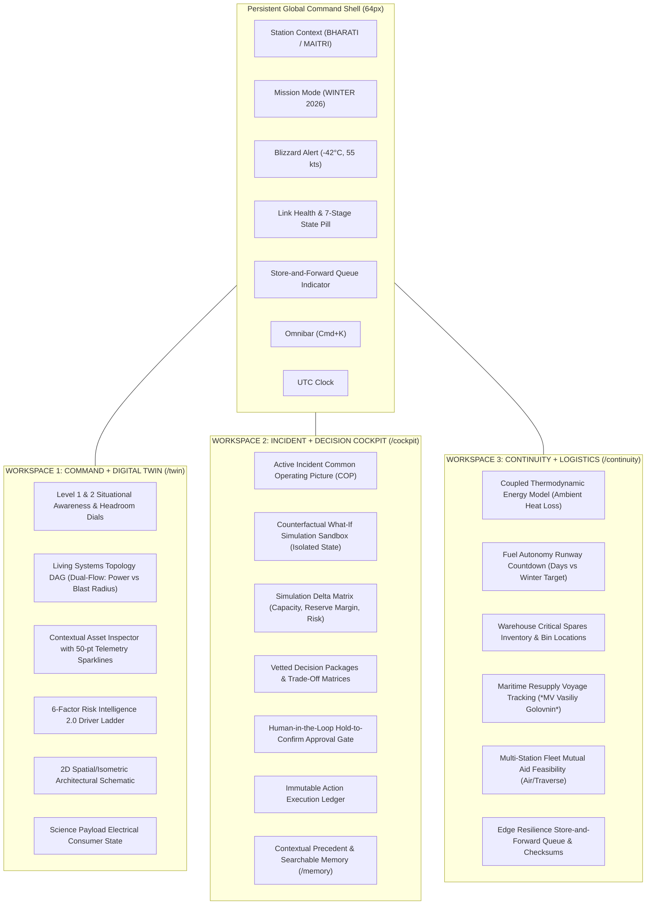
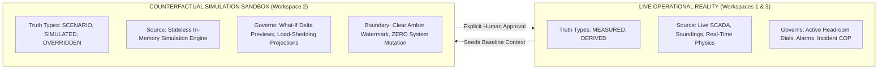

# PolarOps Final Product Architecture

**Author:** Kshitij Parkhe (Product Owner & System Integration Lead)  
**Contributors:** Dhruv (Twin Lead), Tanvi (Decision Lead)  
**Date:** September 2026  
**Status:** AUTHORITATIVE & FINAL (Supersedes all prior audit and draft architecture documents)  
**Repository Branch:** `reimagine/product-blueprint`  
**Baseline:** `5c692ec` (`baseline/phase4-5c692ec`)  
**Target Repository Artifact:** `docs/reimagination/FINAL_PRODUCT_ARCHITECTURE.md`

---

## 1. Executive Charter & The PolarOps Constitution

PolarOps is an **Antarctic Operational Digital Twin and Decision-Support Command System** engineered for the extreme isolation, climatic severity, and communications constraints of **Bharati Station** (Larsemann Hills) and **Maitri Station** (Schirmacher Oasis), operated under India's National Centre for Polar and Ocean Research (NCPOR).

### 1.1 The Product Constitution
The entire frontend and backend integration is governed by the **Universal Operational Chain**:

$$\text{DATA} \longrightarrow \text{STATE} \longrightarrow \text{RELATIONSHIPS} \longrightarrow \text{REASONING} \longrightarrow \text{DECISION} \longrightarrow \text{OUTCOME} \longrightarrow \text{MEMORY}$$

And the operator journey is strictly rendered as:

$$\text{SITUATION} \longrightarrow \text{MEANING} \longrightarrow \text{IMPACT} \longrightarrow \text{CONSTRAINT} \longrightarrow \text{OPTIONS} \longrightarrow \text{DECISION} \longrightarrow \text{EVIDENCE} \longrightarrow \text{OUTCOME} \longrightarrow \text{MEMORY}$$

Every screen, card, drawer, and interaction in PolarOps exists solely to make this journey visible, predictable, and verifiable.

---

## 2. The Three-Macro-Workspace Model

Rather than fragmenting into 8–11 isolated pages or over-separating tightly coupled engineering domains, PolarOps converges on exactly **Three Dedicated Macro-Workspaces**, bound by a **Persistent Global Command Shell**:

---

## 3. Macro-Workspace Alignment with Operator Realities

| Macro-Workspace | Primary Question Answered | Target Persona | Operational Context | Primary Route |
|---|---|---|---|---|
| **Workspace 1: Command + Digital Twin** | *"What is the physical reality of the station right now, what is degrading, and what does it affect?"* | Chief Infrastructure Engineer, Shift Lead | Real-time monitoring, sensor anomaly diagnosis, multi-hop electrical/thermal tracing. | `/twin` (Default Home) |
| **Workspace 2: Incident + Decision Cockpit** | *"What operational crisis requires human intervention, what are my vetted options, and what action do I authorize?"* | Station Commander, Shift Lead | Active emergency triage, counterfactual what-if simulation, two-step human approval, post-mortem debrief. | `/cockpit` |
| **Workspace 3: Continuity + Logistics** | *"What physical resources enable our survival through the winter, and what bottlenecks constrain recovery?"* | Logistics Officer, Chief Engineer, NCPOR Mission Director | Long-horizon fuel runway tracking, warehouse spare part audits, maritime resupply, edge resilience synchronization. | `/continuity` |

---

## 4. Strict Split-Brain Telemetry Prevention & Truth Boundaries

To prevent fatal operational confusion where different screens show contradictory numbers:

1. **Live Reality Integrity:**
   - Workspace 1 and Workspace 3 render strictly **Live Operational Reality** (`MEASURED` sensor data or `DERIVED` real-time physics calculations).
   - Metrics carry green/slate provenance pills indicating origin and freshness age.
2. **Simulation Quarantine:**
   - What-if simulations in Workspace 2 operate strictly inside a **Stateless In-Memory Sandbox**.
   - When simulation mode is active, the viewport renders a persistent, unmissable amber warning watermark: `HYPOTHETICAL SIMULATION SANDBOX — ZERO SYSTEM MUTATION`.
   - Simulation slider adjustments never alter live station baseline metrics or mutate server database state.
3. **Transition Gate:**
   - A simulated option becomes live reality *only* when the human operator executes a deliberate **Hold-to-Confirm Approval**, which dispatches the command to the physical Action Execution Ledger.

---

## 5. Architectural Policies Adopted

### 5.1 2D Spatial Schematic Policy (No WebGL 3D in Production Rebuild)
- True WebGL / Three.js / React Three Fiber is **strictly banned** from the initial production rebuild.
- Spatial understanding is delivered via an accessible **2D Spatial/Isometric Station Architectural Section** (Powerhouse Bay, Boiler Room, Living Quarters, Medical, Science).
- This provides 100% of spatial containment, windward blizzard exposure, and transit tunnel access context with zero GPU overhead, instant load times, and guaranteed reliability on ruggedized low-power field terminals.

### 5.2 Deterministic Hierarchical Topology Policy
- Force-directed random graph layouts are strictly prohibited.
- The Living Topology DAG uses a **deterministic hierarchical layout** (Left-to-Right / Top-to-Bottom):
  $$\text{Energy Resources} \longrightarrow \text{Prime Movers (Generators)} \longrightarrow \text{Distribution Buses} \longrightarrow \text{Consumers (HVAC/Pumps)} \longrightarrow \text{Life Support}$$
- Upstream suppliers render in cyan; downstream blast radius pulses in high-contrast red.
- 1-click fallback to an accessible **TreeGrid Dependency Matrix** with keyboard arrow-key navigation.

### 5.3 Two-Step Emergency Action UX
- To eliminate friction during time-critical emergencies while preventing accidental clicks:
  - Routine work orders use standard confirmation dialogs.
  - Critical emergency dispatches (e.g. emergency generator bypass, science load shedding) use an industrial **Hold-to-Confirm Action Button** (1.5-second continuous press with visual progress ring).

### 5.4 Dual-Sided Operational Memory
- Memory is never co-located in the same state container as active simulations.
- **Contextual Precedent:** Active incidents automatically query `/memory?incident_id=...` to display past post-mortems for identical failure modes.
- **Historical Knowledge Archive:** A dedicated searchable interface in Workspace 2 (`/cockpit?tab=memory`) allowing operators to perform full-text fuzzy search across expedition records (`/memory?q=...`).

---
