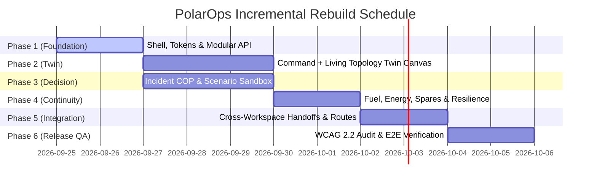

# PolarOps Final Phased Rebuild & Implementation Roadmap

**Author:** Kshitij Parkhe (Product Owner & System Integration Lead)  
**Contributors:** Dhruv (Twin Lead), Tanvi (Decision Lead)  
**Date:** September 2026  
**Status:** AUTHORITATIVE & FINAL  
**Repository Branch:** `reimagine/product-blueprint`  
**Baseline:** `5c692ec` (`baseline/phase4-5c692ec`)  
**Target Repository Artifact:** `docs/reimagination/FINAL_REBUILD_PLAN.md`

---

## 1. Phased Implementation Roadmap

The rebuild proceeds incrementally through **Six Verification Checkpoints**. Each phase produces a fully operational, testable increment without "big-bang" rewrites:

---

## 2. Phase-by-Phase Technical Specifications

### Phase 1: Shared Foundation, Shell & Context Engine
- **Lead Owner:** Kshitij
- **Objective:** Build the Global Command Shell, persistent status bar, 3-workspace navigation strip, URL context engine (`StationContext`), Polaris Industrial design tokens, and modular `frontend/src/lib/api/` structure.
- **Allowed Directories:**
  - `frontend/src/components/shell/*`
  - `frontend/src/context/*`
  - `frontend/src/lib/api/*`
  - `frontend/src/routes/__root.tsx`
  - `frontend/src/routes/twin.tsx` (Empty stub for router mounting)
  - `frontend/src/routes/cockpit.tsx` (Empty stub)
  - `frontend/src/routes/continuity.tsx` (Empty stub)
- **Backend Capabilities:** `GET /health`, `GET /station/overview`.
- **Testing:** Playwright test `tests/e2e/phase1_shell_foundation.spec.ts` (verifying header renders, station toggles, modular API exports compile cleanly).
- **Acceptance Criteria:** Header displays station switcher, blizzard weather pill, link health; router navigates cleanly between the three stub routes; modular API client passes all type checks.

---

### Phase 2: Workspace 1 — Command + Digital Twin
- **Lead Owner:** Dhruv (Lead), Kshitij (Integration)
- **Objective:** Build Workspace 1 (`/twin`): Station situational headroom dials, the Living Systems Topology DAG with dual-flow tracing, the 380px Contextual Asset Inspector with 50-pt SVG sparklines, 6-factor risk ladder, and the 2D isometric station architectural section.
- **Allowed Directories:**
  - `frontend/src/features/twin/*`
  - `frontend/src/routes/twin.tsx`
  - `frontend/src/lib/api/twin.ts`
- **Backend Capabilities:** `GET /assets`, `GET /assets/{id}`, `GET /assets/{id}/dependencies`, `GET /assets/{id}/telemetry`, `GET /assets/{id}/risk`, `GET /explain/asset/{id}`.
- **Testing:** Playwright test `tests/e2e/phase2_twin_topology.spec.ts` (verifying node selection, dual-flow upstream/downstream toggles, sparkline rendering with thresholds, and 1-click treegrid fallback).
- **Acceptance Criteria:** Selecting G-02 opens inspector without page reload; downstream blast radius illuminates life-support paths; SVG sparklines render warning/critical bands accurately.

---

### Phase 3: Workspace 2 — Incident + Decision Cockpit
- **Lead Owner:** Tanvi
- **Objective:** Build Workspace 2 (`/cockpit`): Active Incident Common Operating Picture, chronological Action Execution Ledger, Counterfactual Scenario Simulation Sandbox (isolated in-memory state with amber watermark), Simulation Delta Matrix, Hold-to-Confirm approval gate, and Institutional Memory Archive.
- **Allowed Directories:**
  - `frontend/src/features/decision/*`
  - `frontend/src/routes/cockpit.tsx`
  - `frontend/src/lib/api/decision.ts`, `incidents.ts`, `memory.ts`
- **Backend Capabilities:** `GET /incidents`, `GET /incidents/{id}`, `POST /incidents/{id}/actions`, `POST /scenarios/simulate`, `GET /memory`, `POST /memory`.
- **Testing:** Playwright test `tests/e2e/phase3_decision_cockpit.spec.ts` (verifying incident COP rendering, scenario delta calculations, 1.5-second hold-to-confirm dispatch, and memory search).
- **Acceptance Criteria:** Running what-if simulation outputs side-by-side reserve margin deltas; Hold-to-Confirm dispatches command and updates action ledger; memory search returns matching debriefs.

---

### Phase 4: Workspace 3 — Continuity + Logistics
- **Lead Owner:** Tanvi
- **Objective:** Build Workspace 3 (`/continuity`): Coupled Energy Model (ambient temperature sensitivity slider), Fuel Autonomy Runway countdown gauge, Warehouse Spares Inventory with recovery blockers, Maritime Resupply Tracker, and Edge Resilience Cockpit.
- **Allowed Directories:**
  - `frontend/src/features/continuity/*`
  - `frontend/src/routes/continuity.tsx`
  - `frontend/src/lib/api/resources.ts`, `resilience.ts`, `science.ts`
- **Backend Capabilities:** `GET /resources/fuel`, `GET /resources/energy`, `GET /resources/inventory`, `GET /resources/resupply`, `GET /resilience/*`, `GET /science/instruments`.
- **Testing:** Playwright test `tests/e2e/phase4_continuity_logistics.spec.ts` (verifying fuel runway calculation, warehouse spare filter, offline link toggle, and SHA-256 sync handshake).
- **Acceptance Criteria:** Fuel countdown matches winter policy target; adjusting ambient slider projects thermal demand surge; Resilience Drawer allows triggering offline simulation and verifies SHA-256 checksums.

---

### Phase 5: Cross-Workspace Integration & Route Harmonization
- **Lead Owner:** Kshitij
- **Objective:** Wire seamless cross-workspace operational handoffs (`/twin` $\longleftrightarrow$ `/cockpit` $\longleftrightarrow$ `/continuity`); build Root Mission Gateway (`/`); purge legacy unused components; synchronize URL search parameters (`?station=...&asset=...&incident=...`).
- **Allowed Directories:**
  - `frontend/src/routes/*`
  - `frontend/src/components/shell/*`
- **Testing:** Playwright end-to-end integration test `tests/e2e/phase5_operational_loop.spec.ts` (running the full G-02 anomaly walkthrough across all 14 stages).
- **Acceptance Criteria:** Selecting G-02 in `/twin` and clicking "Check Spares" navigates to `/continuity?asset=G-02` with bin pre-selected; clicking "Simulate" seeds `/cockpit?mode=sim&asset=G-02`; executing action updates Workspace 1 ledger.

---

### Phase 6: Visual Polish, Accessibility (WCAG 2.2 AA) & Final Release
- **Lead Owner:** Kshitij (Lead), Dhruv, Tanvi
- **Objective:** Full accessibility audit, 1024×768 ruggedized display verification, dark theme contrast audit, production bundle optimization.
- **Deliverables:**
  - 100% WCAG 2.2 AA compliance (2px cyan focus rings, $\ge 48\text{px}$ emergency touch targets).
  - All 95 backend unit and contract tests green.
  - Complete automated Playwright test suite green.
  - Production build (`npm run build`) compiles with zero errors and zero warnings.
- **Acceptance Criteria:** System ready for production deployment to Render and Vercel.

---
