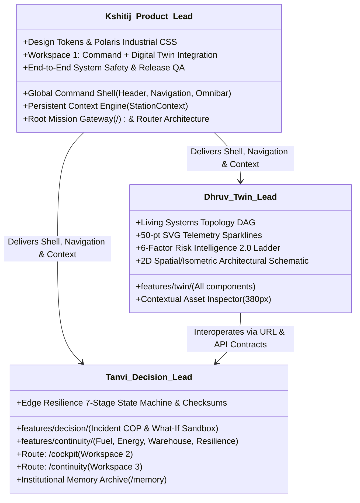

# PolarOps Final Team Working Contract & Engineering Governance

**Author:** Kshitij Parkhe (Product Owner & System Integration Lead)  
**Contributors:** Dhruv (Twin Lead), Tanvi (Decision Lead)  
**Date:** September 2026  
**Status:** AUTHORITATIVE & FINAL  
**Repository Branch:** `reimagine/product-blueprint`  
**Baseline:** `5c692ec` (`baseline/phase4-5c692ec`)  
**Target Repository Artifact:** `docs/reimagination/FINAL_TEAM_CONTRACT.md`

---

## 1. Team Ownership & Non-Overlapping Boundaries

To guarantee that three developers can work concurrently without Git merge chaos, directory ownership is strictly isolated:

---

## 2. Directory & Route Allocation Matrix

| Developer | Dedicated Implementation Directory | Dedicated Route Files | Dedicated API Client Files | Shared / Protected Files |
|---|---|---|---|---|
| **Kshitij** | `frontend/src/components/shell/*` `frontend/src/components/command/*` `frontend/src/context/*` | `frontend/src/routes/__root.tsx` `frontend/src/routes/index.tsx` `frontend/src/routes/twin.tsx` | `frontend/src/lib/api/client.ts` `frontend/src/lib/api/station.ts` `frontend/src/lib/api/explain.ts` `frontend/src/lib/api/index.ts` | Owns `__root.tsx`, `StationContext.tsx`, and design token CSS. |
| **Dhruv** | `frontend/src/features/twin/*` | Sub-views mounted in `/twin` | `frontend/src/lib/api/twin.ts` | Consumes `StationContext`; imports shared design tokens. |
| **Tanvi** | `frontend/src/features/decision/*` `frontend/src/features/continuity/*` | `frontend/src/routes/cockpit.tsx` `frontend/src/routes/continuity.tsx` | `frontend/src/lib/api/decision.ts` `frontend/src/lib/api/resources.ts` `frontend/src/lib/api/resilience.ts` `frontend/src/lib/api/incidents.ts` `frontend/src/lib/api/memory.ts` `frontend/src/lib/api/science.ts` | Consumes `StationContext`; imports shared design tokens. |

**Golden Rule:** No developer touches another developer's dedicated feature directory without explicit prior coordination.

---

## 3. Git Branching & Merge Protocol

1. **`main` is Protected:** Direct commits or force-pushes to `main` are **STRICTLY FORBIDDEN**.
2. **`baseline/phase4-5c692ec` is Immutable:** Permanently points to commit `5c692ec`. Serves as the ultimate recovery anchor.
3. **Feature Branches:**
   - Kshitij: `reimagine/kshitij-product`
   - Dhruv: `reimagine/dhruv-twin`
   - Tanvi: `reimagine/tanvi-decision`
   - Architecture Truth: `reimagine/product-blueprint`
4. **Integration Merge Discipline:** Feature branches merge into `reimagine/product-blueprint` via verified Pull Requests following phase acceptance testing.

---

## 4. Engineering Verification Gates

Every pull request must pass **Four Automated Verification Gates** before merge approval:

1. **Backend Regression Gate:** All 95 backend unit and API tests must pass: `pytest backend/tests`.
2. **E2E Automation Gate:** Playwright automated test suite for the modified workspace must pass: `npm run test:e2e`.
3. **Compilation & Lint Gate:** `npm run build` must complete with zero TypeScript (`tsc --noEmit`) errors and zero lint warnings.
4. **Data Honesty Gate:** Every rendered metric must include explicit provenance metadata (`source`, `timestamp`, `truth_type`). Synthetic test data must never masquerade as measured telemetry.

---
