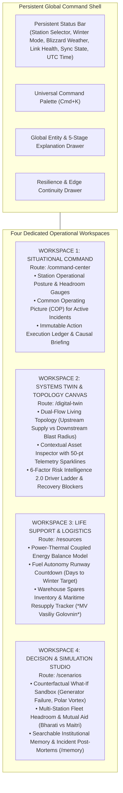

# PolarOps Unified Information Architecture Specification

**Author:** Kshitij Parkhe (Product Owner & System Integration Lead)  
**Contributors:** Dhruv (Twin Lead), Tanvi (Decision Lead)  
**Date:** September 2026  
**Repository Branch:** `reimagine/product-blueprint`  
**Baseline:** `5c692ec` (`baseline/phase4-5c692ec`)  
**Target Repository Artifact:** `docs/reimagination/INFORMATION_ARCHITECTURE.md`

---

## 1. Executive Structural Blueprint

The reimagined PolarOps information architecture eliminates the fragmented 11-page layout of the legacy frontend. It establishes **Four Unified Operational Workspaces**, bound together by a **Persistent Global Command Shell** and **Two Universal Context Drawers**:



---

## 2. Complete Route Disposition Matrix

| Legacy Route | Architectural Disposition | Target Location in New Architecture | Operational Rationale |
|---|---|---|---|
| `/` | **RECONCEPTUALIZE** | Root Authentication & Station Selection Gateway | Marketing fluff removed; serves as station selector (`BHARATI` vs `MAITRI`) and direct pass-through to active operations. |
| `/command-center` | **RECONCEPTUALIZE & EXPAND** | **Workspace 1: Situational Command** | Transformed from passive summary cards into the active Common Operating Picture for station health and incident triage. |
| `/digital-twin` | **RECONCEPTUALIZE (Dhruv)** | **Workspace 2: Systems Twin & Topology Canvas** | Upgraded from static node list to living dual-flow topology graph + high-density asset inspector. |
| `/resources` | **CONSOLIDATE** | **Workspace 3: Life Support & Logistics** | Consolidates fuel runway, thermal balance, spare parts inventory, and maritime resupply into a unified life-support model. |
| `/scenarios` | **EXPAND & UNIFY (Tanvi)** | **Workspace 4: Decision & Simulation Studio** | Expands from an isolated form into a full counterfactual decision sandbox with side-by-side delta matrices and approval gates. |
| `/resilience` | **RETIRE ROUTE $\rightarrow$ GLOBAL DRAWER** | Persistent Shell Header + **Edge Continuity Drawer** | Link health and store-and-forward queueing are ambient system states that must be accessible from any screen via `Ctrl+R` or header click. |
| `/alerts` | **MERGE INTO WORKSPACE 1** | **Workspace 1: Situational Command** | Incident management merged directly alongside station headroom to eliminate split-attention cognitive failures during a crisis. |
| `/stations` | **MERGE INTO WORKSPACE 4** | **Workspace 4: Mode B (Multi-Station Fleet Coordination)** | Fleet comparison is an analytical and mutual aid planning task; consolidated alongside cross-station simulation. |
| `/reports` | **REPLACE WITH MEMORY** | **Workspace 4: Mode C (Institutional Memory Archive)** | Fake downloadable reports replaced with the real backend searchable operational memory and post-mortem ledger (`/memory`). |
| `/offline` | **RETIRE ROUTE $\rightarrow$ GLOBAL STATE** | Universal Application State (Edge Autonomy) | Offline mode is a system-wide reality, not a page you visit. Handled gracefully by local SQLite and store-and-forward caching. |
| `/settings` | **RETIRE ROUTE $\rightarrow$ COMMAND PALETTE** | Command Palette (`Cmd+K`) & Developer Flyout | Cluttered settings buttons moved to accessible keyboard shortcuts. |

---

## 3. Deep Architectural Specification: Workspace 1 — Situational Command

### Purpose
To deliver instantaneous Level 1 (Perception) and Level 2 (Comprehension) situational awareness of station survivability, provide a unified Common Operating Picture (COP) for active incidents, and record real-time mitigation actions to an immutable ledger.

### Primary User & Job
- **Primary User:** Station Commander, Operations Shift Lead.
- **Primary Job:** Immediately assess whether the station is safe, identify what system is degrading, and execute emergency containment procedures.

### Entry Triggers
- Routine shift handover; waking up to an auditory alarm; or returning from exterior field traverses.

### First 5-Second Understanding
1. Overall station status (`NOMINAL`, `DEGRADED`, `CRITICAL`).
2. Current electrical generation reserve margin (kW and %) and thermal hold time (hours).
3. The single most critical active incident threatening station life support.

### Primary Action
Triage active incident, inspect affected services, and execute initial containment action.

### Secondary Actions
- Cycle through active alarms; review recent operational events stream; trigger emergency load shedding; slide out the 5-Stage Explanation Drawer.

### Core Entities & Relationships
- `StationOverview` $\longleftrightarrow$ `IncidentDetail` $\longleftrightarrow$ `SubsystemSummary` $\longleftrightarrow$ `OperationalEvent`.
- Station contains Subsystems; Subsystems contain Assets; Incidents attach to root Assets and propagate blast radius to downstream Services.

### Progressive Disclosure
- **Tier 1 (Surface View):** Executive Status Bar (Health Score, Weather Severity, Reserve Headroom Dials, Active Threat Banner).
- **Tier 2 (Active Incident COP):** Incident severity, location, affected equipment, downstream degraded services, and the live Action Execution Ledger.
- **Tier 3 (Forensic Slide-Out):** One-click trigger to open the 5-Stage Explanation Drawer (`/explain/incident/{id}`).

### Backend Capabilities
- `GET /api/station/overview`
- `GET /api/events`
- `GET /api/intelligence/narrative`
- `GET /api/incidents`
- `GET /api/incidents/{id}`
- `POST /api/incidents/{id}/actions`
- `PATCH /api/incidents/{id}/status`

### Cross-Workspace Handoffs
- Click asset code (`G-02`) $\longrightarrow$ Hands off to **Workspace 2 (Systems Twin)** with G-02 pre-centered on the topology canvas.
- Click "Simulate Mitigation" $\longrightarrow$ Hands off to **Workspace 4 (Decision Studio)** with incident parameters pre-seeded into the counterfactual sandbox.

### States
- `NOMINAL` (All systems within rated envelope; green accents; calm monitoring mode).
- `DEGRADED` (Reserve margin compressed or secondary redundancy lost; amber alert accents).
- `CRITICAL` (Single-point-of-failure breached or emergency incident active; high-contrast crimson accents with auditory pulse).
- `OFFLINE` (Operating in local edge mode; ambient warning pill in header).

### Error & Offline Model
- If API is unreachable, reads from local indexed cache; displays local timestamp and "EDGE CACHED DATA" provenance pill.
- Action submissions buffer locally into the P0 Priority Queue with canonical SHA-256 hash.

### Mobile Model
- Single-column responsive stack; sticky emergency incident banner pinned to top; swipe gestures between incident tabs.

### Accessibility Model
- WCAG 2.2 AA compliant; triple-encoded status badges (Color + Icon + Text); full keyboard navigation (`1` for Workspace 1, `J`/`K` to navigate incident ledger, `Enter` to expand action details).

---

## 4. Deep Architectural Specification: Workspace 2 — Systems Twin & Topology Canvas (Dhruv Stream)

### Purpose
To provide an interactive physical, spatial, and topological digital twin of the station's interconnected engineering infrastructure, revealing multi-hop dependencies, sensor dynamics, and 6-factor explainable risk.

### Primary User & Job
- **Primary User:** Chief Infrastructure Engineer, Mechanical/Electrical Maintenance Technicians.
- **Primary Job:** Trace root cause of sensor anomalies, determine cascading downstream blast radius, and identify component-level maintenance bottlenecks.

### Entry Triggers
- Investigating an incident handed off from Workspace 1; scheduled preventive maintenance rounds; or sensor alarm triage.

### First 5-Second Understanding
1. Which specific machine or circuit is failing, and where is it physically located?
2. What physical mechanism is driving the failure (e.g. `VIBRATION_SEVERITY: 4.8 mm/s`)?
3. If this machine trips, exactly what life-support systems (Habitats, Water, Hospital) lose power or heat?

### Primary Action
Select an asset node on the topology canvas to inspect its 6-factor risk drivers and live sensor sparklines.

### Secondary Actions
- Toggle between Upstream Inflow and Downstream Blast Radius tracing; filter topology by subsystem (Power, Thermal, Water, Comms); inspect warehouse spare stock status for the asset.

### Core Entities & Relationships
- `AssetDetail` $\longleftrightarrow$ `DependencyNode` $\longleftrightarrow$ `DependencyEdge` $\longleftrightarrow$ `AssetTelemetry` $\longleftrightarrow$ `AssetRisk` $\longleftrightarrow$ `AssetRecoveryExposure`.
- Directed graph edges encode physical conduits (`ELECTRICAL`, `THERMAL`, `FUEL`, `DATA`, `PHYSICAL`).

### Progressive Disclosure
- **Tier 1 (Living Canvas):** Interactive multi-hop DAG showing energy flows, node health colors, and active blast-radius halos.
- **Tier 2 (Contextual Inspector - Right Panel):** Equipment identity, nameplate specs, $N-1$ redundancy status, and 50-point SVG sparklines with threshold bands.
- **Tier 3 (Risk Intelligence 2.0 & Supply Chain):** 6-factor ranked driver ladder, failure exposure summary, and warehouse spare part availability with resupply vessel ETA.

### Backend Capabilities
- `GET /api/assets`
- `GET /api/assets/{id}`
- `GET /api/assets/{id}/dependencies?max_depth=5`
- `GET /api/assets/{id}/telemetry?limit=50`
- `GET /api/assets/{id}/risk`
- `GET /api/resources/recovery/{id}`
- `GET /api/explain/asset/{id}`

### Cross-Workspace Handoffs
- Click "Check Spare Parts" $\longrightarrow$ Hands off to **Workspace 3 (Logistics)** focused on warehouse bin location.
- Click "Simulate Asset Trip" $\longrightarrow$ Hands off to **Workspace 4 (Decision Studio)** to evaluate load-shedding options.

### States
- `EXPLORATION` (Standard topology inspection).
- `BLAST_RADIUS_ACTIVE` (Focused node highlighted in red; downstream consumers pulsing; non-affected nodes dimmed).
- `TABULAR_FALLBACK` (Accessible tree-table view for screen readers and low-bandwidth terminals).

### Error & Offline Model
- Graph topology is fully cached in local storage; telemetry sparklines display last verified local samples with "DATA AGE" clock.

### Mobile Model
- Canvas collapsible into full-width inspector; pinch-to-zoom and pan on touch screens; quick-select asset dropdown at top.

### Accessibility Model
- 1-click toggle to **Accessible Blast-Radius TreeGrid**; all interactive nodes have ARIA roles and labels; keyboard navigation via Arrow keys.

---

## 5. Deep Architectural Specification: Workspace 3 — Life Support & Logistics

### Purpose
To monitor and manage the tightly coupled thermodynamic life-support equation: fuel runway countdown, electrical load vs. generation reserve, waste-heat thermal recovery, warehouse critical spares, and maritime resupply tracking.

### Primary User & Job
- **Primary User:** Chief Engineer, Logistics Officer, Station Commander.
- **Primary Job:** Guarantee station thermal survival through the 240-day polar winter; eliminate single-point supply bottlenecks.

### Entry Triggers
- Weekly fuel tank sounding; approaching blizzard warning; spare part requisition for maintenance; or resupply ship tracking.

### First 5-Second Understanding
1. Days of fuel runway remaining vs. mandatory winter target (e.g. `164 days remaining` vs `180 days policy minimum` = `16-day deficit`!).
2. Current thermal balance: Is generator waste-heat recovery sufficient, or are auxiliary immersion heaters firing?
3. Which critical work orders are currently blocked due to zero warehouse stock?

### Primary Action
Inspect fuel depletion projection curve or reserve critical warehouse spares for an impending maintenance order.

### Secondary Actions
- Adjust ambient temperature slider in the Coupled Energy Model to preview blizzard demand surge; track voyage progress of *MV Vasiliy Golovnin*; review science instrument buffer queue.

### Core Entities & Relationships
- `FuelStatus` $\longleftrightarrow$ `EnergyModel` $\longleftrightarrow$ `InventorySpareItem` $\longleftrightarrow$ `ResupplyOpportunityItem` $\longleftrightarrow$ `ScienceInstrument`.
- Ambient temperature drives thermal heat loss; thermal heat loss dictates electrical immersion heating; total electrical load dictates diesel burn rate; diesel burn rate dictates winter fuel runway.

### Progressive Disclosure
- **Tier 1 (Life-Safety Gauges):** Massive Fuel Autonomy Runway countdown gauge with seasonal policy threshold, Generation Reserve kW dial, and Warehouse Stockout Alert pill.
- **Tier 2 (Coupled Energy Balance):** Interactive thermal demand vs electrical load model with ambient temperature override slider.
- **Tier 3 (Logistics & Supply Ledger):** Filterable table of warehouse bins (`Spares Bin M-2`), reserved quantities, and inbound vessel arrival timelines.

### Backend Capabilities
- `GET /api/resources/fuel`
- `GET /api/resources/energy`
- `GET /api/resources/inventory`
- `GET /api/resources/resupply`
- `GET /api/science/instruments`
- `POST /api/science/observations/buffer`

### Cross-Workspace Handoffs
- Click blocked work order $\longrightarrow$ Hands off to **Workspace 1 (Incident COP)** to review maintenance priority.
- Click "Simulate Resupply Delay" $\longrightarrow$ Hands off to **Workspace 4 (Decision Studio)** to test winter fuel rationing scenarios.

### States
- `SURPLUS` (Fuel runway exceeds winter target by $>15\%$).
- `NOMINAL` (Runway matches winter policy target).
- `DEFICIT` (Runway shorter than winter target; triggers conservation advisories).
- `RESERVATION_LOCKED` (Spare parts locked against concurrent work orders).

### Error & Offline Model
- Local database maintains authoritative inventory counts; local reservations buffer into P1 priority queue during satellite blackout.

### Mobile Model
- Responsive Carbon-style data cards; swipeable fuel/energy cards; touch-friendly slider targets ($\ge 44\text{px}$).

### Accessibility Model
- Numeric input alternatives for all sliders; high-contrast threshold markers; screen-reader accessible data tables with sorting headers.

---

## 6. Deep Architectural Specification: Workspace 4 — Decision & Simulation Studio (Tanvi Stream)

### Purpose
To provide a non-destructive counterfactual sandbox for stress-testing operational failure scenarios, evaluating multi-station fleet mutual aid between Bharati and Maitri, and preserving institutional operational memory.

### Primary User & Job
- **Primary User:** Station Commander, Chief Engineer, NCPOR Mission Director (Goa).
- **Primary Job:** Safely evaluate operational trade-offs before physical execution; record post-incident lessons learned for future expedition teams.

### Entry Triggers
- Preparing for severe polar blizzard; evaluating mitigation options for an active incident; conducting multi-station resupply planning; or performing post-incident debrief.

### First 5-Second Understanding
1. What is the net operational impact of the simulated scenario (e.g. `+120 kW Reserve`, `-15% Science Load`, `Thermal Hold Extended to 18 hrs`)?
2. Which station has higher operational headroom (Bharati vs. Maitri)?
3. Has this failure occurred in prior expeditions, and what was the recorded lesson?

### Primary Action
Configure and run a counterfactual scenario simulation, review the resulting decision options, and execute a human approval.

### Secondary Actions
- Toggle to Multi-Station Fleet View to evaluate mutual aid airlift; search historical memory records (`/memory?q=...`); record a new post-mortem debrief record.

### Core Entities & Relationships
- `ScenarioSimulateRequest` $\longleftrightarrow$ `ScenarioSimulateResponse` $\longleftrightarrow$ `StationComparisonResponse` $\longleftrightarrow$ `OperationalMemory`.
- Counterfactual scenario injects simulated failure $\longrightarrow$ computes downstream BFS impact $\longrightarrow$ checks warehouse recovery constraints $\longrightarrow$ ranks vetted decision options $\longrightarrow$ logs to memory.

### Progressive Disclosure
- **Mode A: Counterfactual Simulation Sandbox:**
  - *Tier 1:* Scenario configuration bar (Target machine, blizzard duration, load-shedding toggles).
  - *Tier 2:* Side-by-Side Simulation Delta Matrix (Baseline vs Scenario values for Reserve kW, Risk Score, Affected Services).
  - *Tier 3:* Vetted Decision Options Card with Human-in-the-Loop Approval Checklist and Disclaimers.
- **Mode B: Multi-Station Fleet Coordination:**
  - Side-by-side capability cards for Bharati vs Maitri; cross-station polar traverse flight boundaries; mutual aid requisition.
- **Mode C: Institutional Memory & Knowledge Archive:**
  - Full-text fuzzy search bar over historical debriefs; structured post-mortem cards with lessons learned; authoring modal.

### Backend Capabilities
- `POST /api/scenarios/simulate`
- `GET /api/station/comparison`
- `POST /api/station/comparison/evaluate`
- `POST /api/scenarios/cross-station`
- `GET /api/memory`
- `POST /api/memory`

### Cross-Workspace Handoffs
- Authorize Decision Option $\longrightarrow$ Dispatches work order and automatically appends to **Workspace 1 (Incident Action Ledger)**.
- Deep-dive into simulated asset failure $\longrightarrow$ Opens **Workspace 2 (Systems Twin)** with simulated failure overlay.

### States
- `SANDBOX_ACTIVE` (Clear orange watermark banner: `SIMULATION ENVIRONMENT — HYPOTHETICAL DATA`).
- `EVALUATING` (Simulation computation in progress; deterministic progress loader).
- `DECISION_PENDING` (Human approval gate unlocked; requires explicit confirmation).
- `MEMORY_SEARCH` (Filtered view of historical records).

### Error & Offline Model
- Scenario math runs deterministically in memory; zero backend state mutation. Memory search operates against local SQLite full-text index.

### Mobile Model
- Stacked baseline vs scenario cards; clear sticky approval button at bottom of viewport.

### Accessibility Model
- Accessible modal dialogs with focus trapping for human approvals; clear text diff indicators for all deltas (never color alone).

---

## 7. Global Command Shell Specification

The Persistent Global Shell wraps all four workspaces, ensuring constant situational awareness and uninterrupted navigation.

### 7.1 Header Bar Architecture (Height: 64px)
```
[ BRAND ]  [ STATION SELECTOR ]  [ MISSION MODE ]  [ BLIZZARD WEATHER ]  [ LINK HEALTH ]  [ SYNC PILL ]  [ SEARCH (Cmd+K) ]  [ UTC CLOCK ]
```
1. **Brand Mark:** Minimalist `POLAROPS` typographic mark with Arctic ice-blue accent.
2. **Station Context Switcher:** Dropdown toggling `STATION-BHARATI` $\longleftrightarrow$ `STATION-MAITRI`. Reactively re-queries all workspaces.
3. **Mission Mode Badge:** Declares active Antarctic season (`WINTER POLAR NIGHT 2026`).
4. **Ambient Blizzard Weather Pill:** Triple-encoded (Icon + Temperature -42°C + Wind 55 kts). Pulsing warning halo if blizzard criteria met.
5. **Comms Link Health:** Displays link state and latency (`ONLINE 580ms` | `DEGRADED 2400ms` | `LOCAL EDGE AUTONOMY`). Clicking opens the **Resilience Drawer**.
6. **Store-and-Forward Sync Pill:** Shows pending offline queue items (`14 QUEUED` | `SYNCHRONIZED`).
7. **Omnibar / Command Palette (`Cmd+K`):** Global fuzzy search across assets, incidents, workspaces, and simulation tools.
8. **UTC Time Ticker:** Monospaced clock displaying synchronized Antarctic operational time (`14:32:08 UTC`).

### 7.2 Primary Workspace Navigation Strip (Height: 48px)
Accessible tabbed bar with keyboard accelerators (`Alt+1` through `Alt+4`):
- `[1] Situational Command`
- `[2] Systems Twin & Topology`
- `[3] Life Support & Logistics`
- `[4] Decision & Simulation Studio`

### 7.3 Persistent Flyout Drawers
1. **5-Stage Explanation Drawer (`Radix Sheet`):**
   - Summoned from any asset code, incident card, or decision option.
   - Surfaces structured causal explanation: (1) Observed Anomaly, (2) Physical Mechanism, (3) Cascading Blast Radius, (4) Logistics Recovery Blockers, (5) Actionable Countermeasures.
2. **Edge Resilience & Continuity Cockpit (`Radix Sheet`):**
   - Summoned from header comms pill or `Ctrl+R`.
   - Surfaces 7-stage link state machine, P0–P3 priority queue items with payload viewer, cryptographic SHA-256 integrity badges, and simulation controls.

---
