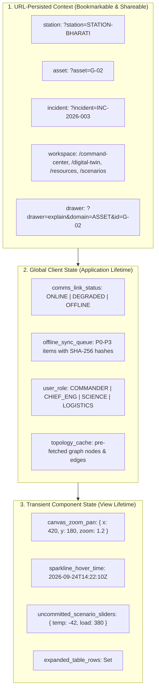
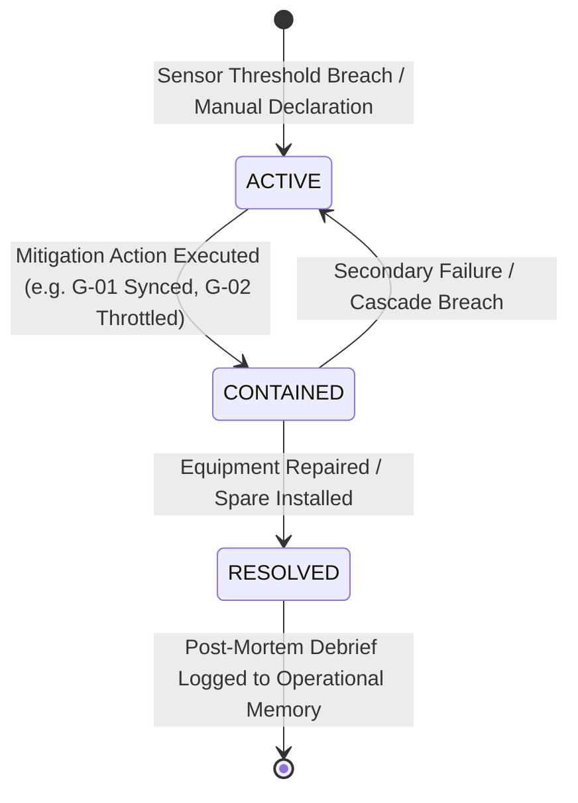
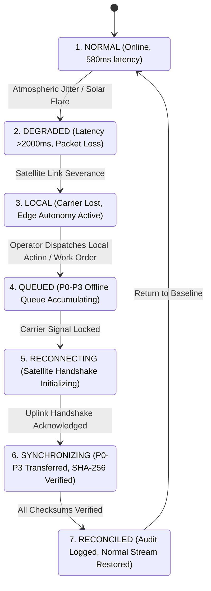
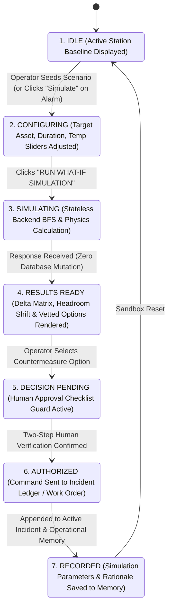
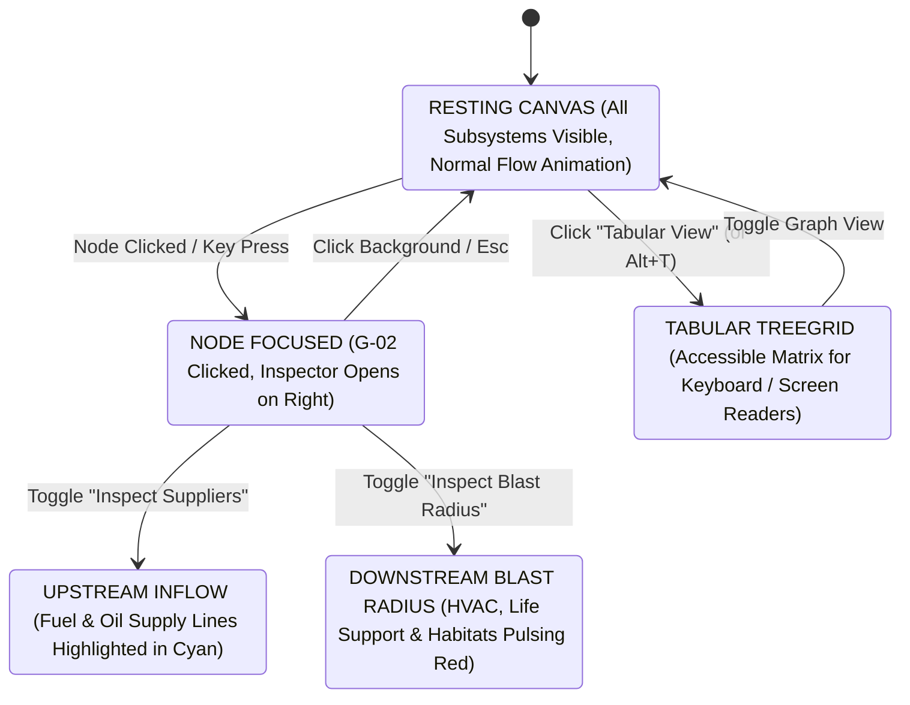

# PolarOps Interaction State & Context Model

**Author:** Kshitij Parkhe (Product Owner & System Integration Lead)  
**Contributors:** Dhruv (Twin Lead), Tanvi (Decision Lead)  
**Date:** September 2026  
**Repository Branch:** `reimagine/product-blueprint`  
**Baseline:** `5c692ec` (`baseline/phase4-5c692ec`)  
**Target Repository Artifact:** `docs/reimagination/INTERACTION_STATE_MODEL.md`

---

## 1. Universal Context Hierarchy

In mission-critical operations, **context fragmentation is fatal**. If an engineer identifies a failing generator in the topology view, navigates to the resource view to check spare parts, and the application forgets which generator was selected, the engineer is forced to manually re-filter and re-orient.

PolarOps implements a **Strict Three-Tier Context Architecture**:

---

## 2. URL-Persisted Context Rules

1. **Station Context (`?station=...`):**
   - Universal query parameter present across all routes.
   - Values: `STATION-BHARATI` (default) | `STATION-MAITRI`.
   - Changing the station in the Global Header dropdown updates the query param and reactively invalidates all TanStack Query caches, re-hydrating the entire application with the new station's data.
2. **Entity Context (`?asset=...`):**
   - Persists the currently selected asset code (e.g. `G-02`).
   - Cross-workspace persistence: An operator selecting `G-02` in `/digital-twin`, then clicking `/resources`, will find the resource view immediately pre-focused on G-02's spare parts and recovery exposure.
3. **Incident Context (`?incident=...`):**
   - Persists the currently active incident ID (e.g. `INC-2026-003`).
   - Direct deep-links allow remote NCPOR engineers in Goa to open the exact Common Operating Picture and Action Ledger being viewed by the station commander.
4. **Drawer Context (`?drawer=...`):**
   - Persists slide-out drawer states:
     - `?drawer=explain&domain=ASSET&id=G-02` (5-Stage Explanation Drawer).
     - `?drawer=resilience` (Edge Resilience Cockpit).
   - Dismissing the drawer via `Esc` or close button removes the drawer query parameter without reloading the page.

---

## 3. Operational State Machines

### 3.1 Incident Lifecycle State Machine (`incident_service.py`)

- **`ACTIVE`:** Emergency status; high-contrast crimson accents; auditory warning chime; primary Common Operating Picture expanded; actions ledger unlocked.
- **`CONTAINED`:** Hazard neutralized but redundancy compromised; amber warning accents; system monitors for secondary thermal or electrical drift.
- **`RESOLVED`:** Normal operating envelope restored; green accents; system prompts operator to launch the **Post-Mortem Authoring Modal** to log lessons learned to `/memory`.

---

### 3.2 7-Stage Resilience & Edge Continuity State Machine (`sync_service.py`)

#### Deterministic Priority Dispatch Rules (P0 – P3):
1. **P0 (Critical Life Support):** Generator emergency shutdowns, incident declarations, life-support breaker trips. Transferred immediately in Packet 1 upon link restoration.
2. **P1 (Operational Actions):** Work order status changes, warehouse inventory reservations, shift handover logs.
3. **P2 (Science Continuity):** Buffered upper-atmosphere radar and seismograph observation batches.
4. **P3 (Diagnostic Telemetry):** Routine 50-point sensor batches and historical battery voltage time series.

---

### 3.3 Counterfactual Scenario Simulation State Machine (`scenario_service.py`)

---

### 3.4 Dual-Flow Living Topology State Machine (`dependency_service.py`)

---

## 4. Error Recovery & Network Resilience Model

In Antarctica, HTTP request failures are expected daily occurrences, not edge-case bugs:

### 4.1 Zero Modal Crashes
- The application will **never** display an intrusive error dialog stating "Network Error: Failed to fetch".
- If an endpoint times out, the component gracefully falls back to the **Last Verified Cache** from local storage, decorating the card with an amber `STALE (Cached 4m ago)` badge.

### 4.2 Optimistic Updates with Rollback & SHA-256 Queueing
- When an operator logs an incident action while offline:
  1. The action immediately appends to the UI Action Ledger with a purple `LOCAL QUEUED` pill.
  2. The action is written to the browser's IndexedDB / local storage queue with a canonical SHA-256 hash.
  3. When satellite comms reconnect, the background sync worker flushes the queue via `POST /api/resilience/restore`.
  4. If the server verifies the hash, the pill transitions to `RECONCILED` (green).
  5. If the server rejects the hash (rare collision), the item is flagged `FAILED_RETRY` with a dedicated 1-click retry button.

---
