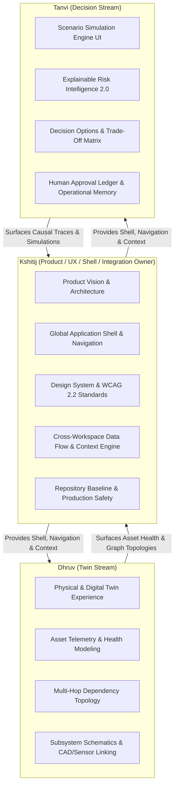
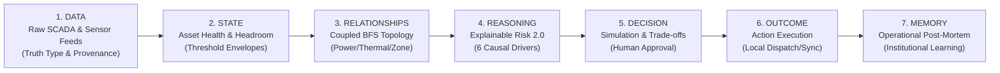
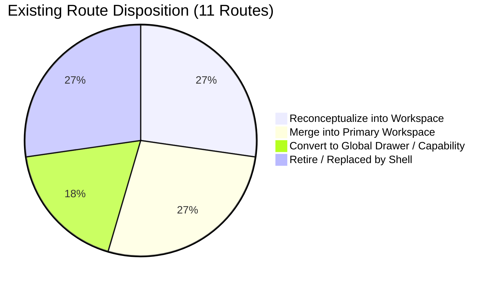
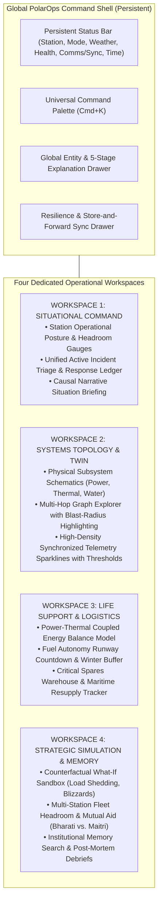

# PolarOps Product Reimagination Architecture & System Integration Audit

**Author:** Kshitij Parkhe  
**Role:** Product Owner + UX / Information Architect + System Integration Owner  
**Date:** September 2026  
**Repository Baseline:** `5c692ec073d6cdd6211250b0ee0e96daef952322` (`baseline/phase4-5c692ec`)  
**Branch:** `reimagine/kshitij-product`  
**Target Repository Artifact:** `docs/reimagination/KSHITIJ_PRODUCT_ARCHITECTURE.md`

---

## 1. Executive Charter & Role Definition

As **Product Owner, UX / Information Architect, and System Integration Owner**, my mandate is to define the unified product vision, information architecture, global application shell, design system, and integration contracts for PolarOps.

### 1.1 Team Operating Streams & Boundaries
PolarOps is being reimagined by a three-person engineering team with clear boundaries of ownership:



- **Kshitij:** Owns the shell, navigation, design tokens, persistent station context, information architecture, route consolidation, and end-to-end integration safety.
- **Dhruv:** Owns the deep domain experience of the Physical Digital Twin (asset visualization, sensor telemetry, and dependency graph topology).
- **Tanvi:** Owns the deep domain experience of Decision Support (counterfactual scenario simulations, 6-factor risk modeling, and human-in-the-loop decision capture).

---

## 2. Product Constitution: The Operational Telemetry Chain

PolarOps operates strictly on the **Universal Operational Chain**:

$$\text{DATA} \longrightarrow \text{STATE} \longrightarrow \text{RELATIONSHIPS} \longrightarrow \text{REASONING} \longrightarrow \text{DECISION} \longrightarrow \text{OUTCOME} \longrightarrow \text{MEMORY}$$



1. **DATA:** Measured physical sensors (vibration, temperature, flow, fuel volume, ambient weather). Every point carries provenance, freshness timestamp, quality rating, and truth type.
2. **STATE:** Normalized operational indicators against rated physical thresholds (Nominal, Degraded, Critical, Offline).
3. **RELATIONSHIPS:** The multi-hop physical, electrical, and thermal graph connecting generators, switchgear, distribution loops, life support, and science modules.
4. **REASONING:** 6-factor causal derivation of risk and failure exposure, explaining *why* an asset is degrading and what will happen if unmitigated.
5. **DECISION:** Counterfactual scenario evaluation generating structured mitigation options with reserve margin impact calculations and human approval gates.
6. **OUTCOME:** Executed work orders, load shedding, or cross-station mutual aid dispatches logged to an immutable ledger.
7. **MEMORY:** Searchable historical decision records, incident timelines, and post-winter debriefs preventing repetitive mistakes across expedition seasons.

---

## 3. Operational Reality & Core User Mental Models

### 3.1 The Extreme Antarctic Operational Environment
PolarOps is built for **Bharati Station** (Larsemann Hills) and **Maitri Station** (Schirmacher Oasis), operated under India's National Centre for Polar and Ocean Research (NCPOR):
- **Isolation:** Complete physical lockdown during the 8-month winter polar night. Zero possibility of external medical evacuation, physical resupply, or replacement parts.
- **Extreme Weather:** Temperatures down to -45°C, wind gusts exceeding 100 knots (blizzard category 3), causing wind-chill equivalents below -65°C.
- **Physical Coupling:** Power and heat are co-generated. Diesel generators provide 100% of electrical power, and their coolant/exhaust jacket heat exchangers provide 100% of station heating. A generator trip is simultaneously an electrical emergency and a thermal catastrophe.
- **Communications Degraded:** Satellite comms suffer severe packet loss, weather attenuation, and daily orbit blackout windows.

### 3.2 The Four Operational Personas & Jobs-to-be-Done (JTBD)

```mermaid
classDiagram
    class StationCommander {
        +Role: Expedition Leader
        +JTBD: Ensure crew survival, mission continuity, and overall station integrity
        +ScanTime: 5 seconds
        +Needs: High-level operational posture, fuel runway, critical risks
    }
    class ChiefEngineer {
        +Role: Power, Thermal & Life Support Lead
        +JTBD: Maintain electrical balance, prevent freeze-up, isolate degrading assets
        +ScanTime: 30 seconds
        +Needs: Deep sensor telemetry, 6-factor risk drivers, spare parts availability
    }
    class RemoteLogisticsDirector {
        +Role: NCPOR Headquarters (Goa)
        +JTBD: Monitor multi-station fleet, coordinate seasonal resupply, dispatch mutual aid
        +ScanTime: 2 minutes
        +Needs: Cross-station headroom comparison, resupply ETA, sync queue status
    }
    class ScienceOfficer {
        +Role: Research & Payload Lead
        +JTBD: Protect scientific experiment continuity without jeopardizing life-support load
        +ScanTime: 1 minute
        +Needs: Science instrument health, buffer queue, load-shedding warnings
    }
```



### 3.3 The Operator Mental Model: Physics & Constraints, Not Pages
An operator does not think in "pages" or "routes". When an alert fires for **Generator G-02 Vibration Spike**:
1. *Not:* "Let me open the `/digital-twin` route."
2. *Real Mental Model:*
   - "How much generation capacity did I just lose?" (Headroom: 400 kW $\rightarrow$ 50 kW)
   - "Is the heat loop to Habitat Module Bravo failing?" (Thermal demand: 180 kW)
   - "If G-02 trips, will G-01 overload and cascade-fail?" (Dependency topology)
   - "Do we have a replacement bearing in the warehouse?" (Spare inventory)
   - "What happens if a blizzard hits tonight?" (Simulation & weather amplification)
   - "What is my immediate recommended mitigation?" (Decision option: Shed science load, spin up reserve generator G-03)

---

## 4. Comprehensive Audit of Existing Repository Capabilities

Our audit of `backend/app/`, `backend/tests/`, `frontend/src/lib/api.ts`, and `docs/integration/` reveals an extraordinary, production-grade engineering backend covering **41 endpoints across 13 domains**.

### 4.1 Backend Domain Inventory & Capabilities Matrix

| Domain | Key Endpoints | Authoritative Backend Service | Core Capabilities & Data Models |
|---|---|---|---|
| **Health** | `GET /health` | System | Service liveness, microservice ping. |
| **Station Overview** | `GET /station/overview` | `station_service.py` | Overall station health score, operational status (`NOMINAL`, `DEGRADED`, `CRITICAL`), ambient weather, subsystem rollups, active incidents. |
| **Station Fleet** | `GET /stations/compare`<br>`POST /stations/compare/evaluate`<br>`POST /scenarios/cross-station` | `station_service.py` | Multi-station portfolio comparison (Bharati vs. Maitri), capability headroom matrices, logistics bottlenecks, cross-station mutual aid simulations. |
| **Asset Twin** | `GET /assets`<br>`GET /assets/{id}` | `asset_service.py` | Station asset catalog, criticality scoring (`CRITICAL`, `HIGH`, `MEDIUM`), physical zone locations, operational status. |
| **Asset Graph** | `GET /assets/{id}/dependencies` | `dependency_service.py` | Multi-hop directed graph traversal, BFS downstream impact, upstream power/fuel origins, service criticality propagation, blast-radius calculation. |
| **Telemetry** | `GET /assets/{id}/telemetry` | `telemetry_service.py` | Historical time series, threshold status (Nominal, Warning, Critical), trend detection (Rising, Falling, Stable), provenance metadata. |
| **Risk Intelligence 2.0** | `GET /assets/{id}/risk` | `risk_service.py` | **6-Factor Explainable Risk:** Thermal margin, vibration severity, oil degradation, hours since overhaul, load factor, environmental stress. Drivers, failure exposure, recovery exposure, headroom impact, state transitions. |
| **Resources & Life Support** | `GET /resources/fuel`<br>`GET /resources/inventory`<br>`GET /resources/resupply`<br>`GET /resources/energy`<br>`GET /resources/recovery/{id}` | `resource_service.py`<br>`energy_service.py` | Winter fuel runway (days), warehouse critical spares, resupply vessel ETA (*MV Vasiliy Golovnin*), electrical load vs. generation reserve, thermal hold-time hours. |
| **Scenarios & Sim** | `POST /scenarios/simulate` | `scenario_service.py` | Counterfactual failure simulations, metric deltas, reserve margin degradation, vetted decision options with human approval requirements. |
| **Explainability** | `GET /explain/{domain}/{id}` | `explainability_service.py` | 5-stage causal trace: Subject, why it matters, sensor evidence, downstream consequences, recovery constraints, recommended next steps. |
| **Resilience & Offline** | `GET /resilience/status`<br>`GET /resilience/queue`<br>`POST /resilience/simulate-offline`<br>`POST /resilience/restore`<br>`POST /resilience/retry/{id}`<br>`POST /resilience/events` | `sync_service.py` | Offline-first store-and-forward queue, priority tiers (Critical, High, Medium, Low), SHA-256 payload checksums, deterministic reconciliation. |
| **Science Load** | `GET /science/instruments`<br>`GET /science/instruments/{id}/observations`<br>`POST /science/observations/buffer` | `science_service.py` | Scientific instrument telemetry, load-shedding buffer queues, observation preservation during power conservation mode. |
| **Incidents & Actions** | `GET /incidents`<br>`GET /incidents/{id}`<br>`POST /incidents`<br>`POST /incidents/{id}/actions`<br>`PATCH /incidents/{id}/status` | `incident_service.py` | Incident lifecycle (Active, Contained, Resolved), chronological action ledger, affected assets and services, mitigation recording. |
| **Memory & Post-Mortem** | `GET /memory`<br>`POST /memory` | `memory.py` | Searchable operational memory, incident post-mortems, institutional lessons learned, decision rationales. |
| **Operational Intelligence** | `GET /intelligence/narrative` | `intelligence_service.py` | Narrative causal chain generation, automated situation synthesis, executive briefing generation. |

---

## 5. Question Every Existing Route: Forensic Evaluation

The existing frontend contains 11 routes. Most were created during early rapid prototyping and exhibit severe **endpoint-mirroring, card inflation, and fragmented context**.

Below is the definitive evaluation of every route:



| Existing Route | Status Determination | Forensic Critique & Operational Rationale | Target Architectural Home |
|---|---|---|---|
| `/` | **RECONCEPTUALIZE** | Currently a marketing landing page with generic SIH 2026 hero banners. Antarctic operators do not need marketing copy. It must be transformed into the **Station Selection & Mission Authentication Portal** or direct redirect to Active Station. | Reconceptualized as Root Authentication & Multi-Station Gateway. |
| `/command-center` | **RECONCEPTUALIZE & EXPAND** | Currently a collection of disconnected summary cards and a mock activity stream. Must become **Workspace 1: Situational Command & Tactical Overview** — providing immediate Level 1 & 2 situational awareness, active incident dispatch, and station headroom. | `Workspace 1: Situational Command` |
| `/digital-twin` | **RECONCEPTUALIZE (Dhruv Stream)** | Currently displays a basic asset list and static node graph. Must become **Workspace 2: Physical Twin & Systems Topology** — deeply linking physical spatial schematics, multi-variable telemetry, 6-factor risk, and BFS blast-radius exploration. | `Workspace 2: Systems Topology & Twin` |
| `/resources` | **RECONCEPTUALIZE & CONSOLIDATE** | Added in Phase 4 with rich data (fuel, inventory, resupply, energy). Must become **Workspace 3: Life Support & Resource Logistics** — tightly binding electrical generation with thermal demand, fuel exhaustion runway, and spare parts supply chains. | `Workspace 3: Life Support & Logistics` |
| `/scenarios` | **MERGE & EVOLVE (Tanvi Stream)** | Currently an isolated page where simulation runs disconnected from current station state. Must be integrated into **Workspace 4: Strategic Simulation & Cross-Station Coordination** — allowing seamless counterfactual runs seeded directly from active station alarms. | `Workspace 4: Simulation & Strategy` |
| `/resilience` | **CONVERT TO GLOBAL DRAWER** | Having a standalone page just to see comms latency is an anti-pattern. Connectivity and sync state are **ambient global conditions** that belong in the persistent header and an accessible **Resilience & Comms Control Drawer**. | Persistent Global Shell + Drawer |
| `/alerts` | **MERGE INTO SITUATIONAL COMMAND** | Incidents are not separate from command situational awareness. Forcing operators to go to `/alerts` to see what is failing while watching gauges on `/command-center` causes severe split-attention failure. Merged directly into Workspace 1. | `Workspace 1: Situational Command` |
| `/stations` | **MERGE INTO STRATEGIC WORKSPACE** | Multi-station comparison is only relevant when planning logistics, winter resupply, or mutual aid during extreme disruptions. Merged into Workspace 4 (Strategic Simulation & Cross-Station Fleet Coordination). | `Workspace 4: Simulation & Strategy` |
| `/reports` | **MERGE INTO OPERATIONAL MEMORY** | Currently a static table of fake downloadable reports. Must be replaced with the real backend **Operational Memory & Institutional Knowledge Ledger** (`/memory`) integrated into Workspace 4. | `Workspace 4: Simulation & Strategy` |
| `/offline` | **CONVERT TO GLOBAL CAPABILITY** | A separate route for "offline analog" makes zero conceptual sense. When a station goes offline, *the entire application* operates in offline-first mode. It is a system state, not a page. | Global Application Shell State |
| `/settings` | **RETIRE / DRAWER** | Mostly contains demo reset buttons and mock toggles. Developer and demo controls belong in a lightweight developer flyout or command palette (`Cmd+K`). | Global Command Palette / Utility Flyout |

---

## 6. Design from First Principles: The Unified Operational Loop

Instead of fragmented screens, PolarOps guides the operator through a closed-loop investigation and decision cycle:

```mermaid
sequenceDiagram
    autonumber
    actor Operator as Station Commander / Engineer
    participant Shell as Global Command Shell
    participant WS1 as Workspace 1: Situational Command
    participant WS2 as Workspace 2: Systems Topology
    participant WS3 as Workspace 3: Life Support
    participant WS4 as Workspace 4: Simulation & Decision
    participant Drawer as Global Entity / Explanation Drawer
    participant Backend as PolarOps FastAPI Backend

    Operator->>Shell: Glance at Persistent Header (03:00 AM)
    Shell-->>Operator: 5-Second Scan: Winter Mode, Ambient -42°C, 1 Critical Alert, Reserve 50 kW
    Operator->>WS1: Inspect Active Incident "G-02 Stator Degradation"
    WS1->>Drawer: Open Causal Explainability Trace (Domain: ASSET, ID: G-02)
    Backend-->>Drawer: Return 5-Stage Evidence (Vibration 4.2mm/s, Thermal Margin 12°C)
    Drawer-->>Operator: Level 2 Comprehension: Blast radius threatens Water Treatment Plant
    Operator->>WS2: Deep-dive into Dependency Graph & Telemetry Sparklines
    WS2-->>Operator: Trace path G-02 -> Busbar-1 -> WTP-01 (No redundant loop active)
    Operator->>WS3: Check Critical Spares & Fuel Runway
    WS3-->>Operator: 0 spare bearings in warehouse; Resupply ship ETA 14 days; Fuel 182 days
    Operator->>WS4: Seed Counterfactual Simulation: "Trip G-02, Shed Science Load, Start G-03"
    Backend-->>WS4: Return Projected Margin: Electrical +120kW, Thermal Hold 12 hrs
    WS4-->>Operator: Present Vetted Decision Options with Trade-off Rationale
    Operator->>WS4: Human-in-the-Loop Approval: Dispatch Work Order & Load Shedding
    WS4->>Backend: Log Incident Action & Record to Operational Memory (/memory)
    Backend-->>Shell: Sync Queue Reconciled (SHA-256 Verified)
```

---

## 7. Final Proposed Information Architecture (The 4 Core Workspaces)

The entire application consolidates into **Four Core Workspaces** plus **Two Persistent Context Drawers**:



---

### 7.1 Detailed Specification: Workspace 1 — Situational Command

- **Purpose:** Provide immediate Level 1 & 2 situational awareness, triage active station anomalies, and log response actions.
- **Primary User:** Station Commander & Shift Lead.
- **Primary Job:** Ascertain station survivability, prioritize incidents, and maintain overall operating posture.
- **Entry Trigger:** Routine shift handover, waking up to an alarm, or returning from field work.
- **First 5-Second Understanding:**
  1. Is the station overall `NOMINAL`, `DEGRADED`, or `CRITICAL`?
  2. How much electrical generation reserve (kW) and thermal hold time (hours) remain?
  3. What is the single highest-priority active incident threatening the station?
- **Primary Action:** Triage active incident or initiate emergency load mitigation.
- **Progressive Disclosure:**
  - *Tier 1 (Surface):* Executive health score, ambient blizzard status, reserve headroom dial, top active incident card.
  - *Tier 2 (Expandable):* Causal situation narrative (`/intelligence/narrative`), subsystem health rollups (Power, HVAC, Water, Life Support, Comms).
  - *Tier 3 (Deep Trace):* One-click slide-out of the 5-Stage Explanation Drawer (`/explain/incident/{id}`).
- **Core Entities:** `Station`, `Incident`, `Subsystem`, `OperationalEvent`.
- **Backend Capabilities:** `GET /station/overview`, `GET /events`, `GET /intelligence/narrative`, `GET /incidents`, `POST /incidents/{id}/actions`.
- **Accessibility & Mobile:** Large high-contrast status badges (triple-encoded), full keyboard accessibility (`1` for Workspace 1, `J`/`K` to cycle incidents, `Enter` to inspect). On mobile/tablet, single-column stack with sticky emergency status banner.

---

### 7.2 Detailed Specification: Workspace 2 — Systems Topology & Twin (Dhruv Stream)

- **Purpose:** Deep diagnostic inspection of physical station assets, multi-hop dependency relationships, and sensor telemetry time series.
- **Primary User:** Chief Infrastructure Engineer & Electrical/Mechanical Technicians.
- **Primary Job:** Trace root cause of sensor anomalies, evaluate structural blast radius, and assess component degradation.
- **Entry Trigger:** Deep-linking from an incident in Workspace 1, or scheduled preventive maintenance rounds.
- **First 5-Second Understanding:**
  1. Which asset is degrading and where is it located?
  2. What is its 6-factor risk score and primary driver (e.g. `VIBRATION_SEVERITY: 4.2 mm/s`)?
  3. If it fails, what critical services (Life Support, Science) immediately lose power or heat?
- **Primary Action:** Inspect upstream/downstream dependency path and trigger targeted maintenance work order.
- **Progressive Disclosure:**
  - *Tier 1 (Surface):* Station asset directory with search/filtering by category, criticality, and health score.
  - *Tier 2 (Selected Asset Card):* 6-factor risk breakdown radar/bars, threshold-referenced telemetry sparklines, upstream source, downstream impact summary.
  - *Tier 3 (Topology View):* Interactive multi-hop DAG showing direct and indirect dependents, redundant backup paths, and blast radius.
- **Core Entities:** `Asset`, `DependencyNode`, `DependencyEdge`, `AssetTelemetry`, `AssetRisk`.
- **Backend Capabilities:** `GET /assets`, `GET /assets/{id}`, `GET /assets/{id}/dependencies`, `GET /assets/{id}/telemetry`, `GET /assets/{id}/risk`.
- **Accessibility & Mobile:** Full screen-reader table alternative for the visual graph; high-contrast edge encoding (solid vs. dashed); pinch-to-zoom and pan on mobile/touch with touch targets $\ge 44\text{px}$.

---

### 7.3 Detailed Specification: Workspace 3 — Life Support & Logistics

- **Purpose:** Manage the tightly coupled life-support equation: Fuel autonomy, electrical generation reserve, thermal heat recovery balance, and critical spares availability.
- **Primary User:** Chief Engineer, Logistics Officer, and Station Commander.
- **Primary Job:** Ensure station thermal survival through the 240-day polar winter; eliminate single-point supply bottlenecks.
- **Entry Trigger:** Weekly fuel tank sounding, approaching blizzard warning, or spare part requisition.
- **First 5-Second Understanding:**
  1. Fuel runway countdown (e.g. `182 days remaining` vs. `210 days winter target` = `28-day deficit`!).
  2. Thermal balance: Is waste heat recovery sufficient, or are auxiliary electrical immersion heaters firing?
  3. Does any active work order lack required warehouse spare parts?
- **Primary Action:** Review resupply ship ETA (*MV Vasiliy Golovnin*), adjust thermal demand setpoints, or reserve critical spares.
- **Progressive Disclosure:**
  - *Tier 1 (Surface):* Big-stat fuel runway gauge with seasonal target threshold, thermal demand vs. recovery wattage, warehouse spare shortage count.
  - *Tier 2 (Coupled Energy Model):* Interactive ambient temperature slider showing how dropping from -20°C to -45°C escalates electrical load and accelerates fuel burn.
  - *Tier 3 (Logistics Ledger):* Critical spares inventory with bin locations, work order reservations, and maritime resupply vessel delivery schedules.
- **Core Entities:** `FuelStatus`, `EnergyModel`, `InventorySpareItem`, `ResupplyOpportunityItem`, `AssetRecoveryExposure`.
- **Backend Capabilities:** `GET /resources/fuel`, `GET /resources/energy`, `GET /resources/inventory`, `GET /resources/resupply`, `GET /resources/recovery/{asset_id}`.
- **Accessibility & Mobile:** Standard Carbon compact data tables with sorting and keyboard focus; high-contrast threshold markers on runway gauges.

---

### 7.4 Detailed Specification: Workspace 4 — Strategic Simulation & Memory (Tanvi Stream)

- **Purpose:** Stress-test counterfactual failure scenarios, coordinate multi-station mutual aid between Bharati and Maitri, and capture institutional operational memory.
- **Primary User:** Station Commander, Chief Engineer, and NCPOR Mission Director.
- **Primary Job:** Evaluate mitigation trade-offs before physical execution; record post-incident lessons learned for future expedition seasons.
- **Entry Trigger:** Preparing for severe blizzard, evaluating an uncontained anomaly, or conducting end-of-season operational debrief.
- **First 5-Second Understanding:**
  1. What is the net delta of the simulated action (e.g. `+120 kW Reserve`, `-15% Science Load`, `Thermal Hold Extended to 18 hrs`)?
  2. Which station has higher operational headroom (Bharati vs. Maitri)?
  3. Has this specific failure mode occurred in prior expeditions, and what was the recorded lesson?
- **Primary Action:** Run scenario simulation, review human approval checklist, and record structured operational memory.
- **Progressive Disclosure:**
  - *Tier 1 (Surface):* Scenario configuration drawer (Target asset, blizzard duration, load-shedding options) + Quick comparison card (Bharati vs. Maitri).
  - *Tier 2 (Simulation Delta Matrix):* Side-by-side baseline vs. scenario comparison of reserve margins, risk scores, and affected services.
  - *Tier 3 (Memory Search & Ledger):* Natural-language search over historical expedition memories (`GET /memory?q=generator+vibration`).
- **Core Entities:** `ScenarioSimulateRequest`, `ScenarioSimulateResponse`, `StationComparisonResponse`, `CrossStationScenarioResponse`, `OperationalMemory`.
- **Backend Capabilities:** `POST /scenarios/simulate`, `GET /station/comparison`, `POST /station/comparison/evaluate`, `POST /scenarios/cross-station`, `GET /memory`, `POST /memory`.
- **Accessibility & Mobile:** Accessible tabbed interface for Simulation vs. Fleet vs. Memory; non-destructive sandbox indicators clearly branded `SIMULATION ENVIRONMENT (NON-OPERATIONAL)` to prevent cognitive confusion with live telemetry.

---

## 8. Global Command Shell Specification

The Global Shell provides uninterrupted, persistent operational context across all workspaces.

```mermaid
flowchart TD
    subgraph SHELL_LAYOUT["Persistent Global Command Shell"]
        subgraph TOP_BAR["Header Bar (64px)"]
            B1["Brand Mark\nPOLAROPS"]
            B2["Station Context\n[BHARATI v | MAITRI]"]
            B3["Mission Mode\n[WINTER 2026]"]
            B4["Ambient Weather\n-42°C | 45 kts BLIZZARD"]
            B5["API & Link Health\nONLINE · LATENCY 140ms"]
            B6["Sync State\n[SYNCHRONIZED]"]
            B7["Universal Search (Cmd+K)"]
            B8["UTC Time Ticker\n14:32:08 UTC"]
        end

        subgraph NAV_BAR["Workspace Switcher (48px)"]
            N1["[1] Situational Command\n(Alarms, Headroom, Briefing)"]
            N2["[2] Systems Topology\n(Twin, Assets, Blast Radius)"]
            N3["[3] Life Support & Logistics\n(Fuel, Energy, Spares)"]
            N4["[4] Simulation & Memory\n(What-If, Fleet, Lessons)"]
        end

        subgraph CONTENT_AREA["Active Workspace Viewport (max-w-1680px)"]
            C1["Focused Operational Workspace Content"]
        end

        TOP_BAR --> NAV_BAR --> CONTENT_AREA
    end
```



### 8.1 Header Anatomy & Persistent Context
1. **Station Selector:** Instant dropdown to toggle between `STATION-BHARATI` and `STATION-MAITRI`. Changes propagate reactively across all queries.
2. **Environmental Indicator:** Dynamic badge showing outdoor temperature, wind speed, and wind chill. When conditions exceed blizzard thresholds, the badge switches to high-contrast warning mode (`BLIZZARD ALERT`).
3. **Resilience & Comms Widget:** Clickable pill disclosing satellite link status (`ONLINE`, `DEGRADED`, `OFFLINE`). Clicking opens the **Resilience & Store-and-Forward Control Drawer**.
4. **Command Palette Trigger (`Cmd+K`):** Opens keyboard-first fuzzy finder across all assets, incidents, workspaces, and simulation tools.
5. **Universal Provenance Indicator:** Displays whether the current screen data is `LIVE TELEMETRY`, `STORED LOCAL SNAPSHOT`, or `OFFLINE CACHED`.

### 8.2 Global Drawers & Flyouts (Radix Sheet Primitives)
- **Global Entity & Explanation Drawer:** Accessible via any asset link, incident button, or command shortcut. Loads the 5-stage explainability trace without leaving the current workspace.
- **Comms & Store-and-Forward Drawer:** Exposes link latency, pending sync queue count, SHA-256 verified packets, and manual "Force Reconcile" triggers.

---

## 9. Aggressive Red Team Critique

To build an uncompromising mission-critical system, we must ruthlessly expose and dismantle the flaws of the current frontend:

### 9.1 The Top 10 Sins of the Baseline Frontend

| # | Anti-Pattern | Where It Exists | Operational Failure Mode | Reimagined Remedy |
|---|---|---|---|---|
| **1** | **Endpoint-Driven UI** | `/resources`, `/digital-twin`, `/alerts` | The UI simply renders raw JSON objects as rows of cards. It reflects database schemas, not operator mental models. | Organize around physical engineering relationships (Power + Heat + Life Support). |
| **2** | **Metric Graveyard & Vanity Numbers** | `/command-center` top row | 4–6 generic KPI cards ("94.2% Health", "24 Assets") with zero operational context or threshold limits. | Replace with operational headroom dials (kW generation reserve, thermal hold hours). |
| **3** | **Split-Attention Cognitive Trauma** | Split between `/command-center` and `/alerts` | An operator investigating a red gauge must navigate to another route to see what incident caused it, losing visual contact with the gauge. | Merge active incident triage directly into Workspace 1 alongside situational telemetry. |
| **4** | **Decorative SVG Topology** | `OperationalTopology.tsx` | A static or rigid circular graph with floating icons that conveys zero load-flow physics or multi-hop power distribution. | Semantic directed acyclic graph (DAG) with directional energy flow, failure propagation highlighting, and BFS blast-radius paths. |
| **5** | **The "Offline Mode" Route Absurdity** | `/offline` route | Treats offline capability as an isolated page you visit! In reality, when comms drop, the *entire station* is offline. | Eliminate `/offline` route completely. Elevate offline status into a universal global application state with persistent store-and-forward queueing. |
| **6** | **Fake Marketing Landing Shell** | `/` landing page | Displays marketing copy ("Antarctic Digital Twin", "Enter System") completely inappropriate for operational hardware. | Convert root into an immediate operational gateway with persistent station context. |
| **7** | **Context Loss on Navigation** | All routes | Selecting an asset in `/digital-twin`, then clicking `/resources`, loses the selected asset context. | Persistent context engine: Selected asset remains in memory and drawers slide over without unmounting. |
| **8** | **Synthetic Data Masquerading as Live Truth** | `demo-data.ts` references | Showing hardcoded timestamps ("14:32:08 UTC") or fake telemetry without explicit `truth_type: SIMULATED` violates scientific honesty. | Strict adherence to the Universal Provenance Contract (`source`, `freshness`, `quality`, `truth_type`). |
| **9** | **Mobile / Tablet Unresponsiveness** | High-density tables and wide flex headers | Elements wrap unpredictably or truncate critical text on rugged field tablets. | Strict mobile-first breakpoints with vertical card collapsing and sticky emergency action bars. |
| **10** | **Keyboard Inaccessibility** | Topology nodes and interactive charts | Impossible to navigate without a precision mouse. Field operators wearing cold-weather gloves cannot operate the system. | 100% WCAG 2.2 keyboard navigation: `Cmd+K` palette, roving tabindex, `Esc` drawer exits. |

---

## 10. Summary of Architectural Decisions & Next Steps

1. **Information Architecture Consolidated:** 11 fragmented routes consolidated into **4 Purpose-Built Operational Workspaces** + **Global Persistent Shell & Drawers**.
2. **Stream Boundaries Formally Established:**
   - **Kshitij:** Global Shell, Persistent Context Engine, Design System, Workspace 1 (Situational Command), Navigation, Route Harmonization.
   - **Dhruv:** Workspace 2 (Systems Topology, Asset Twin, BFS Blast Radius, Sensor Sparklines).
   - **Tanvi:** Workspace 4 (Strategic Simulation Sandbox, 6-Factor Risk Intelligence, Cross-Station Fleet Aid, Operational Memory).
3. **Repository Baseline Protected:** Baseline `5c692ec` verified, remote branch `baseline/phase4-5c692ec` established, and zero application code modified during this audit phase.

---
