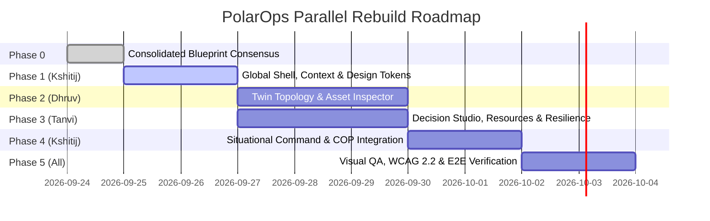

# PolarOps Phased Rebuild & Team Parallelization Plan

**Author:** Kshitij Parkhe (Product Owner & System Integration Lead)  
**Contributors:** Dhruv (Twin Lead), Tanvi (Decision Lead)  
**Date:** September 2026  
**Repository Branch:** `reimagine/product-blueprint`  
**Baseline:** `5c692ec` (`baseline/phase4-5c692ec`)  
**Target Repository Artifact:** `docs/reimagination/REBUILD_PLAN.md`

---

## 1. Rebuild Strategy & Parallelization Principles

To execute the reimagination without merge collisions, regressions, or broken contracts:
1. **Foundation First:** Shared infrastructure (Shell, Navigation, Context Engine, Design Tokens) is established before domain feature work begins.
2. **Strict Directory Isolation:** Each developer works in dedicated, non-overlapping component directories.
3. **Zero Direct Pushes to Main:** All work proceeds on feature branches (`reimagine/*`), verified against Playwright automated tests before merge.
4. **Preserve Baseline Stability:** Baseline commit `5c692ec` remains recoverable on `origin/baseline/phase4-5c692ec`.

---

## 2. Phased Implementation Breakdown

### Phase 1: Shared Foundation, Shell & Context Engine
- **Lead Owner:** Kshitij (Product / UX / Integration Owner)
- **Objective:** Establish the persistent Global Command Shell, header status bar, 4-workspace navigation strip, URL context engine (`station`, `asset`, `incident`), and Radix Sheet drawers.
- **Dependencies:** None.
- **Allowed Files to Modify/Create:**
  - `frontend/src/components/shell/HeaderBar.tsx` (New)
  - `frontend/src/components/shell/WorkspaceNav.tsx` (New)
  - `frontend/src/components/shell/GlobalCommandPalette.tsx` (New)
  - `frontend/src/components/shell/ExplanationDrawer.tsx` (New)
  - `frontend/src/context/StationContext.tsx` (New)
  - `frontend/src/routes/__root.tsx` (Update to mount new shell)
- **Forbidden Files:** `frontend/src/routes/digital-twin.tsx`, `frontend/src/routes/scenarios.tsx`, `backend/*`.
- **Backend Impact:** Zero.
- **Testing:** Playwright automated test `tests/e2e/phase1_shell_foundation.spec.ts` (verifying header renders, station switches, drawer triggers).
- **Acceptance Criteria:** Header displays station switcher, ambient weather, link health pill; navigation switches between 4 workspace routes without error.

---

### Phase 2: Twin Stream — Topology & Asset Intelligence
- **Lead Owner:** Dhruv (Twin Lead)
- **Objective:** Build Workspace 2: Living Systems Topology Canvas with dual-flow tracing (upstream power vs downstream blast radius) and the Contextual Asset Inspector with 50-pt SVG sparklines and 6-factor risk ladder.
- **Dependencies:** Phase 1 (Shell and StationContext).
- **Allowed Files to Modify/Create:**
  - `frontend/src/routes/digital-twin.tsx`
  - `frontend/src/components/twin/LivingTopologyCanvas.tsx` (New)
  - `frontend/src/components/twin/ContextualAssetInspector.tsx` (New)
  - `frontend/src/components/twin/TelemetrySparkline50.tsx` (New)
  - `frontend/src/components/twin/RiskDriverLadder.tsx` (New)
  - `frontend/src/components/twin/BlastRadiusTreeGrid.tsx` (New)
- **Forbidden Files:** `frontend/src/routes/scenarios.tsx`, `frontend/src/routes/resources.tsx`, `frontend/src/components/shell/*`.
- **Backend Impact:** Zero. Consumes existing endpoints (`/assets`, `/dependencies`, `/telemetry`, `/risk`).
- **Testing:** Playwright test `tests/e2e/phase2_twin_topology.spec.ts` (verifying node click, inspector expansion, sparkline rendering, and dual-flow toggle).
- **Acceptance Criteria:** Selecting G-02 opens inspector, renders 50-point SVG sparklines with threshold bands, and highlights downstream blast-radius paths.

---

### Phase 3: Decision & Logistics Stream — Studio, Resources & Resilience
- **Lead Owner:** Tanvi (Decision Lead)
- **Objective:** Build Workspace 3 (Life Support & Logistics) and Workspace 4 (Decision Studio), plus the slide-out Resilience Drawer.
- **Dependencies:** Phase 1 (Shell and StationContext).
- **Allowed Files to Modify/Create:**
  - `frontend/src/routes/scenarios.tsx`
  - `frontend/src/routes/resources.tsx`
  - `frontend/src/components/decision/ScenarioSandbox.tsx` (New)
  - `frontend/src/components/decision/SimulationDeltaMatrix.tsx` (New)
  - `frontend/src/components/decision/DecisionApprovalModal.tsx` (New)
  - `frontend/src/components/decision/InstitutionalMemoryArchive.tsx` (New)
  - `frontend/src/components/resources/CoupledEnergyModel.tsx` (New)
  - `frontend/src/components/resources/FuelRunwayCountdown.tsx` (New)
  - `frontend/src/components/resources/WarehouseSparesLedger.tsx` (New)
  - `frontend/src/components/shell/ResilienceContinuityDrawer.tsx` (New)
- **Forbidden Files:** `frontend/src/routes/digital-twin.tsx`, `frontend/src/components/twin/*`.
- **Backend Impact:** Zero. Consumes existing endpoints (`/scenarios/simulate`, `/resources/fuel`, `/resources/energy`, `/resilience/*`, `/memory`).
- **Testing:** Playwright test `tests/e2e/phase3_decision_resilience.spec.ts` (verifying counterfactual simulation, delta rendering, and offline sync queue).
- **Acceptance Criteria:** Running what-if simulation outputs side-by-side delta matrix with reserve margin shift; Resilience Drawer allows triggering offline simulation and SHA-256 verification.

---

### Phase 4: Situational Command & Cross-Workspace Integration
- **Lead Owner:** Kshitij (Product / UX / Integration Owner)
- **Objective:** Build Workspace 1 (Situational Command & Active Incident COP) and wire the seamless cross-workspace operational loop (Workspace 1 $\leftrightarrow$ 2 $\leftrightarrow$ 3 $\leftrightarrow$ 4).
- **Dependencies:** Phases 1, 2, 3.
- **Allowed Files to Modify/Create:**
  - `frontend/src/routes/command-center.tsx`
  - `frontend/src/components/command/SituationalOverview.tsx` (New)
  - `frontend/src/components/command/ActiveIncidentCOP.tsx` (New)
  - `frontend/src/components/command/ActionExecutionLedger.tsx` (New)
  - `frontend/src/components/command/CausalBriefingNarrative.tsx` (New)
  - `frontend/src/routes/index.tsx` (Redirect to active operational workspace)
- **Backend Impact:** Zero.
- **Testing:** Playwright test `tests/e2e/phase4_cross_workspace_loop.spec.ts` (verifying full operational loop: anomaly $\rightarrow$ incident $\rightarrow$ topology $\rightarrow$ simulation $\rightarrow$ action ledger).
- **Acceptance Criteria:** Clicking an asset in Incident COP navigates to Systems Twin with asset pre-selected; executing a decision option in Workspace 4 appends to Workspace 1 action ledger.

---

### Phase 5: Visual QA, WCAG 2.2 Accessibility & Final Release
- **Lead Owner:** Kshitij (Lead), Dhruv, Tanvi
- **Objective:** Full end-to-end visual review, accessibility audit, and regression testing.
- **Deliverables:**
  - 100% keyboard accessibility (`Cmd+K`, roving tabindex, `Esc` drawer exits).
  - 100% WCAG 2.2 AA compliance (3:1 contrast focus rings, 44px gloved touch targets).
  - All 95 backend unit tests passing.
  - Complete Playwright test suite passing.
- **Acceptance Criteria:** Zero regressions; zero broken links; production build (`npm run build`) compiles cleanly without TypeScript warnings.

---
