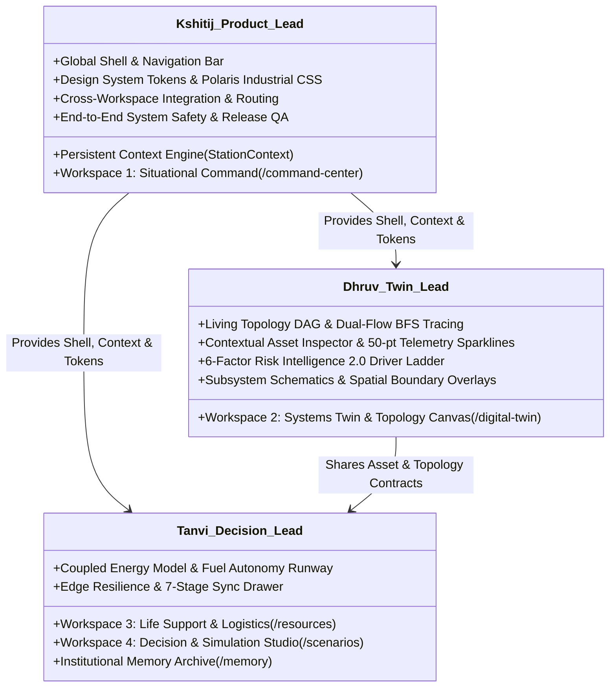

# PolarOps Team Working Contract & Engineering Governance

**Author:** Kshitij Parkhe (Product Owner & System Integration Lead)  
**Contributors:** Dhruv (Twin Lead), Tanvi (Decision Lead)  
**Date:** September 2026  
**Repository Branch:** `reimagine/product-blueprint`  
**Baseline:** `5c692ec` (`baseline/phase4-5c692ec`)  
**Target Repository Artifact:** `docs/reimagination/TEAM_CONTRACT.md`

---

## 1. Team Ownership & Domain Boundaries

To enable seamless, concurrent parallel engineering without merge conflicts or broken contracts, domain responsibilities are strictly partitioned:

---

## 2. Directory & File Boundaries

| Engineer | Dedicated Component Directory | Dedicated Route File | Shared / Protected Files |
|---|---|---|---|
| **Kshitij** | `frontend/src/components/shell/*` `frontend/src/components/command/*` `frontend/src/context/*` | `frontend/src/routes/command-center.tsx` `frontend/src/routes/index.tsx` `frontend/src/routes/__root.tsx` | Owns `__root.tsx`, `StationContext.tsx`, and design token CSS. |
| **Dhruv** | `frontend/src/components/twin/*` | `frontend/src/routes/digital-twin.tsx` | Consumes `StationContext`; imports shared design tokens. |
| **Tanvi** | `frontend/src/components/decision/*` `frontend/src/components/resources/*` | `frontend/src/routes/scenarios.tsx` `frontend/src/routes/resources.tsx` | Consumes `StationContext`; imports shared design tokens. |

### Shared File Protocol
- `frontend/src/lib/api.ts`: Authoritative client library. Any additive client function or type change must be reviewed by Kshitij.
- `frontend/src/routes/__root.tsx`: Strictly owned by Kshitij. Teammates must NOT modify the root router configuration.
- `backend/*`: Protected domain core. Any additive backend change must adhere strictly to `BACKEND_PRODUCT_GAPS.md` and pass all 95 existing tests.

---

## 3. Branching Strategy & Git Protocol

- **`main` (Protected Production Branch):**
  - Direct pushes to `main` are **STRICTLY PROHIBITED**.
  - Deploys automatically to Vercel/Render.
- **`baseline/phase4-5c692ec` (Immutable Baseline):**
  - Points permanently to known-good baseline commit `5c692ec`. Zero commits allowed.
- **`reimagine/product-blueprint` (Architecture Truth):**
  - Houses the authoritative 9 product blueprint documents.
- **Feature Branches:**
  - `reimagine/kshitij-product` (Foundation & Command Center)
  - `reimagine/dhruv-twin` (Digital Twin & Living Topology)
  - `reimagine/tanvi-decision` (Decision Studio, Resources & Resilience)

---

## 4. Engineering Quality & Verification Gates

Before any pull request is merged into an integration branch:

1. **Automated Testing Gate:**
   - All 95 backend unit and API tests must pass: `pytest backend/tests`.
   - Playwright automated E2E tests for the changed workspace must pass: `npm run test:e2e`.
   - Zero visual regressions or broken links.
2. **Build & Type Safety Gate:**
   - Production bundle must compile with zero errors: `npm run build`.
   - Zero TypeScript (`tsc --noEmit`) or ESLint warnings.
3. **Data Honesty Gate:**
   - Every rendered metric must include explicit provenance (`source`, `timestamp`, `truth_type`).
   - Synthetic test data must never masquerade as measured telemetry.
4. **Accessibility Gate:**
   - 100% keyboard accessibility: All critical actions operable without a mouse.
   - Contrast ratio $\ge 4.5:1$ for text, $\ge 3:1$ for graphical boundaries.
   - Status indicators must be triple-encoded (Color + Icon + Explicit Label).

---

## 5. Context Preservation Mandates

Every team member commits to maintaining the application-wide context rules:
- **Station Context:** Never hardcode `"STATION-BHARATI"`. Always read and respect `useStationContext()`.
- **Entity Context:** When rendering an asset code (`G-02`), wrap it in a clickable link or button that updates `?asset=G-02`.
- **Drawer Protocol:** Drawers must slide out over the active screen using Radix Sheet primitives without unmounting or resetting the underlying workspace.

---
