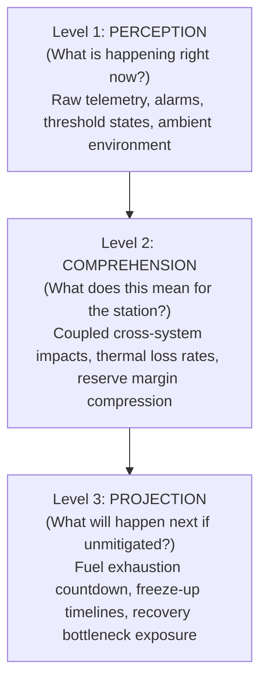
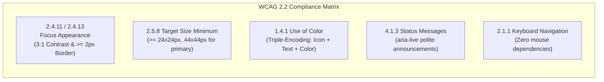

# PolarOps UX Research & Design Engineering Foundation

**Author:** Kshitij Parkhe (Product Owner + UX / Information Architect + System Integration Owner)  
**Date:** September 2026  
**Context:** PolarOps Product Reimagination — Mission-Critical Antarctic Operational Digital Twin  
**Baseline:** `5c692ec` (`baseline/phase4-5c692ec`)  
**Target Repository Artifact:** `docs/reimagination/UX_RESEARCH.md`

---

## 1. Executive Summary & Purpose

PolarOps is not a commercial SaaS application, marketing dashboard, or vanity analytics portal. It is an **Antarctic Operational Digital Twin and Decision-Support Command System** deployed in the most remote, climatically hostile, and bandwidth-constrained environment on Earth (Bharati and Maitri stations, East Antarctica).

In this environment:
- **Mistakes have existential consequences:** An undetected loss of thermal generation during an Antarctic winter blizzard (-45°C, 60-knot winds) will drop habitat interior temperatures to survivability limits within 4 to 8 hours.
- **Cognitive fatigue is baseline:** Operators experience chronic sleep disruption (polar night), high stress, isolation, and physiological strain. Complex interfaces that demand heavy cognitive re-assembly fail catastrophically.
- **Bandwidth is intermittent and degraded:** Satellite links (Iridium/Inmarsat/Ku-band) suffer from weather blackouts, ionospheric disturbances, and high packet latency. Systems that assume constant WebSocket connections or uncompressed JSON payloads crash or present stale data masquerading as live truth.

This research synthesizes foundational principles from **Nielsen Norman Group (NN/g)**, **W3C WCAG 2.2**, **IBM Carbon Design System**, **Radix UI**, and **shadcn/ui**, directly mapped to the operational reality of Antarctic station management.

---

## 2. Nielsen Norman Group (NN/g): Complex Application UX & Usability Heuristics

### 2.1 The 10 Usability Heuristics in Mission-Critical Systems

| Heuristic | Standard Definition | Antarctic Mission-Critical Application | Anti-Pattern to Eradicate |
|---|---|---|---|
| **1. Visibility of System Status** | Keep users informed about what is going on through appropriate feedback within reasonable time. | Every telemetry metric, state indicator, and risk score must declare its **truth type** (`MEASURED`, `DERIVED`, `SIMULATED`, `ESTIMATED`, `OVERRIDDEN`), **freshness age** (e.g. `12s ago`), and **comms link state** (`ONLINE`, `DEGRADED`, `OFFLINE`). | Hiding data age; displaying stale numbers as if they were current live sensor streams; unstated synthetic test data. |
| **2. Match Between System & Real World** | Use familiar language, concepts, and conventions. | The digital twin must represent physical systems as coupled engineering assemblies: Generators produce kW electricity *and* exhaust thermal heat; fuel burn rates translate directly to *winter runway days*; sub-zero winds accelerate thermal loss. | Organizing UI pages by database tables or backend endpoints rather than physical station engineering realities. |
| **3. User Control & Freedom** | Provide "emergency exits" and undo capabilities. | Scenario simulations must be isolated sandboxes. Operators must be able to explore "what-if" counterfactuals (e.g. "What if G-02 fails right now?") with a zero-cost return to active operational reality. | Modal dialogs that lock user state or trigger unconfirmed destructive state overrides. |
| **4. Consistency & Standards** | Users should not have to wonder whether different words or actions mean the same thing. | Universal severity taxonomy: `CRITICAL` (Immediate mission/life hazard), `WARNING` (Degraded reserve/headroom), `NOMINAL` (Within operational limits), `INFO` (Operational note). | Mixing "High", "Critical", "Urgent", and "Severe" arbitrarily across different cards. |
| **5. Error Prevention** | Eliminate error-prone conditions or present confirmation before committing. | Multi-tier human-in-the-loop gating for any operational dispatch, emergency load shedding, or cross-station aid request, including blast-radius impact previews. | Single-click actions that alter station operational status without showing downstream consequences. |
| **6. Recognition Rather than Recall** | Minimize memory load by making objects, actions, and options visible. | When viewing a failing asset (e.g. G-02 Generator), the system must immediately surface its upstream fuel source, downstream critical services (Life Support, Medical Bay, Science), available warehouse spares, and active work orders in one continuous context. | Forcing the operator to navigate to `/resources` to check spare parts, then `/alerts` to see open work orders, then `/digital-twin` to check dependencies. |
| **7. Flexibility & Efficiency of Use** | Accelerators for expert users while supporting novices. | Global Command Palette (`Cmd+K` / `Ctrl+K`) for instantaneous jump to any asset (`G-01`, `WTP-01`), station subsystem, active incident, or simulation tool; keyboard navigation shortcuts (`1-4` for workspaces, `Esc` to close drawers). | Pure point-and-click navigation through nested sidebar menus. |
| **8. Aesthetic & Minimalist Design** | Interfaces should not contain irrelevant or rarely needed information. | High signal-to-noise ratio: Strip decorative gradient blurs, pulsating background animations, and redundant cards. Emphasize operational headroom, delta indicators, and constraint thresholds. | Giant decorative 3D models or unreadable hairball network graphs that provide zero actionable engineering telemetry. |
| **9. Help Users Recognize, Diagnose, & Recover from Errors** | Clear error messages in plain language suggesting constructive solutions. | If comms drop or a sync fails, state exactly which queue item failed (e.g. "Packet #1042: Fuel Log checksum mismatch"), why, and provide a single-click deterministic retry or manual reconciliation override. | Generic error toasts: "Network error: Failed to fetch". |
| **10. Help & Documentation** | Contextual help readily available when needed. | Embedded explainability traces (5-stage reasoning: Why it matters, sensor evidence, downstream consequences, recovery constraints, recommended action). | External PDF manuals that operators cannot access during network blackouts. |

### 2.2 Endsley’s Situational Awareness Model (1995)
According to Mica Endsley's authoritative framework for mission-critical command and control systems, situational awareness comprises three progressive levels:

- **Level 1 (Perception):** The operator sees that Generator G-02 vibration has jumped to 4.2 mm/s and stator temperature is 98°C.
- **Level 2 (Comprehension):** The operator understands that G-02 is experiencing bearing degradation, reducing station available generation reserve from 400 kW to 50 kW, and dropping thermal recovery heat to the water treatment plant.
- **Level 3 (Projection):** The operator projects that if G-02 trips while ambient temperature is -42°C, station generation reserve drops to 0%, the thermal hold time is 3.8 hours before pipe freezing, and the single replacement bearing is 1,200 km away on the *MV Vasiliy Golovnin* with an ETA of 14 days.

**Design Rule:** Every screen in PolarOps must deliberately support Level 2 and Level 3 awareness, not just Level 1 perception. Raw data without comprehension and projection is cognitive noise.

### 2.3 Progressive Disclosure & Cognitive Load Management
NN/g research demonstrates that operators under crisis experience severe "tunnel vision" and cognitive overload. To mitigate this:
1. **Primary Glance (0–5 seconds):** Operational posture, critical warnings, reserve margins, comms status. (Answers: "Is the station safe?")
2. **Secondary Inspection (5–30 seconds):** Causal drivers, affected services, spatial and physical relationships. (Answers: "Where is the failure, and what is dragging it down?")
3. **Tertiary Diagnostics & Action (30+ seconds):** Forensic sensor traces, multi-variable correlation, spare parts inventory, simulation options, human approval ledger. (Answers: "What are my vetted mitigation options, and what are their trade-offs?")

---

## 3. W3C Accessibility Standards: WCAG 2.2 AA in Extreme Environments

Antarctic operational conditions introduce extreme physical and visual constraints that parallel accessibility guidelines:
- **Low-light environments:** During the 6-month polar winter, stations operate in permanent darkness or low artificial lighting; glaring white screens cause eye strain and night-vision loss.
- **Cold & gloves:** Field technicians and control room operators in unheated or partially heated modules wear tactical gloves or experience reduced fine-motor dexterity.
- **High-contrast requirements:** Glare from snow and ice fields during polar summer demands extreme visual clarity and contrast.

### 3.1 WCAG 2.2 Key Success Criteria Implementation

1. **SC 1.4.1 Use of Color (Level A):**
   - Color is *never* the sole indicator of status.
   - Status indicators must use triple-encoding: **Color + Icon + Explicit Text Label**.
   - Example: A critical alarm must have a red accent (`#EF4444`), an alert triangle icon (`AlertTriangle`), and the text label `CRITICAL`.
2. **SC 1.4.3 & 1.4.11 Contrast (Minimum & Non-Text) (Level AA):**
   - Text contrast ratio must be ≥ 4.5:1 against its background.
   - UI components, borders, and graphical elements conveying state (sparklines, threshold lines, status dots) must be ≥ 3:1 against adjacent colors.
   - Dark theme uses high-contrast slate (`#0B0F17` background, `#F8FAFC` primary text, `#94A3B8` secondary text).
3. **SC 2.4.11 & 2.4.13 Focus Appearance (Level AA - WCAG 2.2):**
   - High-visibility keyboard focus rings: 2px solid cyan/primary ring (`outline: 2px solid hsl(var(--ring))`, `outline-offset: 2px`).
   - Focus is never hidden or suppressed.
4. **SC 2.5.8 Target Size (Minimum) (Level AA - WCAG 2.2):**
   - Every interactive control (buttons, toggles, table rows, drawer close triggers) must have an interactive target area of at least 24×24 CSS pixels.
   - Primary operational triggers (dispatch buttons, simulation toggles, incident containment) must have a touch target of at least 44×44 CSS pixels.
5. **SC 4.1.3 Status Messages (Level AA):**
   - Live telemetry updates, offline sync status changes, and simulation runs must be announced programmatically to assistive technology using `aria-live="polite"` or `role="status"` containers without interrupting user input.

---

## 4. IBM Carbon Design System: Enterprise Information Hierarchy & Data Density

The IBM Carbon Design System is the benchmark for industrial, infrastructure, and command-and-control software. Its principles guide PolarOps's data density and visualization patterns:

### 4.1 Data Density Tiers
Industrial operators require high data density without visual clutter. Carbon defines three density modes:
- **High-Density Compact (Grid rows: 32px):** Used for operational telemetry streams, sensor lists, dependency tables, and spare parts catalogs. Maximizes visible items per viewport to prevent unnecessary scrolling during time-critical incidents.
- **Standard Operational (Grid rows: 48px):** Used for active incident queues, scenario delta comparisons, and station health cards.
- **Expanded Diagnostic (Grid rows: 64px+):** Used for multi-stage causal reasoning drawers and decision approval cards where deep explanation text is paramount.

### 4.2 Carbon Visualization Principles
1. **Threshold Context Over Raw Time Series:**
   - A line chart of generator temperature is useless without **operational threshold bands** (Nominal operating envelope, Warning threshold at 85°C, Critical trip threshold at 95°C).
   - PolarOps sparklines and charts must visually anchor the current value against its rated thresholds.
2. **Small Multiples Over Overcrowded Overlays:**
   - Avoid plotting 12 different sensor metrics on a single tangled chart.
   - Use synchronized small multiple sparklines sharing identical time axes to allow instant cross-variable correlation (e.g. comparing vibration spike with exhaust temperature rise).
3. **Semantic Encoding in Topology Graphs:**
   - Node shapes and iconography must reflect physical entity types (`ASSET`, `SERVICE`, `ZONE`).
   - Edge styles must encode physical dependency characteristics:
     - Solid line: Active primary dependency
     - Dashed line: Redundant / standby dependency
     - Thickness: Impact factor / load criticality
     - Color: Propagated failure or degradation state

---

## 5. Radix UI & shadcn/ui: Accessible Primitives & Component Architecture

### 5.1 Primitives Selection & Accessibility Rationale

| UI Pattern | Primitive | Technical Capability | PolarOps Operational Role |
|---|---|---|---|
| **Incident / Entity Inspector** | `Radix Dialog / Sheet` | Accessible modal drawer, focus trapping, `Escape` key dismissal, screen-reader focus return. | 5-stage explainability inspection without losing view of the underlying station dashboard. |
| **Command Palette** | `cmdk` (via shadcn) | Fast keyboard-driven fuzzy search, category grouping, keyboard navigation. | Instant jump to any asset, subsystem, incident, or simulation tool (`Cmd+K`). |
| **Operational Status Badges** | Custom Badge + `Tooltip` | Triple-encoded badge with accessible tooltip disclosing provenance, freshness, and calculation basis. | Revealing whether a metric is `MEASURED` (raw sensor) or `SIMULATED` (predictive model). |
| **Workspace Navigation** | Accessible Tabs / Navigation Menu | `roving-tabindex`, keyboard arrow key traversal, active route synchronization. | Switching between the 4 unified operational workspaces with zero context loss. |
| **Counterfactual Simulation Controls** | `Slider`, `ToggleGroup`, `Accordion` | Accessible slider with numeric keyboard entry, progressive detail expansion. | Fine-grained parameter override for environmental temperature and generator load during simulations. |

---

## 6. Synthesis: The PolarOps UX Design Laws

From this research emerge **Seven Inviolable UX Design Laws** for the reimagined PolarOps platform:

1. **Law of Provenance (Data Honesty):** Every metric must declare its origin, freshness, and truth-type. A simulated prediction must never masquerade as measured sensor reality.
2. **Law of Physical Coupling (Systems Over Silos):** Energy, heat, water, fuel, and human safety are tightly coupled in Antarctica. The UI must never isolate electrical power from thermal consequences or fuel runway.
3. **Law of the 5-Second Scan (Hierarchy):** An operator waking up at 03:00 AM must understand within 5 seconds whether the station is in jeopardy, what subsystem is degraded, and how much headroom remains.
4. **Law of Non-Destructive Exploration (Sandboxed Reasoning):** Operators must be able to stress-test failure scenarios without anxiety of modifying live operational state.
5. **Law of Unified Context (No Page Hopping):** Never force an operator to jump between three different pages to answer a single operational question. Bring secondary context into drawers and contextual overlays.
6. **Law of Autonomous Resilience (Offline-First Dignity):** When satellite connectivity drops, the system does not show an error screen. It shifts gracefully into local-operation mode, activates the store-and-forward queue, and maintains complete operational continuity.
7. **Law of Human Sovereignty (Decision Support):** PolarOps calculates, simulates, exposes risks, and recommends options. It *never* executes autonomous decisions. Human operators approve and own all operational actions.

---
